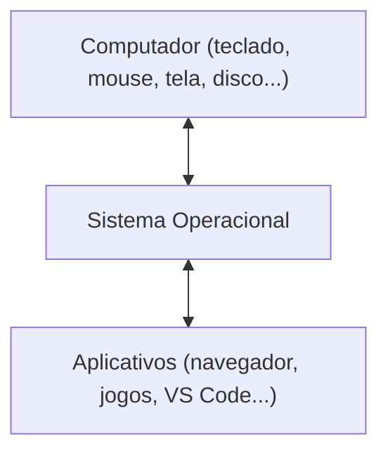

# Módulo 0 — Conhecendo o computador (material do aluno)

## O que vamos aprender hoje

Antes de começar a programar, vamos entender melhor o computador que vamos usar:

- O que é um **sistema operacional**
- **Windows** e **Linux** — dois exemplos de sistema operacional
- O que são **arquivos** e **pastas**
- O que é o **caminho** de um arquivo
- Como usar o **terminal** para navegar entre pastas
- O que é uma **IDE**, e conhecer o **VS Code** — o programa que vamos usar no curso

## Sistema operacional (SO)

É o programa principal que gerencia o computador — abre outros programas, guarda seus arquivos,
controla o teclado e o mouse. Quando você liga o computador, é o SO que aparece primeiro.

**Windows** e **Linux** são dois exemplos de SO. O curso funciona igual nos dois — só muda um
pouco a aparência das janelas.

O SO fica "no meio" entre o computador de verdade (teclado, mouse, tela, disco) e os
aplicativos que você usa (navegador, jogos, VS Code). Nenhum aplicativo fala direto com o
computador — ele sempre passa pelo SO:

## Arquivos e pastas

- **Arquivo**: uma coisa guardada no computador (um texto, uma foto, um programa).
- **Pasta**: uma "caixa" que guarda arquivos, pra organizar tudo.
- **Extensão**: a partezinha depois do ponto no nome do arquivo, tipo `.png` ou `.py` — ela diz
  que tipo de arquivo é aquele.

## Caminho (path)

É o "endereço" de um arquivo ou pasta — o caminho que você percorre, pasta por pasta, até
chegar nele. Igual o endereço de uma casa: sem ele, ninguém acha o que você procura.

## Terminal (CLI): navegando por comandos

Além de clicar nos ícones do gerenciador de arquivos, dá pra navegar entre pastas **digitando
comandos**. Isso se chama **terminal** (ou CLI). O Módulo 1 já vai usar o terminal, então vale
aprender o básico agora.

**Como abrir:**

- **Windows:** menu Iniciar, digite "PowerShell" e aperte Enter.
- **Linux:** aperte `Ctrl+Alt+T`, ou procure "Terminal" no menu de aplicativos.

**Comandos básicos:**

| O que eu quero fazer | Comando |
|---|---|
| Ver em qual pasta eu estou | `pwd` |
| Ver o que tem dentro da pasta atual | `dir` (Windows) ou `ls` (Linux) |
| Entrar numa pasta (andar pra frente) | `cd nome-da-pasta` |
| Voltar uma pasta (andar pra trás) | `cd ..` |
| Criar uma pasta nova | `mkdir nome-da-pasta` |
| Remover uma pasta (só se estiver vazia) | `rmdir nome-da-pasta` |
| Abrir a pasta atual no VS Code | `code .` |

Repare: é o mesmo passeio que você já faz clicando no gerenciador de arquivos — só que agora
digitado.

## IDE: o VS Code

Pra programar, a gente precisa escrever código, rodar ele e ver se deu erro. Um programa que
junta tudo isso num só lugar se chama **IDE**. O **VS Code** é a IDE que vamos usar no curso.

Dentro do VS Code tem:

- a área de edição, onde escrevemos o código;
- o terminal integrado — o mesmo terminal que você acabou de aprender a usar, só que já dentro
  do próprio VS Code;
- o explorador de arquivos na lateral, que mostra as pastas e arquivos do projeto — o mesmo
  passeio de pastas que você já conhece.

Uma forma rápida de abrir o VS Code já na pasta certa: no terminal, `cd` até chegar na pasta e
digitar `code .` (o ponto significa "esta pasta aqui").

O VS Code não é uma linguagem de programação — é só o programa onde vamos escrever e rodar o
código Python, a partir do Módulo 1.

## Instalando o VS Code (pelo terminal)

Abra o terminal e digite:

- **Windows:** `winget install -e --id Microsoft.VisualStudioCode`
- **Linux:** `sudo snap install code --classic`

Feche e abra o terminal de novo, e confirme que instalou com `code --version`. Se der algum
problema, veja `docs/preparacao-ambiente/instalacao_vscode.md` § 3.

## Sua missão

- [ ] Crie uma pasta no seu computador pra guardar os arquivos do curso (ex.: `curso-python`).
- [ ] Dentro dela, crie uma pasta chamada `modulo-01`.
- [ ] Crie um arquivo de texto simples dentro dessa pasta, salve, feche.
- [ ] Ache esse arquivo de novo navegando pelas pastas — sem usar a busca!
- [ ] Consiga dizer o caminho completo até o arquivo que você criou.
- [ ] Abra o terminal e use `cd` para chegar até a pasta `curso-python`, digite `pwd` pra
      confirmar que chegou no lugar certo, e use `dir`/`ls` para ver as pastas que você criou.
- [ ] Instale o VS Code pelo terminal (veja acima) e confirme com `code --version`.
- [ ] Abra a pasta `curso-python` no VS Code usando o terminal (`cd` até chegar nela, depois
      `code .`) e encontre, no explorador de arquivos da lateral, a mesma pasta de módulo que
      você criou.

Essa pasta vai ser onde a gente vai trabalhar a partir do Módulo 1 — é lá que o `jogo.py` vai
morar.

## Palavras novas

| Termo | O que significa |
|---|---|
| Sistema operacional (SO) | O programa principal que gerencia o computador |
| Windows / Linux | Dois exemplos de sistema operacional |
| Arquivo | Uma coisa guardada no computador |
| Pasta | Uma "caixa" que organiza arquivos |
| Extensão | A parte depois do ponto no nome do arquivo (ex.: `.py`) |
| Caminho | O endereço completo até um arquivo ou pasta |
| Terminal / CLI | Jeito de navegar e usar o computador digitando comandos |
| `cd` | Comando pra "andar" entre pastas no terminal |
| IDE | Um programa que junta editor, execução e erros num só lugar |
| VS Code | A IDE que vamos usar no curso |

## Deu dúvida? Tenta isso primeiro

- **Não sei onde salvei o arquivo:** procure na pasta que você escolheu na hora de salvar — não
  no local padrão.
- **Me perdi entre as pastas:** olhe a barra de endereço do gerenciador de arquivos — ela sempre
  mostra onde você está.
- **`rmdir` deu erro:** confira com `dir`/`ls` se a pasta está mesmo vazia — só dá pra remover
  pasta vazia.
- **`code .` não funciona:** feche e abra o terminal de novo depois de instalar o VS Code, e
  confira com `pwd` se você está na pasta certa antes de rodar o comando.
