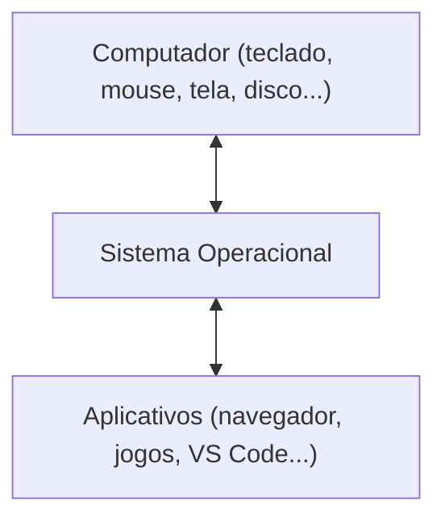
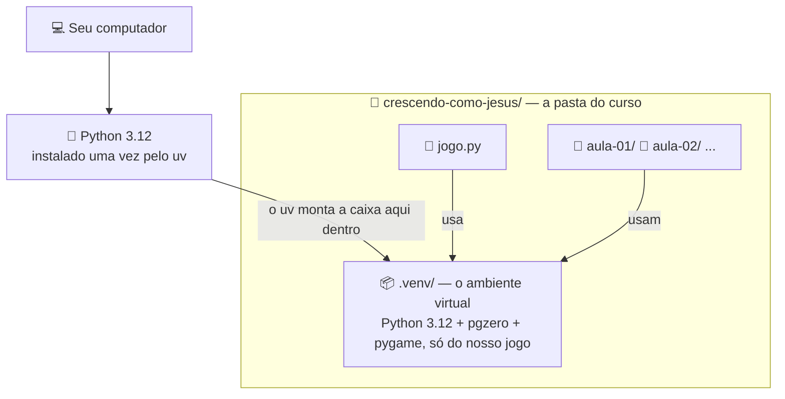

# Módulo 0 — Preparando o computador (material do aluno)

## O que vamos fazer hoje

Ainda **não** vamos programar. Hoje a gente deixa o computador **pronto para escrever código** —
instala as ferramentas, organiza as pastas e monta o ambiente do projeto. No fim, dá pra
começar o Módulo 1 sem parar pra instalar nada.

Você vai entender:

- o que é um **sistema operacional**; **Windows** e **Linux**
- o que são **arquivos**, **pastas**, **caminho** e **extensão**
- como usar o **terminal** para navegar e criar pastas
- as ferramentas do curso: **Python 3.12** (a linguagem), **`uv`**, **VS Code** e o pacote **`pgzero`**
- o que é um **ambiente virtual (venv)**

## Sistema operacional (SO)

É o programa principal que gerencia o computador — abre outros programas, guarda seus arquivos,
controla o teclado e o mouse. Quando você liga o computador, é o SO que aparece.

**Windows** e **Linux** são dois exemplos de SO. O curso funciona igual nos dois — só muda a
aparência das janelas e alguns comandos de instalação. Só precisa saber **qual SO o seu
computador usa**.

Nenhum aplicativo fala direto com o computador — ele sempre passa pelo SO:



## Arquivos, pastas, caminho e extensão

- **Arquivo**: uma coisa guardada no computador (um texto, uma foto, um programa).
- **Pasta**: uma "caixa" que guarda arquivos, pra organizar.
- **Caminho (path)**: o "endereço" de um arquivo ou pasta — o caminho que você percorre, pasta
  por pasta, até chegar nele. Igual o endereço de uma casa.
- **Extensão**: a partezinha depois do ponto no nome do arquivo (`.png`, `.py`) — diz que tipo
  de arquivo é. Os arquivos de Python terminam em `.py`.

## Terminal (CLI): usando o computador por comandos

Além de clicar nos ícones, dá pra usar o computador **digitando comandos**. Isso se chama
**terminal** (ou CLI). Hoje a gente instala quase tudo por aqui.

**Como abrir:**

- **Windows:** menu Iniciar, digite "PowerShell" e aperte Enter.
- **Linux:** aperte `Ctrl+Alt+T`, ou procure "Terminal" no menu.

**Comandos básicos:**

| O que eu quero fazer | Comando | O que deve aparecer |
|---|---|---|
| Ver em qual pasta eu estou | `pwd` | o caminho completo da pasta atual |
| Ver o que tem dentro da pasta atual | `dir` (Windows) ou `ls` (Linux) | a lista de arquivos e pastas dali |
| Entrar numa pasta | `cd nome-da-pasta` | nada; confira com `pwd` |
| Voltar uma pasta | `cd ..` | nada; confira com `pwd` |
| Criar uma pasta nova | `mkdir nome-da-pasta` | nada; a pasta aparece no `dir`/`ls` |
| Remover uma pasta vazia | `rmdir nome-da-pasta` | nada; a pasta some do `dir`/`ls` |

No terminal, **"deu certo" quase sempre é "não apareceu nada"** — a gente confere o efeito com
`pwd` ou `dir`/`ls`. Se aparecer uma linha de erro, leia o que ela diz.

## As ferramentas do curso

| Ferramenta | Para que serve |
|---|---|
| **Python 3.12** | A linguagem do curso — é ela que a gente vem aprender. A versão é **3.12** de propósito (garante o `pygame` pronto). |
| **`uv`** | O instalador do curso: instala o Python, cria o ambiente virtual e instala os pacotes, tudo com os mesmos comandos. Como é ele que traz o Python, é a **primeira** coisa a rodar. |
| **VS Code** + extensão **Python** | A **IDE**: junta editor, terminal e mensagens de erro num lugar só. O VS Code **não** é uma linguagem — é onde a gente escreve e roda o código. |
| **`pgzero`** (Pygame Zero) | Um **pacote** pronto, baixado de graça do **PyPI**, que dá os recursos de janela e desenho do jogo. Instalado **dentro** do ambiente virtual. |

## Passo a passo (siga na ordem)

### 1. Ver o que já está instalado

No terminal:

```
python --version
uv --version
code --version
```

**O que deve aparecer:** para o que já está instalado, uma linha com a versão (ex.:
`Python 3.12.4`). Para o que falta, um erro tipo `'python' não é reconhecido` /
`command not found` — normal, é só instalar abaixo.

### 2. Instalar o Python 3.12 (com o `uv`)

O curso é de Python — mas quem instala o Python pra gente é o `uv`, então ele vem primeiro.

- Instalar o `uv`:
  - **Windows:** `powershell -ExecutionPolicy Bypass -c "irm https://astral.sh/uv/install.ps1 | iex"`
    (o `-ExecutionPolicy Bypass` vale só pra esse comando; sem ele o Windows costuma bloquear com
    um erro de "execução de scripts desabilitada")
  - **Linux:** `curl -LsSf https://astral.sh/uv/install.sh | sh`
  - Deve terminar com uma mensagem de sucesso do instalador.
- **Feche e abra o terminal de novo** e confirme: `uv --version` → deve imprimir algo como
  `uv 0.4.20`.
- Instalar o Python 3.12: `uv python install 3.12` → baixa (barra de progresso) e termina com
  `Installed Python 3.12.x`, sem erro.
- Confirmar: `uv python list` → deve ter uma linha com `3.12` e um caminho ao lado.
  > Não confirme com `python --version` — o Python do `uv` não vira o `python` global do
  > Windows, então esse comando pode continuar dando erro mesmo com o 3.12 instalado. Isso é
  > normal; quem confirma é sempre o `uv python list`.
  >
  > Se a lista vier muito grande (o `uv python list` mostra até versões que dá pra instalar, mas
  > ainda não estão na máquina), use `uv python list --only-installed` para ver só as que já
  > estão instaladas.

### 3. Instalar o VS Code e a extensão Python

- Instalar o VS Code:
  - **Windows:** `winget install -e --id Microsoft.VisualStudioCode`
  - **Linux:** `sudo snap install code --classic`
  - Deve mostrar o progresso e terminar com sucesso.
- **Feche e abra o terminal de novo** e confirme: `code --version` → responde com três linhas.
- Abra o VS Code, clique no ícone de extensões (`Ctrl+Shift+X`), busque **Python** (da
  Microsoft) e clique em **Install** → o botão passa a mostrar "Uninstall".
- Abra o terminal integrado (`` Ctrl+` ``) — no Windows, ele abre um **PowerShell**. Se aparecer
  um erro de **"execução de scripts desabilitada"** ao rodar qualquer comando por aqui (vai
  acontecer mais na frente, ao ativar o `.venv`), libere a execução de scripts **só para o seu
  usuário** com:
  ```
  Set-ExecutionPolicy -Scope CurrentUser -ExecutionPolicy RemoteSigned
  ```
  **O que deve aparecer:** ele pode perguntar para confirmar (responda `S`/`Y`) e não aparece
  nenhuma mensagem de erro depois. Diferente do `-ExecutionPolicy Bypass` do passo 2 (que vale só
  para aquele comando), este `Set-ExecutionPolicy` muda a configuração do terminal **de forma
  permanente**, então só precisa rodar uma vez.

> Se o `winget`/`snap` não funcionar (incluindo erro de acesso negado/política bloqueada em
> computador de empresa), baixe o VS Code manualmente em https://code.visualstudio.com.

### 4. Criar a pasta do curso

No terminal, vá até onde a pasta vai ficar (ex.: a Área de Trabalho) e crie a estrutura:

```
mkdir crescendo-como-jesus
cd crescendo-como-jesus
mkdir aula-01
pwd
```

**O que deve aparecer:** os três primeiros comandos não respondem nada (normal); o `pwd` no fim
mostra o caminho completo terminando em `crescendo-como-jesus`. Um `dir`/`ls` mostra a `aula-01`
lá dentro.

- `crescendo-como-jesus/` é a **pasta principal** do curso — é aqui que tudo vai acontecer.
- `aula-01/` guarda os testes soltos da primeira aula. Cada aula terá a sua (`aula-02`, ...).
- Use `aula-01` (com traço), **não** `modulo-01`.
- O arquivo `jogo.py` vai ficar na **raiz** de `crescendo-como-jesus/`, mas ele só nasce no
  Módulo 1.

Abra essa pasta no VS Code: ainda dentro dela no terminal, digite `code .` → o VS Code abre com
`CRESCENDO-COMO-JESUS` no topo do explorador da lateral e `aula-01` listada dentro.

### 5. Criar o ambiente virtual (venv)

O **venv** é uma "caixa" separada com o Python e os pacotes só do nosso projeto — assim o
ambiente fica igual em qualquer computador. Essa caixa mora **dentro** da pasta do curso, na
subpasta `.venv/`, e é usada tanto pelo `jogo.py` quanto por todas as pastas `aula-NN/`:



Com a pasta aberta no VS Code, abra o **terminal integrado** (`` Ctrl+` ``) e rode:

```
uv venv --python 3.12 .venv
uv pip install pgzero
uv pip freeze > requirements.txt
```

**O que deve aparecer:**

- `uv venv ...` → `Creating virtual environment at: .venv`; a pasta `.venv` surge no explorador.
- `uv pip install pgzero` → a lista dos pacotes (`pgzero`, `pygame`, `numpy`...) e `Installed N
  packages`, sem linha vermelha.
- `uv pip freeze > requirements.txt` → nada no terminal; o arquivo `requirements.txt` aparece no
  explorador.

Depois selecione o interpretador: `Ctrl+Shift+P` → **Python: Select Interpreter** → escolha o
que tem `.venv` (costuma vir como "Recommended") → o canto inferior direito do VS Code passa a
mostrar `3.12.x ('.venv')`.

### 6. Testar se está tudo pronto

Isto **não é** aula de Python — é só pra ver se tudo liga.

- No explorador do VS Code, dentro de `aula-01/`, crie o arquivo `teste.py` com:
  ```python
  print("ambiente pronto para a aula")
  ```
- Clique no botão ▶ **Run Python File** (canto superior direito) — ou, no terminal integrado, com
  o venv ativo, digite:
  ```
  python aula-01/teste.py
  ```
- **O que deve aparecer:** no terminal, a linha exata `ambiente pronto para a aula`, sem erro.
  Se apareceu isso, **está tudo pronto!** (Pode apagar o `teste.py` depois.)

## Checklist final

- [ ] `python --version` (ou `uv python list` com `3.12`), `uv --version` e `code --version`
      respondem
- [ ] extensão **Python** instalada no VS Code
- [ ] pasta `crescendo-como-jesus/` criada, com `aula-01/` dentro
- [ ] `.venv` criado na raiz de `crescendo-como-jesus/`, `pgzero` instalado, `requirements.txt`
      gerado
- [ ] interpretador `.venv` selecionado no VS Code
- [ ] `teste.py` rodou e imprimiu a frase

Quando tudo estiver marcado, seu computador está pronto para o Módulo 1 — é lá que o `jogo.py`
começa.

## Palavras novas

| Termo | O que significa |
|---|---|
| Sistema operacional (SO) | O programa principal que gerencia o computador |
| Windows / Linux | Dois exemplos de sistema operacional |
| Arquivo / Pasta | Uma coisa guardada no computador / uma "caixa" que organiza arquivos |
| Extensão | A parte depois do ponto no nome do arquivo (ex.: `.py`) |
| Caminho (path) | O endereço completo até um arquivo ou pasta |
| Terminal / CLI | Usar o computador digitando comandos |
| `cd` / `mkdir` / `rmdir` | Andar entre pastas / criar pasta / remover pasta vazia |
| `code .` | Abre o VS Code na pasta atual do terminal |
| IDE / VS Code | Programa que junta editor, execução e erros / a IDE do curso |
| Python 3.12 | A linguagem que vamos usar; versão fixa de propósito |
| `uv` | Instala o Python, cria o venv e instala os pacotes |
| Pacote / PyPI | Código pronto e gratuito / o repositório de onde ele vem |
| `pgzero` (Pygame Zero) | O pacote que dá janela e desenho pro jogo |
| Ambiente virtual (venv) | "Caixa" isolada com o Python e os pacotes do projeto |
| `requirements.txt` | Lista das versões exatas dos pacotes, pra recriar o ambiente igual |

## Deu dúvida? Tenta isso primeiro

- **`uv` / `code` não reconhecido depois de instalar:** feche e abra o terminal de novo.
- **`winget` não funciona (inclusive erro de acesso negado):** baixe o VS Code em
  https://code.visualstudio.com.
- **Instalar o `uv` deu erro de "execução de scripts desabilitada":** use o comando com
  `-ExecutionPolicy Bypass` (passo 2 acima).
- **Qualquer outro comando no terminal do VS Code dá esse mesmo erro (comum ao ativar o
  `.venv`, passo 5):** rode uma vez `Set-ExecutionPolicy -Scope CurrentUser -ExecutionPolicy
  RemoteSigned` (passo 3 acima).
- **`uv python install 3.12` parece travado:** ele baixa o Python na primeira vez — aguarde.
- **`python --version` continua com erro depois de instalar com `uv`:** normal — o `uv` não
  registra o Python como o `python` global. Confira com `uv python list`.
- **Me perdi entre as pastas:** use `pwd`, e a barra de endereço do gerenciador de arquivos.
- **`rmdir` deu erro:** a pasta não está vazia (confira com `dir`/`ls`).
- **VS Code não mostra o `.venv`:** confirme que a pasta `.venv` está **dentro** de
  `crescendo-como-jesus/` e recarregue a janela (`Ctrl+Shift+P` → "Developer: Reload Window").
- **`teste.py` deu erro:** repita o passo 5 (Select Interpreter → `.venv`) e confira o
  interpretador no canto inferior direito do VS Code.
