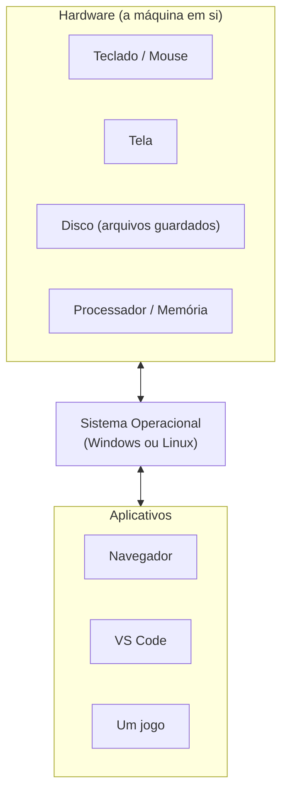
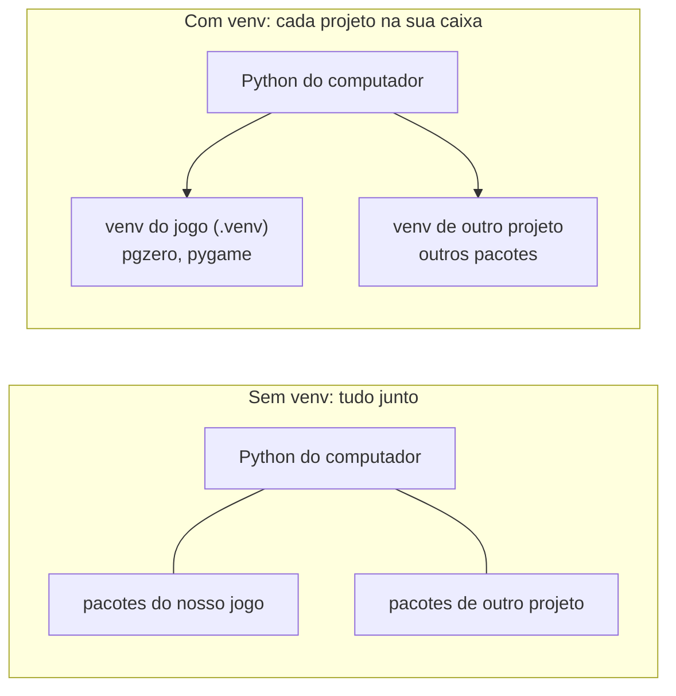
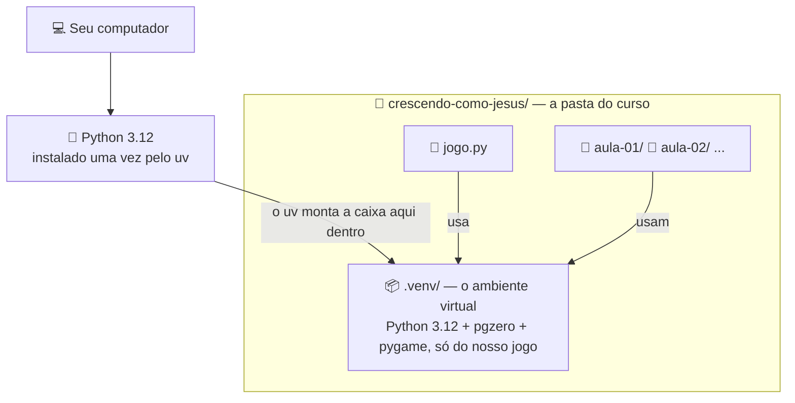

# Módulo 0 — Preparando o computador (material do professor)

**Duração:** ~3h (pode ser dividida em 2 encontros) · **Ferramentas:** o computador (Windows ou
Linux), o terminal, Python 3.12, `uv`, VS Code

> Este módulo é **preparação**, fora da sequência de 12 que constroem o jogo — não tem "parte do
> jogo" associada e **não ensina nada de programação**. O objetivo é um só: ao final, a máquina
> do aluno está **100% pronta para escrever código** — ferramentas instaladas, pastas
> organizadas e o ambiente do projeto criado. Do Módulo 1 em diante ninguém perde tempo
> instalando coisa.
>
> Todo passo é descrito de forma que o aluno (ou alguém ajudando em casa) **consiga refazer
> sozinho**. O guia companheiro, com os mesmos passos em forma de checklist seco, é
> `docs/preparacao-ambiente/instalacao_vscode.md`.

## Conceitos

- O que é um sistema operacional (SO); Windows e Linux
- Arquivos e pastas; caminho; extensão de arquivo
- Terminal (CLI): navegar, criar e remover pastas por comando
- As ferramentas do curso e para que serve cada uma: Python 3.12 (a linguagem), `uv` (o
  instalador), VS Code (a IDE), pacote / PyPI
- Ambiente virtual (venv): o que é e por que usamos
- A estrutura de pastas do curso na máquina do aluno

## Roteiro da aula

### 1. O que é um sistema operacional (15 min)

- Perguntar: "quando vocês ligam o computador, o que aparece primeiro?" — ícones, barra de
  tarefas, etc. Isso tudo é o **sistema operacional (SO)**: o programa principal que gerencia
  tudo — abrir outros programas, guardar arquivos, controlar o teclado e o mouse.
- Analogia: o SO é como o "gerente da casa" — ele não é nenhum cômodo específico, mas é quem
  organiza tudo pra você conseguir usar a casa.
- Mostrar o diagrama abaixo: o SO fica entre o hardware (o computador "de verdade" — teclado,
  mouse, tela, disco) e os aplicativos que o aluno usa (navegador, jogos, VS Code). Nenhum
  aplicativo fala direto com o hardware — todos passam pelo SO.



- Reforçar a analogia do "gerente da casa": os aplicativos pedem coisas ao SO (abrir um
  arquivo, mostrar algo na tela, ler uma tecla) e o SO é quem realmente conversa com o
  hardware — o aplicativo nunca faz isso sozinho.

### 2. Windows e Linux (10 min)

- Apresentar os dois de forma simples, sem detalhe técnico:
  - **Windows** — o mais comum em casas e escolas; ícones, barra de tarefas embaixo, "Este
    Computador".
  - **Linux** — outro SO, mais comum em servidores e em alguns computadores pessoais; várias
    "aparências" (distribuições), mas a ideia de pastas e arquivos é a mesma.
- Deixar claro: **o curso funciona igual nos dois** — Python, VS Code e Pygame Zero rodam nos
  dois. O que muda é só a aparência das janelas e alguns comandos de instalação (a aula mostra
  os dois).
- O importante hoje é saber **qual SO o próprio computador usa** — isso decide qual coluna de
  comandos seguir mais pra frente.

### 3. Arquivos e pastas (15 min)

- **Arquivo**: uma coisa guardada no computador — um texto, uma foto, um programa.
- **Pasta** (ou diretório): uma "caixa" que guarda arquivos (e outras pastas dentro dela), pra
  organizar. Igual pastas de papel guardando folhas.
- Abrir o gerenciador de arquivos (Explorador de Arquivos no Windows, Arquivos/Nautilus no
  Linux) e mostrar ao vivo: navegar entre pastas, criar uma pasta nova, renomear.
- Mostrar a **extensão** do arquivo (a partezinha depois do ponto: `.txt`, `.png`, `.py`) — ela
  diz pro computador que tipo de arquivo é aquele e qual programa deve abrir. `.py` é a extensão
  dos arquivos de Python, que vamos usar do Módulo 1 em diante.

### 4. Caminho: onde as coisas moram (10 min)

- Explicar **caminho (path)**: o "endereço completo" de um arquivo ou pasta, contando a partir
  de onde ele está até chegar nele — pasta dentro de pasta dentro de pasta.
- Analogia: é como o endereço de uma casa (rua, número, apartamento) — sem ele, não tem como
  achar o que você procura.
- Mostrar a barra de endereço do gerenciador de arquivos, que mostra o caminho de onde você
  está.

### 5. Conhecendo o terminal (CLI) (20 min)

- Explicar que, além do gerenciador de arquivos (com ícones e cliques), existe outro jeito de
  usar o computador: **digitando comandos**. Esse jeito se chama **terminal**, ou **CLI**
  (sigla em inglês para "interface de linha de comando").
- Deixar claro por que isso importa hoje: **quase tudo que vamos instalar nesta aula é por
  comando no terminal**. E do Módulo 1 em diante o terminal usado é o que fica dentro do VS
  Code. Aprender o básico agora deixa o resto da aula tranquilo.
- Abrir o terminal ao vivo:
  - **Windows:** menu Iniciar, digitar "PowerShell" e apertar Enter — ou, com o Explorador de
    Arquivos aberto numa pasta, botão direito > "Abrir no Terminal".
  - **Linux:** `Ctrl+Alt+T`, ou procurar "Terminal" no menu de aplicativos.
- Mostrar, ao vivo, cada comando da tabela — sempre pedindo pro aluno repetir no computador
  dele:

  | O que eu quero fazer | Comando | O que deve aparecer se deu certo |
  |---|---|---|
  | Ver em qual pasta eu estou | `pwd` | o caminho completo da pasta atual (ex.: `C:\Users\ana\Desktop`) |
  | Ver o que tem dentro da pasta atual | `dir` (Windows) / `ls` (Linux) | a lista de arquivos e pastas dali |
  | Entrar numa pasta | `cd nome-da-pasta` | nenhuma mensagem; o `pwd` seguinte já mostra a pasta nova |
  | Voltar uma pasta | `cd ..` | nenhuma mensagem; o `pwd` seguinte mostra a pasta de cima |
  | Criar uma pasta nova | `mkdir nome-da-pasta` | nenhuma mensagem; a pasta passa a aparecer no `dir`/`ls` |
  | Remover uma pasta vazia | `rmdir nome-da-pasta` | nenhuma mensagem; a pasta some do `dir`/`ls` (se não estiver vazia, dá erro) |

- **Regra geral do terminal:** quando dá certo, quase sempre **não aparece nada** — é isso mesmo.
  A gente confere o efeito com `pwd` (mudei de lugar?) ou `dir`/`ls` (a pasta apareceu/sumiu?).
  Quando dá errado, aparece uma linha de erro — e é ela que a gente lê para entender o quê.
- Fazer o trajeto completo ao vivo, dentro de qualquer pasta (ex.: Área de Trabalho), narrando o
  resultado de cada passo:
  - `mkdir teste` → sem mensagem; `dir`/`ls` agora mostra a pasta `teste`.
  - `cd teste` → sem mensagem; `pwd` agora termina em `...\teste`.
  - `cd ..` → sem mensagem; `pwd` voltou para a pasta de antes.
  - `rmdir teste` → sem mensagem; `dir`/`ls` não mostra mais `teste`.
- Reforçar: `cd` (de *change directory*) é sempre "andar" entre pastas — pra frente com o nome
  da pasta, pra trás com `..`. É o mesmo passeio do gerenciador de arquivos, só que digitado.
- Deixar claro que `rmdir` só remove pasta **vazia** — é por segurança, evita apagar um monte de
  arquivo sem querer.

### 6. As ferramentas que vamos instalar hoje (10 min)

Antes de sair instalando, mostrar o "mapa" do que a máquina precisa ter e para que serve cada
peça:

| Ferramenta | Para que serve |
|---|---|
| **Python 3.12** | A estrela: a linguagem (o "idioma") em que o curso inteiro é escrito. Todo o resto existe só pra dar suporte a ela. Usamos a versão **3.12** de propósito (explicado no passo 8). |
| **`uv`** | O "instalador" que o curso usa: com os mesmos comandos ele instala a versão certa do **Python**, cria o **ambiente virtual** e instala os **pacotes**. Como é ele que traz o Python, na prática é a primeira coisa a rodar. |
| **VS Code** + extensão **Python** | A **IDE** do curso — o programa que junta, num lugar só, o editor de texto, o terminal e as mensagens de erro. A extensão Python ensina o VS Code a entender arquivos `.py`. |
| **`pgzero`** (Pygame Zero) | Um **pacote** pronto: código que outras pessoas escreveram e publicaram de graça no **PyPI** (o "repositório" de pacotes Python) para qualquer um usar. É ele que vai dar os recursos de janela e desenho do jogo. Instalado **dentro** do ambiente virtual, no passo 11. |

- Deixar claro: **o curso é de Python** — é ele que importa. `uv`, VS Code e `pgzero` são só o
  apoio pra escrever e rodar Python com conforto.
- **Ordem na prática:** como é o `uv` que instala o Python, ele roda primeiro; depois vem o
  Python 3.12, depois o VS Code, e o `pgzero` só no fim, dentro do ambiente do projeto.
- O que é uma **IDE**: "pra programar, a gente escreve código, roda ele e vê se deu erro. Dá pra
  fazer isso espalhado (um bloco de notas aqui, um terminal ali) ou num programa que junta
  tudo — a IDE." O VS Code **não é uma linguagem de programação**; é só o lugar onde vamos
  escrever e rodar o código Python.

### 7. Verificar o que já está instalado (5 min)

- No terminal, rodar os três comandos:
  ```
  python --version
  uv --version
  code --version
  ```
- **O que deve aparecer:** para cada um que já está instalado, uma linha com a versão (ex.:
  `Python 3.12.4`, `uv 0.4.20`, e o `code --version` responde com três linhas). Para o que
  **não** está, aparece um erro tipo `'python' não é reconhecido...` (Windows) ou
  `python: command not found` (Linux) — é normal, os próximos passos instalam.
- Explicar: conferir antes evita reinstalar algo que já está pronto.

### 8. Instalar o Python 3.12 (com o `uv`) (15 min)

1. Instalar o **`uv`** (se o passo 7 não mostrou versão):
   - **Windows (PowerShell):** `powershell -c "irm https://astral.sh/uv/install.ps1 | iex"`
   - **Linux:** `curl -LsSf https://astral.sh/uv/install.sh | sh`
   - **O que deve aparecer:** o instalador mostra o progresso e termina com uma mensagem de
     sucesso (algo como `everything's installed!` / o caminho onde instalou). **Feche e abra o
     terminal**; agora `uv --version` imprime uma linha tipo `uv 0.4.20`.
   - Mencionar de passagem o **`pyenv`**: ferramenta parecida e bem conhecida, mas que cuida só
     da versão do Python — o venv e os pacotes ficariam por conta de `venv`/`pip` separados. O
     curso usa `uv` porque ele faz as três coisas com os mesmos comandos; quem já usa `pyenv`
     pode continuar.
2. Instalar o **Python 3.12** com o `uv` — um único comando, sem baixar instalador nenhum:
   ```
   uv python install 3.12
   ```
   **O que deve aparecer:** na primeira vez ele baixa (uma barra de progresso) e termina com algo
   como `Installed Python 3.12.x`, sem erro. Conferir com `uv python list` — deve haver uma linha
   com `3.12` e um caminho ao lado (sinal de que está instalada).
3. Explicar **por que 3.12 e não a mais nova**: o `pygame` (usado pelo Pygame Zero) só publica
   instalação pronta (*wheel*) para algumas versões do Python. Uma versão nova demais pode não
   ter *wheel* e travar a instalação — a 3.12 evita esse problema. Não precisa decorar o motivo,
   só saber que a versão é fixa de propósito.

> **Se `uv python install 3.12` parecer travado:** ele baixa o Python na primeira vez — é só
> aguardar; da próxima vez é instantâneo (fica em cache).

### 9. Instalar o VS Code e a extensão Python (15 min)

1. Instalar o **VS Code** pelo terminal (reforçando o que foi visto sobre CLI):
   - **Windows:** `winget install -e --id Microsoft.VisualStudioCode`
   - **Linux (Debian/Ubuntu):** `sudo snap install code --classic`
   - **O que deve aparecer:** o progresso do download e uma mensagem de sucesso ao final.
     **Feche e abra o terminal** (o comando `code` só aparece depois disso); `code --version`
     agora responde com três linhas (o número da versão, um código longo e a arquitetura).
2. Abrir o VS Code (digite `code` no terminal, ou pelo menu) e instalar a extensão **Python**
   (da Microsoft): ícone de extensões na barra lateral (ou `Ctrl+Shift+X`), buscar "Python",
   Install. **O que deve aparecer:** o botão "Install" vira "Uninstall" / aparece um ✓ no card
   da extensão.
3. Mostrar rapidamente a "casa" — sem escrever código ainda:
   - a **área de edição**, onde o código vai ser escrito;
   - o **terminal integrado** (**Terminal > New Terminal**, ou `` Ctrl+` ``) — o mesmo terminal
     de antes, só que dentro do próprio VS Code;
   - o **explorador de arquivos** na lateral, que mostra as pastas e arquivos do projeto.
   - Analogia: "é como uma oficina completa — a bancada (editor), as ferramentas (extensões) e o
     lugar de testar (terminal), tudo junto num só programa."

> **Sem `winget`/`snap` disponível?** Baixar o instalador manualmente em
> https://code.visualstudio.com — o resultado final é o mesmo, só muda o jeito de instalar.
> Detalhes em `docs/preparacao-ambiente/instalacao_vscode.md` § 3.

### 10. Criar a estrutura de pastas do curso (15 min)

- Explicar que agora vamos montar a "casa" do curso na máquina, **uma vez só**, e é nela que
  todo o resto vai acontecer. A estrutura é esta:

  ```
  crescendo-como-jesus/      <- a pasta-raiz do aluno (na Área de Trabalho ou em Documentos)
    aula-01/  aula-02/ ...    <- uma subpasta por aula, para os testes soltos daquela aula
  ```

- Fazer ao vivo, no terminal, cada aluno repetindo (nenhum desses comandos "responde" nada — a
  gente confere pelo `pwd`/`dir` e, no fim, pelo VS Code):
  1. Ir até onde a pasta vai ficar (ex.: Área de Trabalho): `cd` até lá — conferir com `pwd`.
  2. `mkdir crescendo-como-jesus` → sem mensagem; `dir`/`ls` já mostra a pasta.
  3. `cd crescendo-como-jesus` → o texto antes do cursor passa a terminar em `crescendo-como-jesus`.
  4. `mkdir aula-01` → sem mensagem; `dir`/`ls` mostra `aula-01`.
  5. `pwd` → o **caminho completo** até `crescendo-como-jesus` (ler em voz alta).
- Deixar dois pontos bem claros:
  - O arquivo principal do jogo (`jogo.py`) vai morar **na raiz** de `crescendo-como-jesus/`,
    mas ele **nasce no Módulo 1** — hoje a raiz fica só com a pasta `aula-01/` dentro.
  - As subpastas se chamam `aula-01`, `aula-02`, ... (com traço), **não** `modulo-01` — assim
    ninguém confunde com os módulos do material do professor.
- Abrir essa pasta no VS Code: no terminal, estando dentro de `crescendo-como-jesus`, digitar
  `code .` (o ponto significa "esta pasta"). **O que deve aparecer:** o VS Code abre (ou ganha
  foco) com `CRESCENDO-COMO-JESUS` no topo do explorador da lateral e `aula-01` listada dentro.
  (Alternativa sem terminal: **File > Open Folder...**.)

### 11. Entender e criar o ambiente virtual (venv) (20 min)

> ⚠️ **Passo-chave da aula.** Quase todo erro chato do curso ("pgzero não encontrado", "screen
> is not defined") vem de um `.venv` mal criado ou de um interpretador errado selecionado no VS
> Code. Vale caprichar aqui — reforçar bem essa ideia poupa tempo de debug em todos os módulos
> seguintes.

- Perguntar: "se dois projetos no mesmo computador precisassem de versões diferentes do mesmo
  pacote, o que aconteceria se tudo estivesse instalado junto, misturado?" — daria conflito, um
  projeto atrapalharia o outro.
- Explicar com analogia: um **ambiente virtual (venv)** é uma **caixa de ferramentas separada
  para cada projeto** — cada projeto tem sua própria cópia do Python e dos pacotes que precisa,
  sem misturar com outros projetos nem com o resto do computador.



- Reforçar: **não precisa entender os detalhes técnicos hoje** — o importante é que o `.venv` é
  a "caixa" só do nosso jogo, e por isso o ambiente fica sempre igual em qualquer computador.
- Mostrar **onde essa caixa vive**: dentro da pasta `crescendo-como-jesus/`, na subpasta
  `.venv/`, servindo o `jogo.py` e todas as `aula-NN/` (é o mesmo diagrama do material do aluno):



- Fazer ao vivo, com a pasta `crescendo-como-jesus` aberta no VS Code e o **terminal integrado**
  aberto (`` Ctrl+` ``), cada aluno repetindo:
  1. Criar o venv com a versão certa do Python (a "caixa" do diagrama, virando o `.venv`):
     ```
     uv venv --python 3.12 .venv
     ```
     **Deve aparecer:** duas linhas tipo `Using CPython 3.12.x` e
     `Creating virtual environment at: .venv`; a pasta `.venv` surge no explorador.
  2. Instalar o pacote do jogo dentro dele:
     ```
     uv pip install pgzero
     ```
     **Deve aparecer:** a lista dos pacotes baixados (`pgzero`, `pygame`, `numpy`...) e no fim
     `Installed N packages`, sem nenhuma linha vermelha de erro.
  3. Registrar as versões instaladas num `requirements.txt` — é esse arquivo que garante o
     ambiente **sempre igual** em qualquer computador, mesmo depois:
     ```
     uv pip freeze > requirements.txt
     ```
     **Deve aparecer:** nada no terminal; o arquivo `requirements.txt` surge no explorador, com
     uma linha por pacote (ex.: `pgzero==1.2.1`).
  4. Selecionar o venv como interpretador do VS Code: `Ctrl+Shift+P` → **"Python: Select
     Interpreter"** → escolher o que aparece com `.venv` (geralmente já vem marcado como
     "Recommended"). **Deve aparecer:** no canto inferior direito do VS Code passa a mostrar algo
     como `3.12.x ('.venv')`. Isso grava a configuração sozinho, sem editar arquivo à mão.
- Abrir o `requirements.txt` gerado e mostrar que ele **não foi escrito à mão** — foi gerado a
  partir do que ficou instalado no venv. Num computador novo, em vez de instalar pacote por
  pacote, basta `uv pip install -r requirements.txt`.

### 12. Teste de fumaça do ambiente (10 min)

- Deixar explícito: **isto não é aula de Python.** É só o "test drive" — rodar uma linha
  qualquer pra confirmar que todas as peças ligam juntas. Pode apagar depois.
1. No explorador do VS Code, dentro de `aula-01/`, criar o arquivo `teste.py` com uma linha:
   ```python
   print("ambiente pronto para a aula")
   ```
2. Clicar no botão ▶ **Run Python File** (canto superior direito) ou `Ctrl+F5`.
3. **O que deve aparecer:** no terminal integrado, a linha exata `ambiente pronto para a aula`
   (e mais nada de erro). Se aparecer isso, **está tudo pronto**. Se der erro, é quase sempre
   interpretador errado (passo 11.4) ou `.venv` fora da pasta aberta — ver "Erros comuns".

### 13. Revisão (10 min)

- Perguntar a 2-3 alunos: "qual é o caminho da pasta `crescendo-como-jesus` que você criou?"
- Perguntar a mais 2-3: "que comando entra numa pasta pelo terminal? E qual volta?"
- Perguntar: "pra que serve o venv?" (isolar o Python e os pacotes do projeto) e "o que a IDE
  junta num lugar só?" (editor, terminal, erros).
- Conferir o **checklist final** com a turma (mesmo do material do aluno):
  - [ ] `python --version` (ou `uv python list` com 3.12), `uv --version` e `code --version`
    respondem
  - [ ] extensão **Python** instalada no VS Code
  - [ ] pasta `crescendo-como-jesus/` criada, com `aula-01/` dentro
  - [ ] `.venv` criado na raiz de `crescendo-como-jesus/`, `pgzero` instalado, `requirements.txt`
    gerado
  - [ ] interpretador `.venv` selecionado no VS Code
  - [ ] `teste.py` rodou e imprimiu a frase
- Reforçar: é nessa pasta, com esse ambiente, que o **Módulo 1** começa — lá o `jogo.py` nasce.

## Fundamentos trabalhados

- Sistema operacional (o que é, pra que serve); diferença Windows/Linux (superficial)
- Arquivos, pastas, organização; caminho (path); extensão de arquivo
- Terminal (CLI): abrir, ver a pasta atual, navegar, criar e remover pasta
- Ferramentas do curso: Python 3.12 (a linguagem, e por que a versão é fixa), `uv` (instala o
  Python, cria o venv, instala os pacotes), VS Code + extensão Python
- IDE: o que é e como junta editor, terminal e execução num só programa
- Pacote / PyPI: código pronto e gratuito que se instala em vez de reescrever
- Ambiente virtual (venv): o que é, por que isola cada projeto, e `requirements.txt`
- Estrutura de pastas do curso na máquina do aluno (`crescendo-como-jesus/` + `aula-NN/`)

## Resultado esperado

A máquina do aluno está **pronta para escrever código**: Python 3.12, `uv` e VS Code (com a
extensão Python) instalados; a pasta `crescendo-como-jesus/` criada com `aula-01/` dentro; o
`.venv` criado na raiz dela, com `pgzero` instalado e `requirements.txt` gerado; e o
interpretador `.venv` selecionado no VS Code. O aluno sabe abrir o terminal, navegar por pastas,
descrever o caminho até uma pasta e reabrir o projeto no VS Code com `code .`. Nenhum conceito
de programação foi ensinado ainda — isso começa no Módulo 1.

## Vocabulário novo para os alunos

| Termo | Explicação simples |
|---|---|
| Sistema operacional (SO) | O programa principal que gerencia tudo no computador |
| Windows / Linux | Dois exemplos de sistema operacional; o curso funciona nos dois |
| Arquivo | Uma coisa guardada no computador (texto, foto, programa) |
| Pasta (diretório) | Uma "caixa" que organiza arquivos (e outras pastas) |
| Extensão | A partezinha depois do ponto no nome do arquivo (ex.: `.py`), que diz o tipo do arquivo |
| Caminho (path) | O "endereço completo" de um arquivo ou pasta no computador |
| Terminal / CLI | Jeito de usar o computador digitando comandos, em vez de clicar |
| `cd` | Comando pra "andar" entre pastas no terminal (entrar ou voltar com `..`) |
| `mkdir` / `rmdir` | Criar pasta / remover pasta vazia pelo terminal |
| `code .` | Abre o VS Code já direto na pasta atual do terminal |
| IDE | Um programa que junta editor, execução e mensagens de erro num só lugar |
| VS Code | A IDE que vamos usar no curso; **não** é uma linguagem |
| Extensão Python (do VS Code) | O "acessório" que ensina o VS Code a entender arquivos `.py` |
| Python 3.12 | A linguagem em que vamos programar; a versão é fixa (garante `pygame` pronto) |
| `uv` | Ferramenta que instala o Python, cria o venv e instala os pacotes |
| `pyenv` | Ferramenta parecida com o `uv`, mas que só troca a versão do Python |
| Pacote (biblioteca) | Código pronto, feito por outra pessoa, que instalamos de graça |
| PyPI | O repositório oficial de pacotes Python gratuitos e de código aberto |
| `pgzero` (Pygame Zero) | O pacote que instalamos para criar o jogo |
| Ambiente virtual (venv) | Uma "caixa" isolada com o Python e os pacotes do projeto, sempre igual em qualquer computador |
| `requirements.txt` | Lista das versões exatas dos pacotes; gerada com `uv pip freeze`, reusada com `uv pip install -r` |

## Erros comuns e como ajudar

- **`uv` / `code` não reconhecido logo depois de instalar:** fechar e abrir o terminal de novo —
  o PATH só atualiza numa janela nova.
- **`winget` não existe (Windows desatualizado):** instalar o "App Installer" pela Microsoft
  Store, ou baixar o VS Code manualmente em https://code.visualstudio.com.
- **`uv python install 3.12` parece travado:** ele baixa o Python na primeira vez — aguardar; da
  próxima é instantâneo (cache).
- **Aluno não sabe onde criou a pasta:** usar `pwd` no terminal e a barra de caminho do
  gerenciador de arquivos como "mapa" — sempre mostram onde ele está.
- **Confundir `cd` com `dir`/`ls`:** `cd` **anda** entre pastas; `dir`/`ls` só **mostra** o que
  tem na pasta atual, sem sair dela.
- **`rmdir` não funciona:** a pasta não está vazia — conferir com `dir`/`ls` antes.
- **Nomeou as subpastas de `modulo-01`:** pedir pra renomear para `aula-01` — o padrão do curso
  usa `aula-NN` pra não confundir com os módulos do material.
- **VS Code não mostra o `.venv` na lista de interpretadores:** confirmar que a pasta `.venv`
  foi criada **dentro** de `crescendo-como-jesus/` (a pasta aberta no VS Code) e recarregar a
  janela (`Ctrl+Shift+P` → "Developer: Reload Window").
- **`teste.py` dá `ModuleNotFoundError` / erro estranho ao rodar:** quase sempre é o
  interpretador errado — repetir o passo 11.4 (Select Interpreter → `.venv`) e conferir o
  indicador no canto inferior direito do VS Code.
- **Achar que o VS Code é "a linguagem Python":** reforçar que o VS Code é só o programa onde
  escrevemos e rodamos o código — quem entende o código é o Python, instalado à parte.
