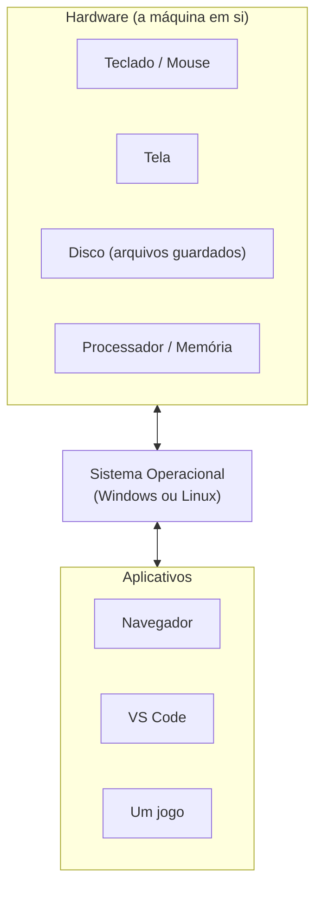

# Módulo 0 — Conhecendo o computador (material do professor)

**Duração:** 2h · **Ferramentas:** o computador (Windows ou Linux), VS Code

> Este módulo é **preparação**, fora da sequência de 12 que constroem o jogo — não tem "parte do
> jogo" associada. Sem ele, o Módulo 1 (instalar VS Code, criar pasta do projeto, salvar
> `jogo.py`) fica confuso pra quem nunca navegou num gerenciador de arquivos.

## Conceitos

- O que é um sistema operacional (SO)
- Windows e Linux: o que muda, o que é igual
- Arquivos e pastas (organização)
- Caminho (onde uma coisa "mora" no computador)
- Extensão de arquivo (o que é o `.py`)
- Terminal (CLI): navegar, criar e remover pastas por comando
- O que é uma IDE, e o VS Code como a IDE do curso

## Roteiro da aula

### 1. O que é um sistema operacional (15 min)

- Perguntar: "quando vocês ligam o computador, o que aparece primeiro?" — ícones, barra de
  tarefas, etc. Isso tudo é o **sistema operacional (SO)**: o programa principal que gerencia
  tudo — abrir outros programas, guardar arquivos, controlar o teclado e o mouse.
- Analogia: o SO é como o "gerente da casa" — ele não é nenhum cômodo específico, mas é quem
  organiza tudo pra você conseguir usar a casa.
- Mostrar que existem SOs diferentes, e o computador que o aluno usa já vem com um instalado.
- Mostrar o diagrama abaixo: o SO fica entre o hardware (o computador "de verdade" — teclado,
  mouse, tela, disco) e os aplicativos que o aluno usa (navegador, jogos, VS Code). Nenhum
  aplicativo fala direto com o hardware — todos passam pelo SO.

- Reforçar a analogia do "gerente da casa": os aplicativos pedem coisas ao SO (abrir um
  arquivo, mostrar algo na tela, ler uma tecla) e o SO é quem realmente conversa com o
  hardware — o aplicativo nunca faz isso sozinho.

### 2. Windows e Linux (15 min)

- Apresentar os dois de forma simples, sem entrar em detalhes técnicos:
  - **Windows** — o mais comum em casas e escolas; ícones, barra de tarefas embaixo, "Meu
    Computador"/"Este Computador".
  - **Linux** — outro SO, mais comum em servidores e em alguns computadores pessoais; várias
    "aparências" diferentes (distribuições), mas a ideia de pastas e arquivos é a mesma.
- Deixar claro: **o curso funciona igual nos dois** — o Python, o VS Code e o Pygame Zero rodam
  tanto em Windows quanto em Linux. O que muda é só a aparência das janelas e alguns atalhos.
- Não é preciso decorar diferenças — o importante é saber qual SO o próprio computador usa.

### 3. Arquivos e pastas (20 min)

- **Arquivo**: uma coisa guardada no computador — um texto, uma foto, um programa (ex.:
  `jogo.py` vai ser um arquivo).
- **Pasta** (ou diretório): uma "caixa" que guarda arquivos (e outras pastas dentro dela), pra
  organizar. Igual pastas de papel guardando folhas.
- Abrir o gerenciador de arquivos (Explorador de Arquivos no Windows, Nautilus/Files no Linux) e
  mostrar ao vivo: navegar entre pastas, criar uma pasta nova, renomear.
- Mostrar a **extensão** do arquivo (a partezinha depois do ponto, tipo `.txt`, `.png`, `.py`) —
  ela diz pro computador que tipo de arquivo é aquele, e qual programa deve abrir.

### 4. Caminho: onde as coisas moram (10 min)

- Explicar **caminho (path)**: o "endereço completo" de um arquivo ou pasta, contando a partir
  de onde ele está até chegar nele — pasta dentro de pasta dentro de pasta.
- Analogia: é como o endereço de uma casa (rua, número, apartamento) — sem ele, não tem como
  achar o que você procura.
- Mostrar a barra de endereço do gerenciador de arquivos, que mostra o caminho de onde você está.

### 5. Conhecendo o terminal (CLI) (15 min)

- Explicar que, além do gerenciador de arquivos (com ícones e cliques), existe outro jeito de
  navegar entre pastas: digitando comandos. Esse jeito se chama **terminal**, ou **CLI**
  (sigla em inglês para "interface de linha de comando"). O Módulo 1 já vai usar o terminal do
  VS Code, então vale conhecer o básico agora.
- Abrir o terminal ao vivo:
  - **Windows:** menu Iniciar, digitar "PowerShell" (ou "Terminal") e apertar Enter — ou, com o
    Explorador de Arquivos aberto numa pasta, botão direito > "Abrir no Terminal".
  - **Linux:** `Ctrl+Alt+T`, ou procurar "Terminal" no menu de aplicativos.
- Mostrar, ao vivo, cada comando da tabela abaixo — sempre pedindo pro aluno repetir no
  computador dele:

  | O que eu quero fazer | Comando | Funciona em |
  |---|---|---|
  | Ver em qual pasta eu estou | `pwd` | Windows e Linux |
  | Ver o que tem dentro da pasta atual | `dir` (Windows) / `ls` (Linux) | — |
  | Entrar numa pasta (andar pra frente) | `cd nome-da-pasta` | Windows e Linux |
  | Voltar uma pasta (andar pra trás) | `cd ..` | Windows e Linux |
  | Criar uma pasta nova | `mkdir nome-da-pasta` | Windows e Linux |
  | Remover uma pasta (só se estiver vazia) | `rmdir nome-da-pasta` | Windows e Linux |
| Abrir a pasta atual no VS Code | `code .` | Windows e Linux (depois de instalar o VS Code) |

- Fazer o trajeto completo ao vivo, no terminal, dentro de qualquer pasta (ex.: Área de
  Trabalho): `mkdir teste`, `cd teste`, `pwd` (mostrar que mudou), `cd ..` (mostrar que voltou),
  `rmdir teste`.
- Reforçar: `cd` (de "change directory") é sempre "andar" entre pastas — pra frente com o nome
  da pasta, pra trás com `..`. É o mesmo passeio que o gerenciador de arquivos faz com cliques,
  só que digitado.
- Deixar claro que `rmdir` só remove pasta **vazia** — é assim mesmo, por segurança: evita
  apagar um monte de arquivo sem querer.

### 6. Conhecendo a IDE: VS Code (15 min)

- Perguntar: "vocês repararam que, pra programar, a gente precisa escrever código **e** rodar
  ele **e** ver se deu erro? Dá pra fazer isso tudo espalhado (um bloco de notas aqui, um
  terminal ali), ou dá pra usar um programa que já junta tudo." Esse programa se chama **IDE**
  (ambiente de desenvolvimento).
- Mostrar que dá pra abrir o VS Code já direto na pasta certa, pelo terminal: navegar até a
  pasta com `cd` e digitar `code .` (o ponto significa "esta pasta") — evita ter que abrir o VS
  Code e depois procurar a pasta pelo menu.
- Abrir o VS Code ao vivo (sem escrever código ainda — só mostrar a "casa"):
  - a área de edição de texto, onde o código vai ser escrito;
  - o terminal integrado (**Terminal > New Terminal**, ou `` Ctrl+` ``) — o mesmo terminal que
    acabamos de aprender a usar, só que já dentro do mesmo programa;
  - o explorador de arquivos na lateral, que mostra pastas e arquivos — o mesmo passeio de
    pastas que fizemos no gerenciador de arquivos e no terminal, só que dentro do VS Code.
- Analogia: "é como uma oficina completa — a bancada (editor), as ferramentas (extensões) e o
  lugar de testar se funcionou (terminal), tudo junto num só programa, sem precisar sair dele."
- Reforçar: o VS Code **não é uma linguagem de programação** — é só o programa onde vamos
  escrever e rodar o código Python. A partir do Módulo 1, todo o curso acontece dentro dele.
- Instalar o VS Code ao vivo, pelo terminal (reforçando o que acabamos de aprender sobre CLI):
  - **Windows:** `winget install -e --id Microsoft.VisualStudioCode`
  - **Linux:** `sudo snap install code --classic`
  - Fechar e abrir o terminal de novo, e confirmar com `code --version`.
  - Ver `docs/preparacao-ambiente/instalacao_vscode.md` § 3 para o passo a passo completo e
    alternativa sem terminal (instalador manual), caso `winget`/`snap` não estejam disponíveis.

### 7. Atividade prática (25 min)

Cada aluno deve:

1. Criar uma pasta no computador para guardar os arquivos do curso (ex.: `curso-python` na
   Área de Trabalho ou em Documentos).
2. Dentro dela, criar uma pasta para cada módulo (ex.: `modulo-01`).
3. Criar um arquivo de texto simples dentro de uma dessas pastas, salvar, fechar, e depois achar
   esse mesmo arquivo de novo navegando pelas pastas (sem usar busca).
4. Dizer em voz alta o caminho completo até o arquivo que criou.
5. Abrir o terminal, usar `cd` para chegar até a pasta `curso-python`, digitar `pwd` pra
   confirmar que chegou no lugar certo, e usar `dir`/`ls` para ver as pastas de módulo criadas.
6. Instalar o VS Code pelo terminal (comandos da seção anterior) e confirmar com `code --version`.
7. Abrir a pasta `curso-python` no VS Code — pelo terminal, com `cd` até chegar nela e depois
   `code .` — e encontrar, no explorador de arquivos da lateral, a mesma pasta de módulo criada
   antes. (Alternativa sem terminal: **File > Open Folder...** dentro do VS Code.)

### 8. Revisão (5 min)

- Perguntar a 2-3 alunos: "qual é o caminho da pasta que você criou?"
- Perguntar a mais 2-3 alunos: "que comando eu uso pra entrar numa pasta pelo terminal? E pra
  voltar?"
- Perguntar: "o que a IDE junta num só programa?" (editor, terminal, mensagens de erro)
- Reforçar: essa pasta vai ser onde o Módulo 1 começa — é lá que o `jogo.py` vai morar.

## Fundamentos trabalhados

- Sistema operacional (o que é, pra que serve)
- Diferença Windows/Linux (superficial — não afeta o curso)
- Arquivos, pastas e organização
- Caminho (path)
- Extensão de arquivo
- Terminal (CLI): abrir, ver a pasta atual, navegar, criar e remover pasta
- IDE (VS Code): o que é, e como junta editor, terminal e execução num só programa

## Resultado esperado

O aluno consegue criar uma pasta, salvar um arquivo dentro dela, e descrever o caminho até esse
arquivo — sem precisar da busca do sistema. O aluno também consegue abrir o terminal e usar
`pwd`, `cd`, `mkdir` e `rmdir` para repetir, digitando, o mesmo passeio que fez com cliques no
gerenciador de arquivos. O aluno reconhece o VS Code como a IDE do curso e sabe localizar, nele,
o editor, o terminal integrado e o explorador de arquivos.

## Vocabulário novo para os alunos

| Termo | Explicação simples |
|---|---|
| Sistema operacional (SO) | O programa principal que gerencia tudo no computador |
| Windows | Um sistema operacional, o mais comum em casas e escolas |
| Linux | Outro sistema operacional, comum em servidores e em alguns computadores pessoais |
| Arquivo | Uma coisa guardada no computador (texto, foto, programa) |
| Pasta (diretório) | Uma "caixa" que organiza arquivos (e outras pastas) |
| Extensão | A partezinha depois do ponto no nome do arquivo (ex.: `.py`), que diz que tipo de arquivo é |
| Caminho (path) | O "endereço completo" de um arquivo ou pasta no computador |
| Terminal / CLI | Jeito de navegar entre pastas e usar o computador digitando comandos, em vez de clicar |
| `cd` | Comando pra "andar" entre pastas no terminal (entrar ou voltar) |
| `code .` | Comando pra abrir o VS Code já direto na pasta atual do terminal |
| IDE | Um programa que junta editor, execução e mensagens de erro num só lugar |
| VS Code | A IDE que vamos usar no curso para escrever e rodar nosso código |

## Erros comuns e como ajudar

- **Aluno não sabe onde salvou o arquivo:** relembrar de sempre escolher a pasta certa na hora
  de salvar, em vez de aceitar o local padrão sem olhar.
- **Confundir nome do arquivo com a extensão:** mostrar que `jogo.py` = nome `jogo` + extensão
  `.py`, e que trocar a extensão muda como o computador trata o arquivo.
- **Perder-se entre pastas:** usar a barra de caminho do gerenciador de arquivos como "mapa" —
  ela sempre mostra onde você está.
- **Confundir `cd` com `dir`/`ls`:** `cd` **anda** entre pastas (muda onde você está); `dir`/`ls`
  só **mostra** o que tem na pasta atual, sem sair dela.
- **`rmdir` não funciona:** normalmente é porque a pasta não está vazia — pedir pro aluno
  verificar (com `dir`/`ls`) se ainda tem algo lá dentro antes de tentar remover.
- **Achar que o VS Code é "a linguagem Python":** reforçar que o VS Code é só o programa onde
  escrevemos e rodamos o código — quem entende o código é o Python, instalado à parte.
- **`code --version` não reconhecido logo depois de instalar:** fechar e abrir o terminal de
  novo — o PATH só atualiza numa janela nova.
- **`winget` não existe (Windows desatualizado):** usar o instalador manual em
  https://code.visualstudio.com (ver `docs/preparacao-ambiente/instalacao_vscode.md`).
- **`code .` não abre nada / comando não encontrado:** fechar e abrir o terminal de novo depois
  de instalar o VS Code (o comando `code` só aparece numa janela nova); confirmar que está
  dentro da pasta certa com `pwd` antes de rodar `code .`.
