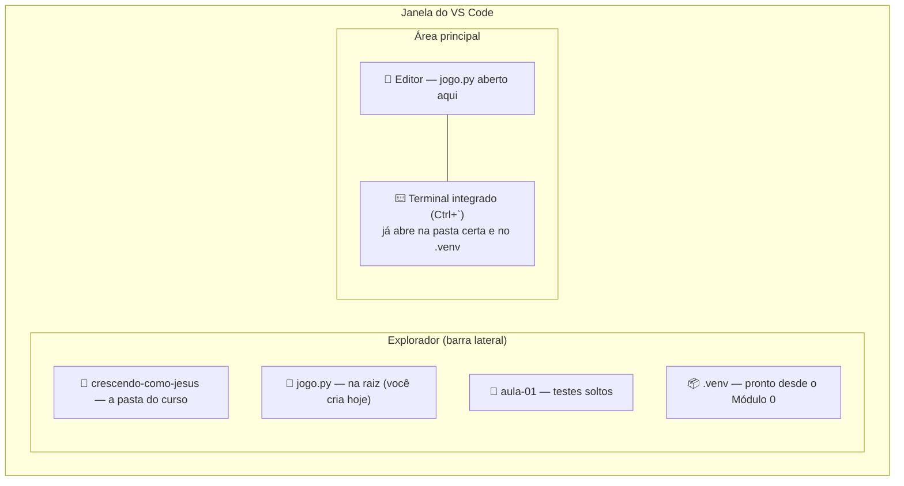
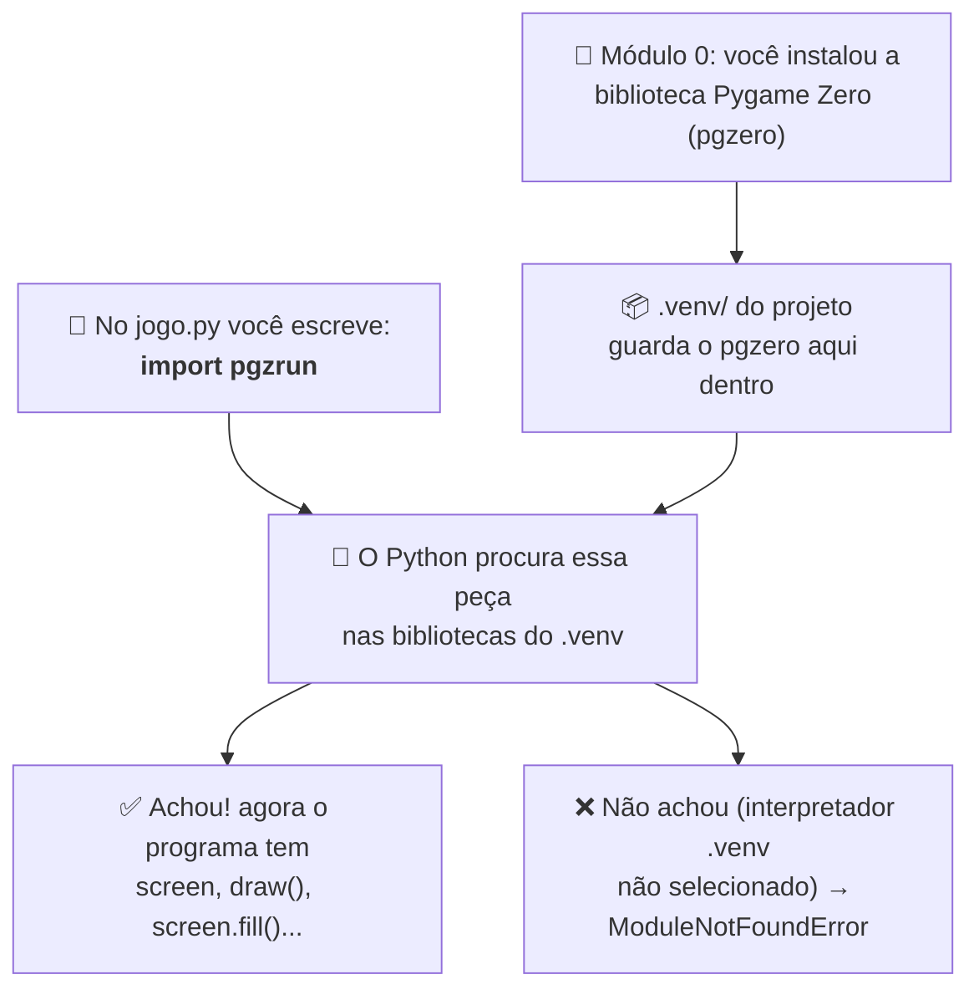

# Módulo 1 — Conhecendo a programação (material do aluno)

## O jogo que vamos construir

Ao longo do curso vamos construir, um pedaço por aula, um **jogo de labirinto no estilo
Pac-Man** com a ideia do versículo:

> "E crescia Jesus em sabedoria, e em estatura, e em graça, para com Deus e os homens."
> (Lucas 2:52)

No jogo, o personagem anda pelo "labirinto da vida":

- coletando **bons hábitos** — 🙏 oração, 📖 Bíblia, ⛪ culto, ❤️ obedecer aos pais, 🤝 ajudar o
  próximo —, que aumentam a **estatura**;
- desviando das **tentações** — 😡 desobediência, 🤥 mentira, 😴 preguiça, 📱 distração —, que
  fazem perder uma vida;
- a **oração** é um poder: por alguns segundos as tentações fogem e podem ser vencidas;
- são **4 fases**: Sabedoria → Estatura → Graça com Deus → Graça com os homens.

O professor vai mostrar o **jogo pronto rodando** — é para onde a gente vai chegar. Hoje vamos
fazer só o começo: a **primeira tela**.

## O que vamos aprender hoje

- O que é um **programa** e um **algoritmo**
- Como o computador executa as instruções: **uma de cada vez, na ordem** em que foram escritas
- O que é uma **biblioteca** e de onde vem o código do **Pygame Zero**
- O que é uma **variável**
- O que é uma **função** e por que o **recuo** (indentação) importa tanto no Python
- Escrever e rodar o nosso **primeiro programa** em Python, com o **Pygame Zero**

## O que você já tem pronto (do Módulo 0)

**Hoje não instala nada.** No Módulo 0 sua máquina já ficou pronta:

- Python 3.12 e o VS Code (com a extensão Python);
- a pasta **`crescendo-como-jesus/`** com a subpasta `aula-01/`;
- o ambiente virtual **`.venv/`** dentro dela, com o pacote **`pgzero`** instalado;
- o interpretador `.venv` selecionado no VS Code.

**Confira uma coisa só:** no canto inferior direito do VS Code deve aparecer algo como
`3.12.x ('.venv')`. Se não aparecer, aperte `Ctrl+Shift+P`, digite **Python: Select
Interpreter** e escolha o que tem `.venv` (costuma vir marcado como "Recommended"). Esse é o
"Python do projeto" — o que tem o `pgzero` que você instalou no Módulo 0.

## Programa, algoritmo e a ordem das coisas

- Um **programa** é uma **lista de instruções** que o computador segue.
- Um **algoritmo** é a **sequência de passos** para resolver um problema — como uma **receita de
  bolo**: cada passo na ordem certa.
- O computador faz **uma instrução de cada vez, de cima para baixo**, na ordem em que você
  escreveu. Ele **não adivinha** o que você quis dizer nem pula na frente. Numa receita, trocar
  "leve ao forno" com "misture os ovos" estraga tudo — no código é igual.

## Abrindo a pasta do curso no VS Code

Abra a pasta `crescendo-como-jesus/` (a que você criou no Módulo 0):

- no terminal, **dentro dela**, digite `code .`  — ou
- no VS Code, **File > Open Folder...** e escolha a pasta.

No explorador (barra lateral) você vê `CRESCENDO-COMO-JESUS` no topo, com `aula-01/` e `.venv/`
dentro.

O arquivo que vamos criar hoje, o **`jogo.py`**, fica na **raiz** de `crescendo-como-jesus/` —
**não** dentro de `aula-01/`. Ele é o arquivo que vai crescer o curso inteiro. A `aula-01/` é só
para testes soltos, quando você quiser experimentar algo fora do jogo.



## Como o Python roda um arquivo

**Você é quem diz qual arquivo o Python vai rodar.** Ele pega esse arquivo e executa **do começo
ao fim, linha por linha**, na ordem em que as linhas aparecem.

Dois jeitos de rodar, que fazem **exatamente a mesma coisa**:

- **Botão ▶ "Run Python File"** (canto superior direito do VS Code): roda o arquivo que está
  aberto no editor.
- **Pelo terminal integrado** (`` Ctrl+` `` para abrir):
  ```
  python jogo.py
  ```
  - `python` — o programa que **lê e executa** o código.
  - `jogo.py` — o arquivo que ele vai ler, começando pela primeira linha.

O botão é só um atalho para não digitar isso toda vez.

## Construindo a primeira tela, passo a passo

Crie um arquivo novo e salve como **`jogo.py`** na **raiz** de `crescendo-como-jesus/`. Vamos
escrever o código aos poucos e **rodar depois de cada passo** — assim dá para ver o efeito de
cada pedaço antes de seguir.

### Passo 1 — o esqueleto mínimo

```python
import pgzrun

pgzrun.go()
```

- `import pgzrun` — **traz** para o seu programa um código pronto que veio **de fora**. É ele que
  dá `screen`, `draw()` e o resto do jogo. Vai sempre na **primeira** linha.
- `pgzrun.go()` — **liga o motor do jogo**: abre a janela e fica repetindo "desenha a tela,
  escuta o teclado, desenha de novo...". Vai sempre na **última** linha.

#### De onde vem o `pgzrun`?

Você não escreveu esse código, e ele não estava na sua máquina antes do curso. Ele vem de uma
**biblioteca** (também chamada **pacote**): um monte de código pronto que outras pessoas
escreveram e deixaram disponível para todo mundo usar — assim você não precisa fazer tudo do zero.

- A biblioteca que usamos se chama **Pygame Zero**. No **Módulo 0**, ela foi baixada da internet
  e guardada **dentro do `.venv/`** do seu projeto.
- Repare numa coisa: você instalou o **`pgzero`**, mas escreve **`import pgzrun`**. O pacote
  inteiro é o `pgzero`; o `pgzrun` é uma **peça de dentro dele** — a "chave de ligar" que abre a
  janela do jogo.
- Quando o Python lê `import pgzrun`, ele vai **procurar** essa peça nas bibliotecas do `.venv`.
  Se acha, o seu programa ganha o `screen`, o `draw()`, o `screen.fill()` e o resto. Se não acha
  (interpretador errado), aparece `ModuleNotFoundError: No module named 'pgzero'`.



**Rode.** Deve abrir uma **janelinha preta**, do tamanho padrão — já é um jogo Pygame Zero de
verdade, só que vazio. Feche a janela para continuar.

> Se aparecer o erro `screen is not defined`, é porque falta uma dessas duas linhas (`import
> pgzrun` ou `pgzrun.go()`). Se aparecer `ModuleNotFoundError`, é o interpretador `.venv` que não
> está selecionado.

### Passo 2 — tamanho e título da janela

Adicione estas três linhas **entre** o `import` e o `pgzrun.go()`:

```python
WIDTH = 800
HEIGHT = 600
TITLE = "Crescendo como Jesus"
```

- Isto é uma **variável**: um **nome que guarda um valor**. `WIDTH = 800` quer dizer "de agora
  em diante, `WIDTH` vale 800".
- `WIDTH` (largura) e `HEIGHT` (altura) são o tamanho da janela **em pixels** — os pontinhos que
  formam a tela.
- `TITLE` é um **texto** (fica entre aspas) e aparece na **barra** da janela.
- O Pygame Zero reconhece **esses três nomes sozinho** — por isso eles precisam ser escritos
  assim mesmo, em letras maiúsculas.

**Rode de novo.** A janela nasce do tamanho `800 x 600` e com o título na barra.

### Passo 3 — pintar o fundo

```python
COR_DE_FUNDO = "skyblue"


def draw():
    screen.fill(COR_DE_FUNDO)
```

Antes de rodar, repare em duas coisas novas:

- **Função:** é um pedaço de código com **nome**, guardado para ser executado quando alguém
  chama. `def` cria a função, o nome (`draw`) vem logo depois, e os `()` e `:` no fim são
  obrigatórios. A função `draw()` é **especial**: **o próprio Pygame Zero chama ela sozinho**,
  várias vezes por segundo, sempre que precisa redesenhar a tela. Você só escreve **o que**
  desenhar dentro dela.
- **Indentação (o recuo):** a linha `screen.fill(...)` **não começa colada na margem** — está
  recuada (um "tab" para dentro). No Python, esse recuo **não é enfeite, é regra**: é ele que
  diz "esta linha faz parte da função `draw`". Se faltar ou ficar torto, dá um erro chamado
  `IndentationError`. O VS Code ajuda: depois de uma linha que termina em `:`, ele recua a
  próxima sozinho quando você aperta Enter.

`screen.fill(COR_DE_FUNDO)` **pinta a tela inteira** com a cor. `COR_DE_FUNDO` é só uma variável
com um texto dentro.

**Rode de novo.** A janela aparece pintada. Troque `"skyblue"` por outro nome de cor
(`"darkgreen"`, `"black"`, `"white"`...) e rode outra vez para ver a diferença. A lista completa
de nomes está na
[documentação do Pygame Zero](https://pygame-zero.readthedocs.io/en/stable/builtins.html#colors);
também dá para usar um valor RGB, como `(255, 0, 0)` para vermelho.

### Passo 4 — a mensagem de boas-vindas

Dentro de `draw()`, **depois** do `screen.fill`, use `screen.draw.text(...)`:

```python
COR_DO_TEXTO = "white"


def draw():
    screen.fill(COR_DE_FUNDO)
    screen.draw.text(
        "Bem-vindo(a) ao " + TITLE + "!",
        center=(WIDTH // 2, HEIGHT // 2),
        fontsize=40,
        color=COR_DO_TEXTO,
    )
```

Cada parte de `screen.draw.text(...)`:

- `"Bem-vindo(a) ao " + TITLE + "!"` — o **texto** que vai na tela. O `+` **junta textos**: o
  pedaço fixo `"Bem-vindo(a) ao "`, mais o conteúdo da variável `TITLE`, mais `"!"`.
- `center=(WIDTH // 2, HEIGHT // 2)` — o ponto onde o texto fica **centralizado**. O `//` é
  **divisão inteira**: `WIDTH // 2` é a metade da largura, ou seja, o **meio da tela**.
- `fontsize=40` — o **tamanho** da letra.
- `color=COR_DO_TEXTO` — a **cor** do texto (mesma ideia de variável do passo 3).

**Rode de novo.** A mensagem aparece no centro da tela.

### Passo 5 — o seu nome como pecador

Mais uma chamada de `screen.draw.text`, um pouco **mais abaixo** na tela — repare no `+ 60`:

```python
NOME_DO_PECADOR = "Escreva seu nome aqui"


def draw():
    screen.fill(COR_DE_FUNDO)
    screen.draw.text(
        "Bem-vindo(a) ao " + TITLE + "!",
        center=(WIDTH // 2, HEIGHT // 2),
        fontsize=40,
        color=COR_DO_TEXTO,
    )
    screen.draw.text(
        "Pecador: " + NOME_DO_PECADOR,
        center=(WIDTH // 2, HEIGHT // 2 + 60),
        fontsize=24,
        color=COR_DO_TEXTO,
    )
```

- O `+ 60` no `center` empurra este texto **60 pixels para baixo**, para não ficar em cima do
  texto anterior.

**Rode uma última vez** e troque `"Escreva seu nome aqui"` pelo seu nome de verdade.

Pronto — sua tela já tem tudo da missão de hoje! Compare com o [`exemplo.py`](exemplo.py) deste
módulo: ele vem com **um passo a mais** (o versículo de Lucas 2:52 na tela), que é exatamente o
desafio extra logo abaixo.

## Sua missão

Crie uma tela com:

- [ ] título do jogo (aparece na barra da janela);
- [ ] uma mensagem de boas-vindas na tela;
- [ ] uma cor de fundo escolhida por você;
- [ ] seu nome como pecador, escrito na tela.

Construa **do zero**, seguindo os passos acima — não copie o `exemplo.py` pronto; ele é só para
comparar no fim ou para destravar se você empacar.

## Desafios

- **Desafio extra:** adicione uma segunda mensagem na tela — que tal o versículo de Lucas 2:52?
- **Desafio criativo:** escolha cores que combinem com o jogo que você imagina criar.

## Palavras novas

| Termo | O que significa |
|---|---|
| Programa | Uma lista de instruções que o computador segue |
| Algoritmo | A sequência de passos para resolver um problema |
| Sequência de execução | O computador faz uma instrução de cada vez, de cima para baixo, na ordem |
| Python | A linguagem que usamos para escrever os programas |
| VS Code | A IDE (o programa) onde escrevemos e rodamos o código |
| Executar (Run) | Mandar o computador seguir as instruções do programa |
| `import` | Trazer para o nosso programa um código pronto de fora (uma biblioteca) |
| Biblioteca / pacote | Um monte de código pronto que outras pessoas escreveram para todo mundo usar |
| `pgzero` (Pygame Zero) | A biblioteca que dá `screen`, `draw()` e o resto do jogo — instalada no `.venv` no Módulo 0 |
| `pgzrun` | A peça de dentro do `pgzero` que liga o jogo (`import pgzrun` no topo, `pgzrun.go()` no fim) |
| Variável | Um nome que guarda um valor (`WIDTH = 800`) |
| `WIDTH` / `HEIGHT` / `TITLE` | Nomes que o Pygame Zero reconhece: largura, altura e título da janela |
| Função | Um pedaço de código com nome, executado quando alguém chama (criada com `def`) |
| `draw()` | Função especial que o Pygame Zero chama sozinho para desenhar a tela |
| Indentação (recuo) | O espaço no começo da linha que diz o que "pertence" a uma função — no Python é regra, não enfeite |
| `screen.fill(cor)` | Pinta a tela inteira de uma cor |
| `screen.draw.text(...)` | Desenha um texto na tela (posição, tamanho e cor) |
| `//` | Divisão inteira — `WIDTH // 2` é a metade da largura (o meio da tela) |

## Deu erro? Tenta isso primeiro

- **`screen is not defined`:** confira se o arquivo **começa** com `import pgzrun` e **termina**
  com `pgzrun.go()`.
- **`ModuleNotFoundError: No module named 'pgzero'`:** o interpretador certo não está
  selecionado — `Ctrl+Shift+P` → **Python: Select Interpreter** → o que tem `.venv`. (Você não
  precisa instalar nada; isso já foi feito no Módulo 0.)
- **`IndentationError`:** alguma linha dentro de `draw()` não está recuada igual às outras —
  confira se todas têm o mesmo espaço antes do código.
- **Erro apontando uma linha:** leia a mensagem — ela sempre mostra **em qual linha** está o
  problema.
- **Cor não funciona:** confira o nome na lista de cores do Pygame Zero, ou use um valor RGB
  como `(255, 0, 0)`.

Ao final, **salve** o `jogo.py` (na raiz de `crescendo-como-jesus/`) — vamos usá-lo em todos os
módulos!
