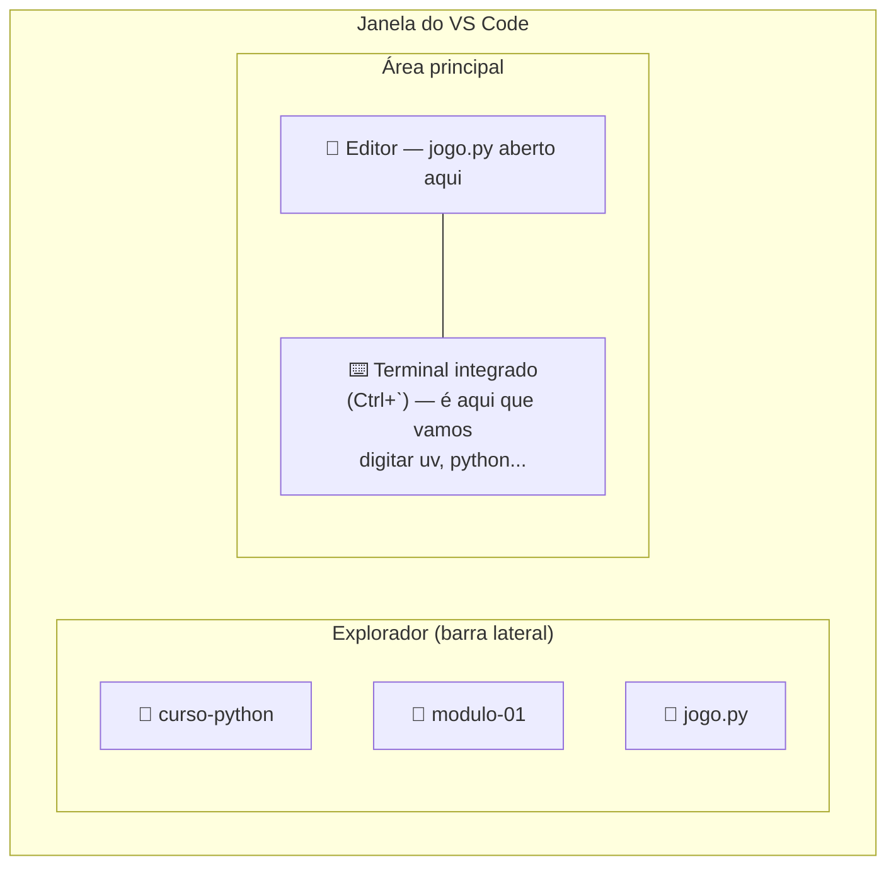
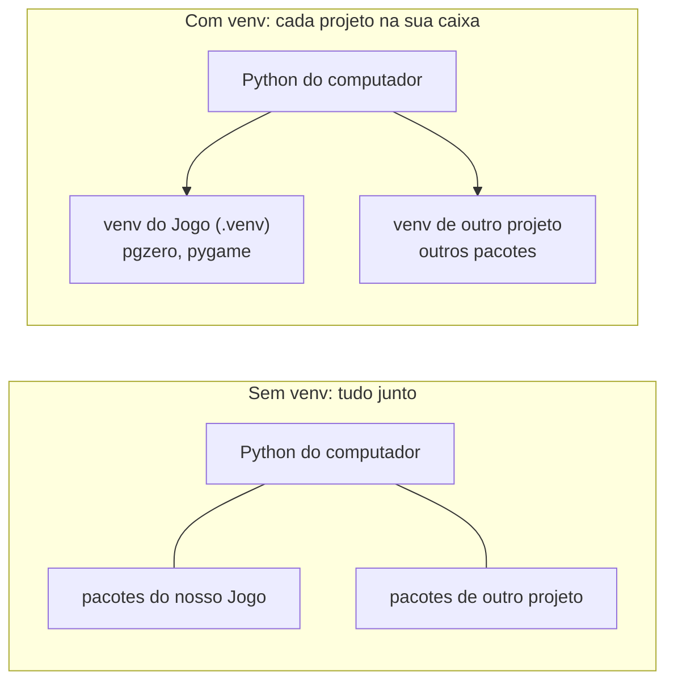
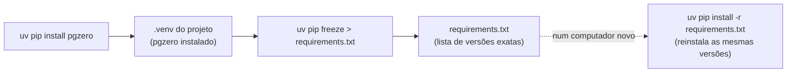
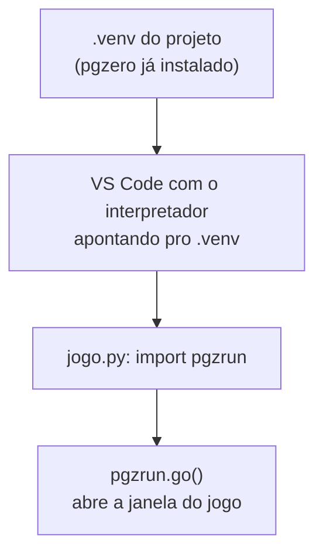

# Módulo 1 — Conhecendo a programação (material do aluno)

## O jogo que vamos construir

Ao longo do curso, vamos criar um jogo em que o personagem cresce em "estatura espiritual" ao
coletar bons hábitos (🙏 Oração, 📖 Bíblia, ⛪ Culto, ❤️ Obedecer aos pais, 🤝 Ajudar o próximo)
— inspirado no versículo:

> "E crescia Jesus em sabedoria, e em estatura, e em graça, para com Deus e os homens."
> (Lucas 2:52)

Hoje vamos só começar: a **primeira tela** do jogo!

## O que vamos aprender hoje

- O que é um **programa** e um **algoritmo**
- O que é um **pacote** — código pronto que a gente pode usar de graça
- Como o computador executa nossas instruções, na ordem certinha
- O que é uma **função** e por que a indentação (o recuo) importa tanto no Python
- Vamos escrever e rodar nosso primeiro programa em Python, usando o **VS Code** — a IDE que já
  conhecemos do Módulo 0!

## Ferramentas

**Python** + **VS Code** + **`uv`**. O VS Code é a IDE (o programa) onde vamos escrever e rodar
nosso código; o `uv` é quem instala o Python certinho e prepara o ambiente do projeto.

## Passo a passo de hoje

Hoje tem bastante coisa nova de ambiente antes de chegar no código — siga a ordem, um passo de
cada vez, sem pular:

1. Abrir a pasta no VS Code
2. Abrir o terminal integrado
3. Instalar o Python
4. Entender e criar o ambiente virtual (venv) — **a "caixa" do nosso projeto**
5. Escrever nosso primeiro programa

## Passo 1 — Abrindo a pasta no VS Code

Você já sabe fazer isso desde o Módulo 0: abra a pasta de hoje pelo terminal (`cd` até ela e
`code .`). Daqui pra frente, o assunto muda — vamos preparar o Python.

Este é o mockup da janela do VS Code, com as três áreas que vamos usar hoje:



## Passo 2 — Abrindo o terminal integrado do VS Code

Até agora usamos o terminal "de fora" (do sistema operacional) só pra chegar na pasta certa e
digitar `code .`. A partir de agora, todo comando (`uv`, `python`...) vai ser digitado **dentro**
do VS Code, num terminal próprio dele:

- Abra pelo menu **Terminal > New Terminal**, ou pelo atalho `` Ctrl+` ``.
- Esse terminal já abre **na pasta certa** — não precisa navegar com `cd` de novo.
- É o mesmo terminal do Módulo 0 (mesmos comandos `cd`, `dir`/`ls`, `pwd`), só que agora mora
  dentro da IDE.

## Passo 3 — Instalando o Python

### Antes de instalar qualquer coisa, confira o que já está no seu computador

```
python --version
uv --version
```

Se algum comando der erro de "não encontrado", é só seguir os passos abaixo pra instalar.

1. Instalar o `uv` (ferramenta que instala a versão certa do Python, cria o venv e instala os
   pacotes, tudo com o mesmo comando):
   - **Windows:** `powershell -c "irm https://astral.sh/uv/install.ps1 | iex"`
   - **Linux:** `curl -LsSf https://astral.sh/uv/install.sh | sh`
   - Feche e abra o terminal, e confirme com `uv --version`.
2. Instalar o Python 3.12: `uv python install 3.12` (confirme com `uv python list`).

## Passo 4 — Entendendo e criando o ambiente virtual (venv)

> ⚠️ **Este é o passo mais importante da aula de hoje.** Quase todo erro chato que vamos ver no
> curso ("pgzero não encontrado", "screen is not defined"...) acontece porque o `.venv` não foi
> criado direito ou o VS Code não está apontando pra ele. Entender essa parte agora evita dor de
> cabeça em **todos** os módulos seguintes.

Agora que o Python já está instalado, se dois projetos diferentes precisassem de versões
diferentes do mesmo pacote, e tudo estivesse instalado junto no computador, um atrapalharia o
outro. Por isso cada projeto tem sua própria **caixa de ferramentas separada**: um **ambiente
virtual**, ou **venv**. É a cópia só dele do Python e dos pacotes que ele precisa.



Não precisa entender tudo hoje — o importante é saber que o `.venv` do nosso jogo é essa caixa,
e é por causa dela que o ambiente fica sempre igual em qualquer computador. Vamos criar essa
caixa agora:

1. **Criar o venv do projeto:**
   ```
   uv venv --python 3.12 .venv
   ```
2. Instalar o pacote do jogo direto pelo terminal: `uv pip install pgzero`.
3. Registrar as versões instaladas num arquivo `requirements.txt` — esse arquivo é quem garante
   que o ambiente fica **sempre igual** em qualquer computador: `uv pip freeze > requirements.txt`.
4. Selecionar o venv como interpretador: `Ctrl+Shift+P` → **"Python: Select Interpreter"** →
   escolher o que aparece com `.venv` (geralmente já vem marcado como "Recommended"). Isso grava
   a configuração automaticamente — não precisa editar nada à mão.

Repare: você não escreveu o `requirements.txt` à mão — ele foi **gerado** a partir do que já
estava instalado no `.venv`. Numa próxima aula, ou num computador novo, em vez de instalar pacote
por pacote de novo, basta rodar `uv pip install -r requirements.txt` pra reinstalar exatamente as
mesmas versões:



> **`pyenv` é parecido:** troca entre versões do Python instaladas, mas só isso — o venv e os
> pacotes ficariam por conta de `venv`/`pip` separados. O curso usa `uv` porque ele junta tudo.

Se tiver dúvida, siga com calma o guia `docs/preparacao-ambiente/instalacao_vscode.md`.

## Passo 5 — Nosso primeiro programa

### Como o Python roda um arquivo

O Python não tem um arquivo "oficial" pra começar sozinho — **você é quem diz pra ele qual
arquivo rodar**, e ele executa esse arquivo do começo ao fim, linha por linha, na ordem em que
elas aparecem (é a mesma ideia de sequência de execução que já vimos hoje). Poderia se chamar
`jogo.py`, `teste.py`, `abc.py`... qualquer nome de arquivo `.py` funciona, contanto que seja
esse o arquivo que você manda rodar.

Hoje vamos usar dois jeitos de rodar, que fazem exatamente a mesma coisa:

- **Botão "Run Python File"** (▶, no canto superior direito do VS Code): roda o arquivo que
  está aberto no editor naquele momento.
- **Pelo terminal**, digitando o comando, parte por parte:
  ```
  uv run jogo.py
  ```
  - `uv run` — pede pro `uv` rodar o comando a seguir usando o Python de dentro do venv do
    projeto (por isso importa tanto qual venv está criado, como vimos no Passo 4) — o "tradutor"
    que vai ler o código.
  - `jogo.py` — o arquivo que queremos que ele leia e execute, começando pela primeira linha.

O botão só existe pra evitar digitar esse comando toda vez — por baixo dos panos, é a mesma
coisa.

Lembra dos pacotes que acabamos de instalar no `.venv`? Agora vamos usá-los de verdade:



O `import pgzrun`, que vamos escrever na primeira linha do código, é literalmente buscando o
pacote que você acabou de instalar. Se der o erro "pgzero não encontrado" ou "screen is not
defined", é porque alguma dessas caixinhas do diagrama não aconteceu direito — geralmente o
interpretador errado selecionado no VS Code.

### Construindo o `jogo.py`, passo a passo

Vamos escrever o código aos poucos, testando (`Run Python File`) depois de cada passo — assim dá
pra ver o efeito de cada pedaço antes de seguir pro próximo. Crie o arquivo `jogo.py` na pasta
deste módulo.

**1. O esqueleto mínimo.** Toda vez que formos criar o jogo, o arquivo começa com `import
pgzrun` e termina com `pgzrun.go()` — é entre essas duas linhas que a mágica acontece:

```python
import pgzrun

pgzrun.go()
```

Rode. Deve abrir uma janelinha preta, do tamanho padrão — já é um jogo Pygame Zero de verdade,
só que ainda vazio.

**2. Tamanho e título da janela.** Adicione essas três linhas **entre** o `import` e o
`pgzrun.go()`:

```python
WIDTH = 800
HEIGHT = 600
TITLE = "Crescendo como Jesus"
```

Rode de novo — repare que a janela já nasce do tamanho certo, e o `TITLE` aparece na barra dela.

**3. Pintando o fundo.** Toda vez que a tela precisa ser desenhada, o Pygame Zero chama sozinho
uma função especial chamada `draw()` — você não chama ela, só escreve o que tem dentro. Adicione,
antes do `pgzrun.go()`:

```python
COR_DE_FUNDO = "skyblue"


def draw():
    screen.fill(COR_DE_FUNDO)
```

Antes de rodar, repare em duas coisas novas nessa linha `def draw():`:

- **Função:** é um pedaço de código com nome, guardado pra ser executado quando alguém (ou, nesse
  caso, o próprio Pygame Zero) chamar ele. `def` é a palavra que cria uma função; o nome dela
  (`draw`) vem logo depois; e os `()` e `:` no final são obrigatórios — é assim que o Python
  reconhece "aqui começa uma função".
- **Indentação (o recuo):** repare que a linha `screen.fill(...)` não começa colada na margem —
  ela está recuada (um "tab" pra dentro). No Python, esse recuo **não é estética, é sintaxe**: é
  ele que diz "essa linha pertence à função `draw`". Toda linha do código de dentro da função
  precisa ter o mesmo recuo; se faltar ou ficar torto, dá um erro chamado `IndentationError`. O
  VS Code já ajuda: ao apertar Enter depois de uma linha terminada em `:`, ele recua a próxima
  linha sozinho.

Rode de novo — a janela aparece pintada da cor escolhida. `COR_DE_FUNDO` é só uma **variável com
um texto dentro** (entre aspas); troque `"skyblue"` por outro nome de cor que o Pygame Zero
reconheça (ex.: `"darkgreen"`, `"black"`, `"white"`...) e rode de novo pra ver o efeito. A lista
completa de nomes aceitos está na
[documentação do Pygame Zero](https://pygame-zero.readthedocs.io/en/stable/builtins.html#colors)
— se preferir, também dá pra usar um valor RGB, como `(255, 0, 0)` pra vermelho.

**4. A mensagem de boas-vindas.** Dentro de `draw()`, depois do `screen.fill`, use
`screen.draw.text(...)` pra desenhar um texto na tela:

```python
COR_DO_TEXTO = "white"


def draw():
    screen.fill(COR_DE_FUNDO)
    screen.draw.text(
        "Bem-vindo(a) ao " + TITLE + "!",
        center=(WIDTH // 2, HEIGHT // 2),
        fontsize=40,
        color=COR_DO_TEXTO,
    )
```

Rode de novo. Repare nos parâmetros de `screen.draw.text`: o texto entre aspas, `center=(x, y)`
(o ponto onde o texto fica centralizado — `WIDTH // 2` e `HEIGHT // 2` são exatamente o meio da
tela), `fontsize=` (tamanho da letra) e `color=` (cor do texto, a mesma ideia de variável do
passo 3).

**5. Seu nome como criador.** Mais uma chamada de `screen.draw.text`, um pouco mais abaixo na
tela — repare no `+ 60` pra não desenhar em cima do texto anterior:

```python
NOME_DO_CRIADOR = "Escreva seu nome aqui"


def draw():
    screen.fill(COR_DE_FUNDO)
    screen.draw.text(
        "Bem-vindo(a) ao " + TITLE + "!",
        center=(WIDTH // 2, HEIGHT // 2),
        fontsize=40,
        color=COR_DO_TEXTO,
    )
    screen.draw.text(
        "Criado por: " + NOME_DO_CRIADOR,
        center=(WIDTH // 2, HEIGHT // 2 + 60),
        fontsize=24,
        color=COR_DO_TEXTO,
    )
```

Rode uma última vez e troque `"Escreva seu nome aqui"` pelo seu nome de verdade.

Pronto — sua tela já tem tudo da missão de hoje! Compare com
[`exemplo.py`](exemplo.py) deste módulo, que já vem com um passo a mais (o versículo de Lucas
2:52 na tela) — é exatamente o desafio extra logo abaixo.

## Sua missão

Crie uma tela com:

- [ ] título do jogo (aparece na barra da janela);
- [ ] uma mensagem de boas-vindas na tela;
- [ ] uma cor de fundo escolhida por você;
- [ ] seu nome como criador, escrito na tela.

## Desafios

- **Desafio extra:** adicione uma segunda mensagem na tela — que tal o versículo de Lucas 2:52?
- **Desafio criativo:** escolha cores que combinem com o jogo que você imagina criar.

## Palavras novas

| Termo | O que significa |
|---|---|
| Programa | Uma lista de instruções que o computador segue |
| Algoritmo | A sequência de passos para resolver um problema |
| Python | A linguagem que usamos pra escrever os programas |
| IDE | Um programa que junta editor, execução e erros num só lugar |
| VS Code | A IDE que usamos no curso |
| Função | Um pedaço de código com nome, guardado pra ser executado quando alguém chama ele (criada com `def`) |
| Indentação (recuo) | O espaço no começo da linha que diz o que "pertence" a uma função — no Python, isso é regra, não estética |
| Pacote | Código pronto, feito por outra pessoa, que usamos de graça |
| `pgzero` (Pygame Zero) | O pacote que usamos para criar o jogo |
| venv | A "caixinha" com o Python e os pacotes do projeto |
| `uv` | Ferramenta que instala o Python, cria o venv e instala os pacotes |
| `pyenv` | Ferramenta parecida, mas que só troca a versão do Python |
| `requirements.txt` | Lista com as versões exatas dos pacotes instalados, gerada com `uv pip freeze` |
| Executar (Run) | Mandar o computador seguir as instruções do programa |
| Terminal integrado | O terminal que mora dentro do VS Code (`` Ctrl+` ``), já aberto na pasta do projeto |

## Deu erro? Tenta isso primeiro

- **"pgzero não encontrado":** confira se o interpretador selecionado no VS Code é o do `.venv`.
- **"screen is not defined":** confira se seu arquivo começa com `import pgzrun` e termina com
  `pgzrun.go()`.
- **Erro apontando uma linha:** leia a mensagem — ela sempre mostra em qual linha está o problema.
- **`IndentationError` (erro de indentação):** alguma linha dentro de `draw()` não está recuada
  igual às outras — confira se todas têm o mesmo espaço antes do código.
- **`uv`/`python` não reconhecido logo após instalar:** feche e abra o terminal de novo.

Ao final, salve seu arquivo como `jogo.py` — vamos usá-lo em todos os módulos!
