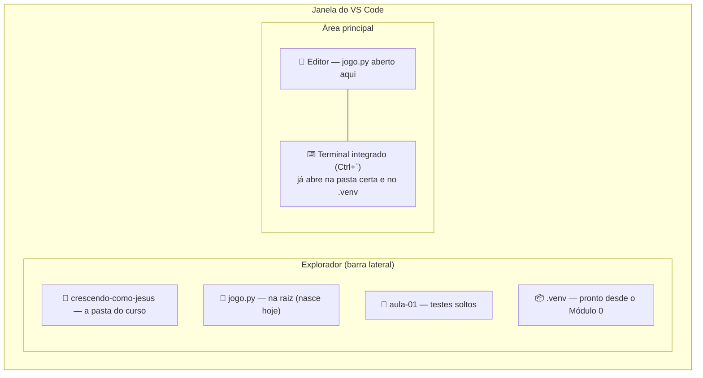
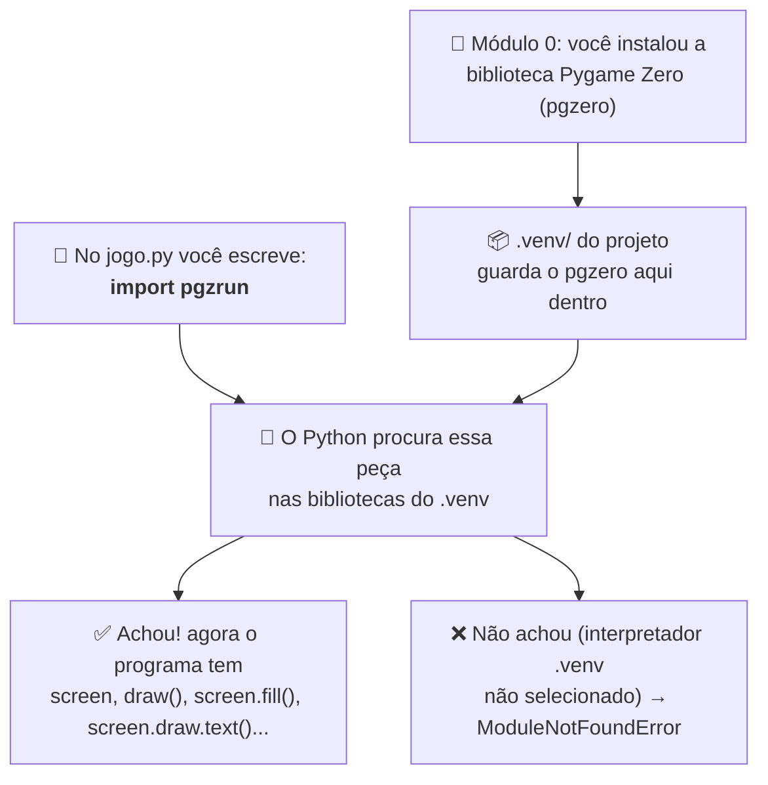
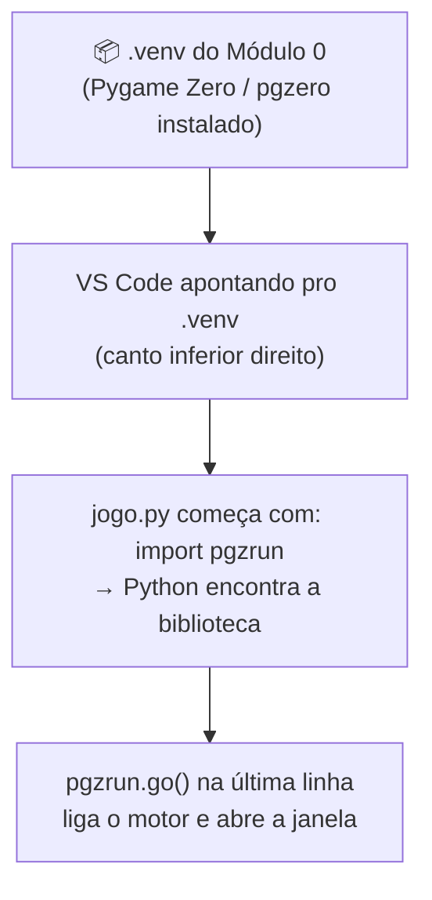

# Módulo 1 — Conhecendo a programação (material do professor)

**Duração:** 1h30 · **Ferramentas:** Python, VS Code (já instalados no Módulo 0)

## O que o aluno já traz do Módulo 0

Este módulo **não instala nada** e **não repete** preparação de ambiente. A máquina já está
pronta desde o Módulo 0:

- Python 3.12 (instalado pelo `uv`), VS Code + extensão Python;
- a pasta `crescendo-como-jesus/` criada, com a subpasta `aula-01/`;
- o ambiente virtual `.venv/` dentro dela, com `pgzero` instalado, e o interpretador `.venv`
  selecionado no VS Code.

Se algum aluno chegou sem isso, resolver **antes** da aula com o Módulo 0 / o guia
`docs/preparacao-ambiente/instalacao_vscode.md` — não gastar o tempo do Módulo 1 com instalação.

## Conceitos

- O jogo que vamos construir no curso (visão geral + demonstração do jogo pronto)
- O que é um **programa** e o que é um **algoritmo**
- **Sequência de execução:** o computador faz uma instrução de cada vez, na ordem escrita
- Recapitulando o VS Code: editor, explorador, terminal integrado, botão **Run**
- Primeiro programa com Pygame Zero:
  - `import pgzrun` no topo e `pgzrun.go()` no fim
  - **variáveis** `WIDTH`, `HEIGHT`, `TITLE`
  - **função** (`def draw():`) e **indentação** (o recuo é sintaxe, não estética)
  - `screen.fill(...)` (cor de fundo) e `screen.draw.text(...)` (texto na tela)

## Parte do jogo

A primeira janela do `jogo.py` — tela inicial com título, mensagem de boas-vindas, cor de fundo e
o nome do pecador.

## Roteiro da aula

### 1. O jogo que vamos construir + demonstração (12 min)

- **Rodar o jogo pronto na frente da turma** (2–3 min jogando): é a "propaganda" do curso — eles
  veem onde vão chegar. O jogo é um **labirinto no estilo Pac-Man** com a temática de Lucas 2:52:
  - a criança anda pelo labirinto coletando **bons hábitos** — 🙏 oração, 📖 Bíblia, ⛪ culto,
    ❤️ obedecer aos pais, 🤝 ajudar o próximo —, que aumentam a **estatura**;
  - foge das **tentações** — 😡 desobediência, 🤥 mentira, 😴 preguiça, 📱 distração —, que
    custam uma vida ao encostar;
  - a **oração** é o "poder": por alguns segundos as tentações fogem e podem ser vencidas;
  - são **4 fases**: Sabedoria → Estatura → Graça com Deus → Graça com os homens.
- Como rodar a demo (no computador do professor, com o repositório do curso): abrir `jogo/jogo.py`
  no VS Code e clicar em **Run Python File**, ou no terminal, dentro da pasta `jogo/`, rodar
  `python jogo.py`. Detalhes em `jogo/README.md`.
- Contextualizar o versículo-base: *"E crescia Jesus em sabedoria, e em estatura, e em graça, para
  com Deus e os homens."* (Lucas 2:52) — o jogo é uma forma de brincar com essa ideia.
- Deixar claro: **não vamos construir tudo hoje.** Cada aula constrói um pedaço; hoje é só a
  primeira tela.

### 2. O que é um programa, um algoritmo e a ordem das coisas (8 min)

- Conversa: "o que é um programa de computador?" — puxar exemplos do dia a dia (jogos, apps,
  sites). Um **programa** é uma lista de instruções que o computador segue.
- Um **algoritmo** é a sequência de passos para resolver um problema — como uma **receita de
  bolo**: cada passo na ordem certa.
- **Sequência de execução:** o computador faz **uma instrução de cada vez, de cima para baixo**,
  na ordem em que foram escritas — ele não "adivinha" a intenção nem pula na frente. Exemplo
  rápido: numa receita, trocar a ordem de "leve ao forno" e "misture os ovos" estraga o bolo; no
  código é igual.

### 3. Recapitulando o VS Code (4 min)

- O **VS Code** é a **IDE** do curso: junta num só lugar o **editor** (onde escrevemos o código),
  o **explorador** (a lista de pastas e arquivos, na lateral) e o **terminal integrado**
  (`` Ctrl+` `` ou **Terminal > New Terminal**), que já abre na pasta certa.
- Hoje é a primeira vez que vamos de fato **escrever e rodar** código — mostrar o botão
  **▶ Run Python File** (canto superior direito), que ainda não tinha sido usado.
- **Conferir uma coisa só** (não é instalar nada): no canto inferior direito da janela deve
  aparecer algo como `3.12.x ('.venv')`. Esse é o "Python do projeto", com o `pgzero` que foi
  instalado no Módulo 0. Se não aparecer, `Ctrl+Shift+P` → **Python: Select Interpreter** →
  escolher o que tem `.venv` (costuma vir como "Recommended").

### 4. Abrindo a pasta do curso no VS Code (4 min)

- Cada aluno abre a pasta `crescendo-como-jesus/` (criada no Módulo 0): no terminal, dentro dela,
  `code .` — ou **File > Open Folder...** e escolher a pasta.
- O explorador mostra `CRESCENDO-COMO-JESUS` no topo, com a `aula-01/` e a `.venv/` dentro.
- **Onde o `jogo.py` vai ficar:** na **raiz** de `crescendo-como-jesus/` (não dentro de
  `aula-01/`). É o arquivo que vamos evoluir o curso inteiro. A `aula-01/` fica para testes
  soltos, quando a gente quiser experimentar algo fora do jogo.



### 5. Como o Python roda um arquivo (4 min)

- **Quem diz qual arquivo rodar é você** — o Python não tem um arquivo "oficial" pra começar
  sozinho. Ele pega o arquivo indicado e executa **do começo ao fim, linha por linha**, na ordem
  (a mesma "sequência de execução" da Parte 2).
- Dois jeitos de rodar, e são a mesma coisa por baixo:
  - **Botão ▶ Run Python File** (VS Code): roda o arquivo aberto no editor.
  - **Terminal integrado:** `python jogo.py` — `python` é o programa que lê e executa o código;
    `jogo.py` é o arquivo que ele vai ler, começando pela primeira linha. Como o `.venv` está
    selecionado, o terminal já usa o Python do projeto (com o `pgzero`).
- O nome do arquivo podia ser qualquer um (`teste.py`, `abc.py`) — a gente usa `jogo.py` porque é
  o que vai crescer no curso todo.

### 6. Demonstração: a primeira tela, passo a passo (22 min)

Escrever **ao vivo, rodando depois de cada passo** — o mesmo passo a passo que os alunos vão
seguir na atividade. Não pular pro `exemplo.py` pronto: o efeito "mudei o código → vi o
resultado" só funciona testando cada pedaço antes do próximo. Criar o arquivo e salvar como
`jogo.py` **na raiz** de `crescendo-como-jesus/`.

**Passo 1 — o esqueleto mínimo.**

```python
import pgzrun

pgzrun.go()
```

- `import pgzrun` — **traz** para o nosso programa um código pronto que veio **de fora**. É ele
  que vai nos dar `screen`, `draw()` e o resto. De onde esse código vem está logo abaixo.
- `pgzrun.go()` — **liga o motor do jogo**: abre a janela e fica num laço, redesenhando a tela e
  escutando o teclado. Fica sempre na **última** linha.
- Rodar: abre uma **janela preta** do tamanho padrão. Destacar: são essas duas linhas que fazem o
  botão **Run** funcionar; sem elas apareceria `screen is not defined`.

**De onde vem o `pgzrun`?** Vale parar aqui uns 2 minutos — é a primeira vez no curso que o aluno
usa código que não foi ele quem escreveu.

- Ninguém digitou o `pgzrun` na nossa máquina: ele vem de uma **biblioteca** (também chamada
  **pacote**) — um monte de código pronto que outras pessoas escreveram e deixaram disponível
  para todo mundo usar, para a gente não ter que fazer tudo do zero.
- A biblioteca aqui chama-se **Pygame Zero**. No **Módulo 0**, o comando de instalação baixou ela
  da internet e guardou **dentro do `.venv/`** do projeto. Por isso ela só funciona neste
  projeto, e só quando o interpretador `.venv` está selecionado (canto inferior direito do VS Code).
- Detalhe que confunde: **instalamos `pgzero`, mas escrevemos `import pgzrun`**. O pacote inteiro
  se chama `pgzero`; o `pgzrun` é uma **peça de dentro dele** — a "chave de ligar" que abre a
  janela. Os dois são da mesma biblioteca.
- Quando o Python lê `import pgzrun`, ele **sai procurando** essa peça nas bibliotecas do
  `.venv`. Se acha, o nosso programa ganha de presente o `screen`, o `draw()`, o `screen.fill()`,
  o `screen.draw.text()` e o resto. Se não acha (interpretador errado), dá
  `ModuleNotFoundError: No module named 'pgzero'`.



**Passo 2 — tamanho e título da janela.** Entre o `import` e o `pgzrun.go()`:

```python
WIDTH = 800
HEIGHT = 600
TITLE = "Crescendo como Jesus"
```

- Isso é uma **variável**: um nome que guarda um valor. `WIDTH = 800` lê-se "de agora em diante,
  `WIDTH` vale 800".
- `WIDTH` e `HEIGHT` são a largura e a altura da janela **em pixels** (pontinhos da tela).
- `TITLE` é um **texto** (fica entre aspas) e aparece na barra da janela.
- O Pygame Zero reconhece **esses três nomes automaticamente** — por isso precisam ser escritos
  exatamente assim, em maiúsculas.
- Rodar: a janela nasce 800×600 e com o título na barra.

**Passo 3 — pintar o fundo.**

```python
COR_DE_FUNDO = "skyblue"


def draw():
    screen.fill(COR_DE_FUNDO)
```

Duas coisas novas antes de rodar:

- **Função:** um pedaço de código com **nome**, guardado para ser executado quando alguém chama.
  `def` cria a função, o nome vem depois (`draw`), e `()` + `:` são obrigatórios. A função
  `draw()` é especial: **o próprio Pygame Zero chama ela sozinho**, várias vezes por segundo,
  toda vez que precisa redesenhar a tela. A gente só diz **o que** desenhar.
- **Indentação (o recuo):** a linha `screen.fill(...)` está recuada (um "tab" para dentro). No
  Python isso **não é estética, é sintaxe**: o recuo é o que diz "esta linha pertence à função
  `draw`". Recuo faltando ou torto gera `IndentationError`. O VS Code recua sozinho a linha de
  baixo quando você aperta Enter depois de um `:`.

`screen.fill(COR_DE_FUNDO)` **pinta a tela inteira** com a cor. `COR_DE_FUNDO` é só uma variável
com um texto dentro — trocar `"skyblue"` por `"darkgreen"`, `"black"`, etc. e rodar de novo
mostra o efeito ao vivo. Citar a lista de cores na documentação do Pygame Zero e a alternativa em
RGB (`(255, 0, 0)`).

**Passo 4 — mensagem de boas-vindas.** Dentro de `draw()`, depois do `screen.fill`:

```python
COR_DO_TEXTO = "white"


def draw():
    screen.fill(COR_DE_FUNDO)
    screen.draw.text(
        "Bem-vindo(a) ao " + TITLE + "!",
        center=(WIDTH // 2, HEIGHT // 2),
        fontsize=40,
        color=COR_DO_TEXTO,
    )
```

Explicar cada parte de `screen.draw.text(...)`:

- `"Bem-vindo(a) ao " + TITLE + "!"` — o texto a desenhar. O `+` **junta textos**: pedaço fixo +
  o conteúdo da variável `TITLE` + `"!"`.
- `center=(WIDTH // 2, HEIGHT // 2)` — o ponto onde o texto fica **centralizado**. `//` é
  **divisão inteira**: `WIDTH // 2` é a metade da largura, ou seja, o meio da tela.
- `fontsize=40` — o tamanho da letra.
- `color=COR_DO_TEXTO` — a cor do texto (mesma ideia de variável do passo 3).
- Rodar: o texto aparece no centro.

**Passo 5 — o nome do pecador.** Mais uma chamada de `screen.draw.text`, um pouco mais abaixo:

```python
NOME_DO_PECADOR = "Escreva seu nome aqui"

# dentro de draw(), depois do texto de boas-vindas:
    screen.draw.text(
        "Pecador: " + NOME_DO_PECADOR,
        center=(WIDTH // 2, HEIGHT // 2 + 60),
        fontsize=24,
        color=COR_DO_TEXTO,
    )
```

- O `+ 60` no `center` empurra este texto **60 pixels para baixo**, para não desenhar em cima do
  anterior.
- Rodar uma última vez e trocar o nome de exemplo pelo do professor, reforçando que é assim que
  os alunos personalizam o deles.

Mostrar o [`exemplo.py`](exemplo.py) completo — é o mesmo código, com **um passo a mais** (o
versículo de Lucas 2:52 na tela), que é exatamente o desafio extra da aula.

> Por que rodar funciona: o `import pgzrun` na primeira linha busca a biblioteca **Pygame Zero**
> instalada no `.venv` do Módulo 0 (ver o diagrama do Passo 1). Se o interpretador `.venv` não
> estiver selecionado (canto inferior direito), o Python não acha o `pgzrun` e dá
> `ModuleNotFoundError`. Já o `screen is not defined` é outra coisa: aí falta a própria linha
> `import pgzrun` (ou o `pgzrun.go()`).



### 7. Atividade prática (25 min)

Cada aluno cria o próprio `jogo.py` (na raiz de `crescendo-como-jesus/`), com:

- título do jogo (na barra da janela);
- mensagem de boas-vindas (texto desenhado na tela);
- cor de fundo escolhida por ele;
- nome do pecador (o próprio aluno) exibido na tela.

Cada um constrói **do zero**, seguindo o passo a passo da demonstração — não copiar o
[`exemplo.py`](exemplo.py) pronto; ele serve só para comparar no fim ou destravar quem empacou.

### 8. Desafios (5 min)

- **Missão principal:** tela com título, boas-vindas, cor de fundo e nome do pecador.
- **Desafio extra:** uma segunda linha de texto — o versículo de Lucas 2:52 — brincando com
  `fontsize` e `COR_DO_TEXTO`.
- **Desafio criativo:** trocar as cores para combinar com o tema que o aluno imagina para o jogo.

### 9. Revisão e salvamento (6 min)

- Cada aluno salva o `jogo.py` na raiz de `crescendo-como-jesus/` — é o arquivo que evolui em
  todos os módulos seguintes.
- Roda rápida: 2 ou 3 alunos mostram a tela para a turma e explicam o que fizeram.

## Fundamentos trabalhados

- Visão geral do projeto final (jogo de labirinto estilo Pac-Man)
- Programa e algoritmo
- Sequência de execução
- Bibliotecas / pacotes: código pronto que vem de fora (`import`), e onde ele mora (o `.venv`)
- Textos (strings) e o `+` que junta textos
- Variáveis
- Funções (`def`) e indentação
- Execução de um programa (botão Run e `python jogo.py`)
- Recapitulação do VS Code (editor, explorador, terminal integrado)

## Resultado esperado

Uma janela com o nome do jogo ("Crescendo como Jesus") e uma mensagem inicial na tela, podendo
incluir o versículo-base do curso (Lucas 2:52) e o nome do aluno.

## Vocabulário novo para os alunos

| Termo | Explicação simples |
|---|---|
| Programa | Uma lista de instruções que o computador segue |
| Algoritmo | A sequência de passos para resolver um problema |
| Sequência de execução | O computador faz uma instrução de cada vez, de cima para baixo, na ordem escrita |
| Python | A linguagem (o "idioma") em que escrevemos os programas |
| IDE | Um programa que junta editor, execução e mensagens de erro num só lugar |
| VS Code | A IDE que usamos no curso |
| Executar (Run) | Mandar o computador seguir as instruções do programa |
| `import` | Trazer para o nosso programa um código pronto de fora (uma biblioteca) |
| Biblioteca / pacote | Um monte de código pronto que outras pessoas escreveram para todo mundo usar |
| `pgzero` (Pygame Zero) | A biblioteca que dá `screen`, `draw()` e o resto do jogo — instalada no `.venv` no Módulo 0 |
| `pgzrun` | A peça de dentro do `pgzero` que liga o jogo (`import pgzrun` no topo, `pgzrun.go()` no fim) |
| Variável | Um nome que guarda um valor (`WIDTH = 800`) |
| `WIDTH` / `HEIGHT` / `TITLE` | Nomes que o Pygame Zero reconhece: largura, altura e título da janela |
| Função | Pedaço de código com nome, executado quando é chamado (criada com `def`) |
| `draw()` | Função especial que o Pygame Zero chama sozinho para desenhar a tela |
| Indentação (recuo) | O espaço no começo da linha que diz o que "pertence" a uma função — no Python é sintaxe, não estética |
| `screen.fill(cor)` | Pinta a tela inteira de uma cor |
| `screen.draw.text(...)` | Desenha um texto na tela (posição, tamanho e cor) |
| `//` | Divisão inteira — `WIDTH // 2` é a metade da largura |

## Erros comuns e como ajudar

- **`screen is not defined` (ou `NameError` parecido):** falta o `import pgzrun` na primeira
  linha ou o `pgzrun.go()` na última — sem as duas o VS Code roda como Python puro e não carrega
  `screen`/`draw()`.
- **`ModuleNotFoundError: No module named 'pgzero'` / "pgzero não encontrado":** o interpretador
  selecionado não é o do `.venv`. Conferir o canto inferior direito do VS Code (`Ctrl+Shift+P` →
  **Python: Select Interpreter** → o que tem `.venv`). O `pgzero` já foi instalado no Módulo 0;
  aqui **não** se cria venv nem se instala pacote.
- **`IndentationError`:** alguma linha dentro de `draw()` ficou com recuo diferente das outras.
  Ler a mensagem junto com o aluno — ela aponta a linha.
- **Cor inválida:** mostrar a lista de nomes de cores do Pygame Zero (`"skyblue"`, `"darkgreen"`,
  ...) ou o formato RGB `(255, 0, 0)`.
- **Esqueceu de salvar antes de rodar:** o VS Code costuma salvar ao rodar, mas vale conferir a
  bolinha de "não salvo" no nome da aba.
- **VS Code não lista o `.venv` nos interpretadores:** confirmar que a pasta aberta é
  `crescendo-como-jesus/` (a que tem `.venv/` dentro) e recarregar a janela (`Ctrl+Shift+P` →
  **Developer: Reload Window**). Se persistir, é assunto de Módulo 0.
