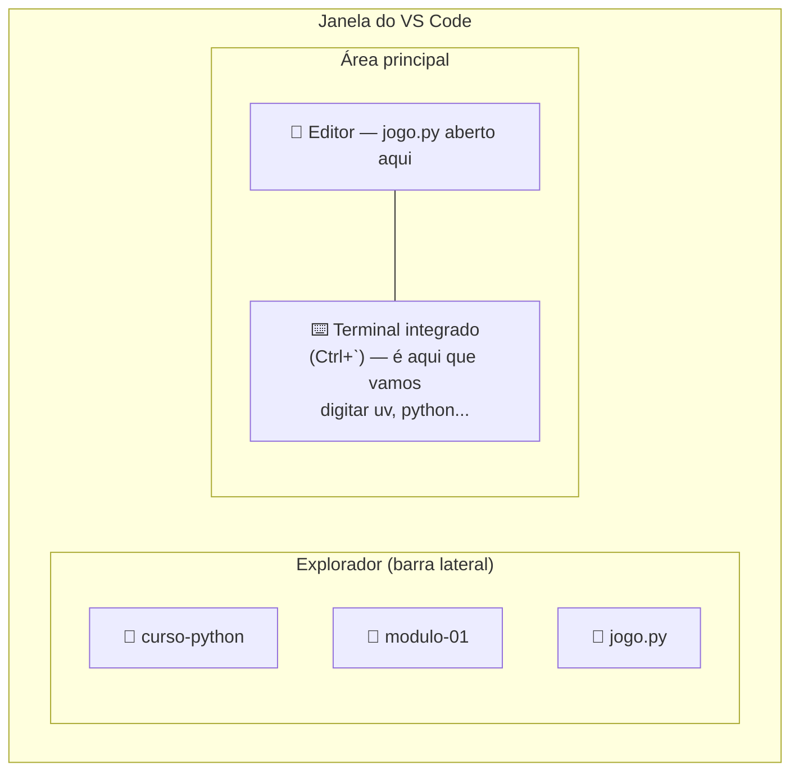
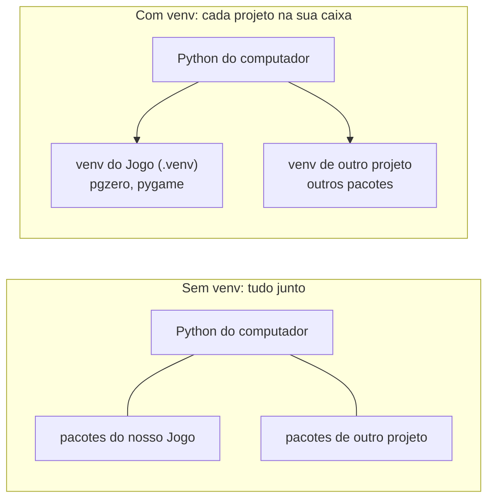
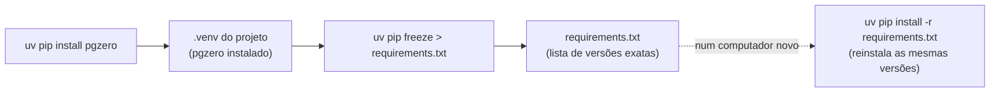
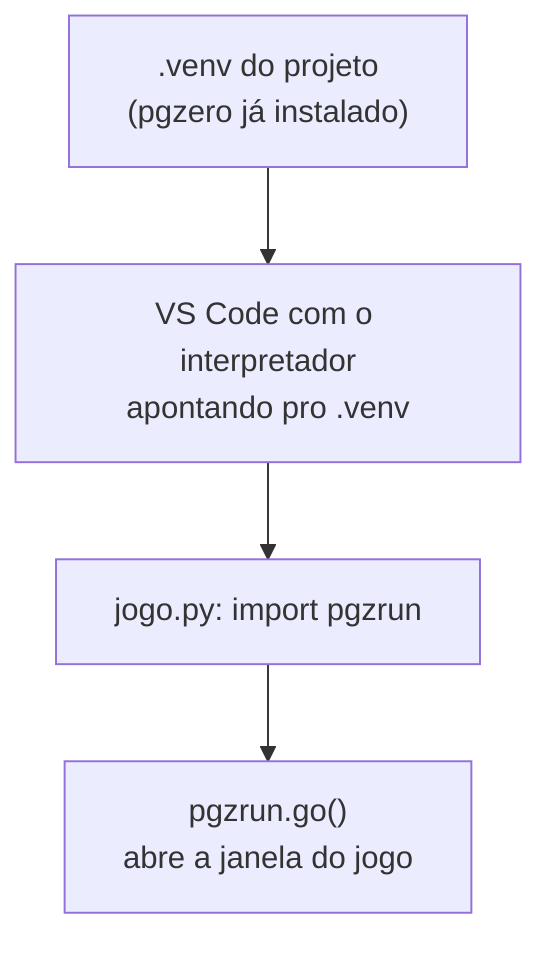

# Módulo 1 — Conhecendo a programação (material do professor)

**Duração:** 1h45 · **Ferramentas:** Python, VS Code, `uv`

## Conceitos

- O que é o jogo que vamos construir (visão geral do curso)
- O que é programação
- O que é um algoritmo
- IDE e VS Code (revisão do Módulo 0)
- Terminal integrado do VS Code
- O que são pacotes/bibliotecas livres e gratuitos
- Comandos e instruções
- Sequência de execução
- Instalação do Python com `uv` (e por que verificar versões antes de instalar)
- Ambiente virtual (venv) e instalação do Pygame Zero
- Primeiro programa: funções (`def`), indentação e `screen.draw`

## Parte do jogo

Criação da primeira janela do jogo.

## Roteiro da aula

### 1. O jogo que vamos construir (10 min)

- Mostrar (print, vídeo, ou o professor jogando) como vai ficar o jogo **no final do curso**:
  um personagem que cresce em "estatura espiritual" ao coletar bons hábitos (🙏 Oração, 📖
  Leitura da Bíblia, ⛪ Ir ao culto, ❤️ Obedecer aos pais, 🤝 Ajudar o próximo) e perde vida ao
  tocar em hábitos ruins (😡 desobediência, 🤥 mentira, distrações).
- Contextualizar o versículo-base: "E crescia Jesus em sabedoria, e em estatura, e em graça,
  para com Deus e os homens." (Lucas 2:52) — o jogo é uma forma de brincar com essa ideia.
- Deixar claro: **não vamos construir tudo hoje.** Cada aula constrói um pedaço novo — hoje é só
  a primeira tela.

### 2. Apresentação do conceito (10 min)

- Conversa inicial: "o que é um programa de computador?" — trazer exemplos do dia a dia dos
  alunos (jogos, apps, sites).
- Explicar que um **algoritmo** é uma sequência de passos para resolver um problema (ex.: uma
  receita de bolo).
- Mostrar que o computador executa exatamente o que mandamos, na ordem em que mandamos — não
  "adivinha" a intenção.

### 3. Recapitulando: IDE e VS Code (3 min)

- Relembrar rapidamente o que foi visto no Módulo 0: o **VS Code** é a **IDE** do curso — o
  programa que junta editor, terminal e mensagens de erro num só lugar.
- Hoje é a primeira vez que vamos efetivamente escrever e rodar código nele — mostrar de novo o
  botão de rodar (▶ Run Python File), que ainda não tinha sido usado.

### 4. Pacotes livres e gratuitos (5 min)

- Explicar: um **pacote** (ou biblioteca) é um código pronto que outra pessoa escreveu e
  compartilhou, pra qualquer um usar sem precisar reescrever do zero.
- Mostrar o **PyPI** (pypi.org) como a "loja" onde ficam milhares de pacotes Python gratuitos e
  de código aberto — qualquer um pode baixar, usar e até ler como foi feito.
- Apresentar o pacote que vamos usar no curso: **`pgzero`** (Pygame Zero) — feito por
  voluntários da comunidade Python, gratuito, e é o que vai nos dar `screen`, `draw()`, e os
  outros recursos para criar o jogo sem ter que programar gráficos do zero.
- Reforçar: instalar um pacote é seguro e gratuito quando vem de uma fonte confiável como o
  PyPI — é assim que praticamente todo programa Python "de verdade" é feito, reaproveitando
  pacotes em vez de reinventar tudo.

### 5. Abrindo o projeto no VS Code (5 min)

- Relembrar rapidamente o Módulo 0: cada aluno já tem uma pasta de módulo criada dentro de
  `curso-python` (ex.: `modulo-01`) e já sabe abrir pastas no VS Code pelo terminal.
- Cada aluno abre, no terminal, a pasta onde vai trabalhar hoje: `cd` até ela e `code .`.
- Deixar claro: esse é só o "onde vamos trabalhar" — o que vem a seguir (instalar Python,
  preparar o ambiente) é um assunto novo e separado, não é mais sobre pastas.

- Mostrar o mockup abaixo da janela do VS Code, com as três áreas que vamos usar hoje: o
  **explorador** (barra lateral, com as pastas e arquivos), o **editor** (onde o código é
  escrito) e o **terminal integrado** (onde os comandos são digitados) — as mesmas três áreas
  já citadas no Módulo 0, agora vistas juntas, do jeito que aparecem na tela de verdade.



- **Abrir o terminal integrado do VS Code:** até agora usamos o terminal "de fora" (do sistema
  operacional) só pra chegar na pasta certa e digitar `code .`. A partir de agora, todo comando
  (`uv`, `python`, etc.) vai ser digitado **dentro** do VS Code, num terminal próprio dele — e
  não em outra janela.
  - Abrir: menu **Terminal > New Terminal**, ou o atalho `` Ctrl+` `` — mostrar os dois jeitos.
  - Mostrar que esse terminal já abre **na pasta certa** (a mesma que foi aberta com `code .`) —
    diferença importante em relação a abrir um terminal solto: não precisa navegar com `cd` de
    novo.
  - Reforçar: é o mesmo tipo de terminal (mesmos comandos `cd`, `dir`/`ls`, `pwd`) visto no
    Módulo 0 — só que agora mora dentro da IDE, então dá pra editar código e rodar comando sem
    trocar de janela.

### 6. Instalando o Python (10 min)

1. **Verificar antes de instalar qualquer coisa** — no terminal já aberto na pasta do projeto,
   rodar:
   ```
   python --version
   uv --version
   ```
   Explicar: sempre vale conferir o que já está instalado antes de sair instalando de novo —
   evita duplicar ferramenta ou usar uma versão errada sem perceber.
2. Instalar o **`uv`** (se o comando acima não tiver funcionado) — ele cuida de instalar a
   versão certa do Python, criar o venv e instalar os pacotes, tudo com o mesmo comando:
   - **Windows:** `powershell -c "irm https://astral.sh/uv/install.ps1 | iex"`
   - **Linux:** `curl -LsSf https://astral.sh/uv/install.sh | sh`
   - Fechar e abrir o terminal de novo, e confirmar com `uv --version`.
   - Mencionar rapidamente o **`pyenv`**: é uma ferramenta parecida, bem conhecida, que troca
     entre versões do Python instaladas na máquina — só que ele cuida só da versão do Python; o
     venv e os pacotes ficariam por conta de `venv`/`pip` separados. Por isso o curso usa `uv`
     (junta as três coisas), mas quem já usa `pyenv` no dia a dia pode continuar usando.
3. Instalar o Python 3.12 com o `uv`:
   ```
   uv python install 3.12
   ```
   Confirmar com `uv python list`.

### 7. Entendendo e criando o ambiente virtual (venv) (10 min)

> ⚠️ **Passo-chave da aula.** Quase todo erro chato do curso ("pgzero não encontrado", "screen is
> not defined") vem de um `.venv` mal criado ou de um interpretador errado selecionado no VS
> Code. Vale caprichar aqui, mesmo sem entrar em detalhe técnico — reforçar bem essa ideia poupa
> tempo de debug em todos os módulos seguintes.

- Perguntar: "se dois projetos diferentes no mesmo computador precisassem de versões diferentes
  do mesmo pacote, o que aconteceria se tudo estivesse instalado junto, misturado?" — daria
  conflito, um projeto atrapalharia o outro.
- Explicar com analogia simples: agora que o Python já está instalado, um **ambiente virtual
  (venv)** é como uma **caixa de ferramentas separada para cada projeto** — cada projeto tem sua
  própria cópia do Python e dos pacotes que precisa, sem misturar com outros projetos nem com o
  resto do computador.
- Mostrar o diagrama abaixo: sem venv, tudo fica junto e pode dar conflito; com venv, cada
  projeto tem sua caixa isolada.



- Reforçar: **não precisa entender os detalhes técnicos hoje** — o importante é saber que o
  `.venv` que vamos criar é a "caixa" só do nosso jogo, e por isso o ambiente fica sempre igual
  em qualquer computador.

1. Criar o venv do projeto com a versão certa (a "caixa" do diagrama, virando o `.venv`):
   ```
   uv venv --python 3.12 .venv
   ```
2. Instalar o pacote do jogo direto pelo terminal:
   ```
   uv pip install pgzero
   ```
3. Registrar as versões instaladas num arquivo `requirements.txt` — é esse arquivo que garante
   que o ambiente fica **sempre igual** em qualquer computador, mesmo depois:
   ```
   uv pip freeze > requirements.txt
   ```
4. Selecionar o venv como interpretador do VS Code: `Ctrl+Shift+P` → **"Python: Select
   Interpreter"** → escolher o que aparece com `.venv` (geralmente já vem marcado como
   "Recommended"). Isso grava a configuração automaticamente, sem precisar editar arquivo
   nenhum à mão — bem mais simples do que digitar JSON.

- Mostrar o `requirements.txt` gerado (abrir no VS Code) — reforçar que ele não foi escrito à
  mão, foi **gerado** a partir do que já estava instalado no venv.
- Explicar quando o `requirements.txt` é usado de novo: numa próxima aula, ou num computador
  novo, em vez de repetir `uv pip install pgzero` um pacote de cada vez, basta rodar
  `uv pip install -r requirements.txt` pra reinstalar exatamente as mesmas versões.



> **Testar antes da aula:** confirme que o exemplo deste módulo roda certinho na máquina que vai
> ser usada, antes de levar pra sala. Ver `docs/preparacao-ambiente/instalacao_vscode.md`.

### 8. Demonstração (15 min)

- Explicar antes de tudo: **o Python não tem um arquivo fixo pra começar sozinho** — quem diz
  qual arquivo rodar é a pessoa que está usando ele. O Python executa o arquivo indicado do
  começo ao fim, linha por linha, na ordem (a mesma ideia de sequência de execução já vista na
  Parte 2 da aula). Poderia se chamar `jogo.py`, `teste.py`, `abc.py` — qualquer nome de arquivo
  `.py` funciona, desde que seja esse o arquivo mandado rodar.
- Mostrar os dois jeitos de rodar um arquivo, e que são a mesma coisa por baixo dos panos:
  - **Botão "Run Python File"** (▶) do VS Code: roda o arquivo aberto no editor.
  - **Pelo terminal**, comando a comando:
    ```
    uv run jogo.py
    ```
    - `uv run` — pede pro `uv` rodar o comando a seguir usando o Python de dentro do venv do
      projeto (o "tradutor" que lê o código); reforçar por que o venv importa (Passo 7).
    - `jogo.py` — o arquivo que ele vai ler e executar, começando pela primeira linha.
- Antes de escrever código, conectar o que acabou de ser feito (instalar pacotes no venv) com o
  que vem a seguir (usar esses pacotes no código) — mostrar o diagrama:



- Explicar: o `import pgzrun`, na primeira linha do código, é literalmente buscando o pacote que
  acabamos de instalar com `uv pip install` — se o venv errado estiver selecionado, ou o pacote
  não tiver sido instalado, é aí que aparece o erro `screen is not defined` (o Python não achou o
  `pgzrun`).
- Criar um arquivo novo e salvar como `jogo.py`.
- Escrever ao vivo, **passo a passo, rodando (`Run Python File`) depois de cada etapa** — o
  mesmo roteiro que os alunos vão seguir na atividade prática (ver material do aluno). Não pular
  direto pro `exemplo.py` pronto: o efeito de "mudei o código → vi o resultado" só funciona se
  cada passo for testado antes do próximo.

  1. **Esqueleto mínimo:**
     ```python
     import pgzrun

     pgzrun.go()
     ```
     Rodar — abre uma janela preta, tamanho padrão. Destacar: são essas duas linhas que
     permitem usar o botão **Run Python File** direto no VS Code; sem elas, apareceria o erro
     `screen is not defined`.
  2. **Tamanho e título**, entre o `import` e o `pgzrun.go()`:
     ```python
     WIDTH = 800
     HEIGHT = 600
     TITLE = "Crescendo como Jesus"
     ```
     Rodar de novo — a janela já nasce do tamanho certo, com o título na barra.
  3. **Pintando o fundo:**
     ```python
     COR_DE_FUNDO = "skyblue"


     def draw():
         screen.fill(COR_DE_FUNDO)
     ```
     Antes de rodar, explicar as duas coisas novas dessa linha `def draw():`:
     - **Função:** um pedaço de código com nome, guardado pra ser executado quando alguém (nesse
       caso, o próprio Pygame Zero, sozinho) chamar ele. `def` cria a função, o nome vem depois
       (`draw`), e `()` + `:` são obrigatórios.
     - **Indentação (recuo):** a linha `screen.fill(...)` está recuada — no Python isso não é
       estética, é sintaxe: é o recuo que diz "essa linha pertence à função `draw`". Recuo
       errado ou faltando gera um erro (`IndentationError`). Mencionar que o VS Code recua
       sozinho a linha de baixo quando o Enter é apertado depois de um `:`.
     Rodar de novo — a tela aparece pintada. Reforçar que `COR_DE_FUNDO` é só uma **variável com
     um texto dentro**; trocar a cor de fundo é trocar esse texto por outro nome que o Pygame
     Zero reconheça (ex.: `"darkgreen"`, `"black"`). Mostrar ao vivo trocando o valor e rodando
     de novo. Mencionar a lista completa na documentação do Pygame Zero e a alternativa em RGB
     (`(255, 0, 0)`).
  4. **Mensagem de boas-vindas**, dentro de `draw()`, com `screen.draw.text(...)`:
     ```python
     COR_DO_TEXTO = "white"


     def draw():
         screen.fill(COR_DE_FUNDO)
         screen.draw.text(
             "Bem-vindo(a) ao " + TITLE + "!",
             center=(WIDTH // 2, HEIGHT // 2),
             fontsize=40,
             color=COR_DO_TEXTO,
         )
     ```
     Rodar de novo. Explicar os parâmetros: o texto entre aspas, `center=(x, y)` (ponto
     centralizado — `WIDTH // 2` e `HEIGHT // 2` são o meio da tela), `fontsize=` (tamanho da
     letra) e `color=` (mesma ideia de variável do passo 3).
  5. **Nome do criador**, mais uma chamada de `screen.draw.text`, com `+ 60` no `center` pra não
     sobrepor o texto anterior:
     ```python
     NOME_DO_CRIADOR = "Escreva seu nome aqui"

     # dentro de draw(), depois do texto de boas-vindas:
         screen.draw.text(
             "Criado por: " + NOME_DO_CRIADOR,
             center=(WIDTH // 2, HEIGHT // 2 + 60),
             fontsize=24,
             color=COR_DO_TEXTO,
         )
     ```
     Rodar uma última vez e trocar o nome de exemplo pelo do professor, pra reforçar que é
     assim que os alunos vão personalizar o deles.
- Mostrar o [`exemplo.py`](exemplo.py) completo do módulo — é o mesmo código construído acima,
  só com um passo a mais (o versículo de Lucas 2:52), que é exatamente o desafio extra da aula.

### 9. Atividade prática (25 min)

Cada aluno deve criar uma tela com:

- título do jogo (na barra da janela);
- mensagem de boas-vindas (texto desenhado na tela);
- cor de fundo escolhida por ele;
- nome do criador (o próprio aluno) exibido na tela.

Cada aluno constrói o próprio `jogo.py` do zero, seguindo o mesmo passo a passo da demonstração
(seção 8) — não copiar o [`exemplo.py`](exemplo.py) pronto; ele serve só de referência pra
comparar no final, ou pra quem travar em algum passo.

### 10. Desafios (5 min)

- **Missão principal:** tela com título, mensagem de boas-vindas, cor de fundo e nome do criador.
- **Desafio extra:** adicionar uma segunda linha de texto (ex.: o versículo de Lucas 2:52) e
  experimentar com `COR_DO_TEXTO`.
- **Desafio criativo:** trocar as cores para combinar com o tema que o aluno imagina para o
  próprio jogo.

### 11. Revisão e salvamento (5 min)

- Cada aluno salva o arquivo `jogo.py` — será o arquivo que vamos evoluir em todos os módulos
  seguintes.
- Roda rápida: 2 ou 3 alunos mostram a tela pros colegas.

## Fundamentos trabalhados

- Visão geral do projeto final
- Comandos
- Ordem de execução
- Textos (strings)
- Funções (`def`) e indentação
- Execução de um programa
- IDE (VS Code) — revisão do Módulo 0
- Terminal integrado do VS Code
- Pacotes livres e gratuitos (PyPI, `pgzero`)
- Ambiente virtual (venv) — noção rápida, sem aprofundar

## Resultado esperado

Uma janela com o nome do jogo ("Crescendo como Jesus") e uma mensagem inicial na tela, podendo
incluir o versículo-base do curso (Lucas 2:52).

## Vocabulário novo para os alunos

| Termo | Explicação simples |
|---|---|
| Programa | Uma lista de instruções que o computador segue |
| Algoritmo | A sequência de passos para resolver um problema |
| Python | A linguagem (o "idioma") que usamos para escrever os programas |
| IDE | Um programa que junta editor, execução e mensagens de erro num só lugar |
| VS Code | A IDE que usamos no curso para escrever e rodar nosso código |
| Função | Pedaço de código com nome, guardado pra ser executado quando é chamado (criada com `def`) |
| Indentação (recuo) | Espaço no começo da linha que diz o que "pertence" a uma função — no Python é sintaxe, não estética |
| Pacote (biblioteca) | Código pronto, feito por outra pessoa, que podemos usar de graça no nosso programa |
| PyPI | A "loja" oficial de pacotes Python gratuitos e de código aberto |
| `pgzero` (Pygame Zero) | O pacote que instalamos para criar o jogo — é o único que instalamos manualmente |
| `pygame` | A ferramenta por trás do Pygame Zero; é instalada automaticamente junto com o `pgzero`, não precisamos instalá-la à parte |
| Executar (Run) | Mandar o computador seguir as instruções do programa |
| Terminal integrado | O terminal que mora dentro do VS Code (`` Ctrl+` `` ou Terminal > New Terminal), já aberto na pasta do projeto |
| venv | Uma "caixa" isolada com o Python e os pacotes do projeto, sempre igual em qualquer computador |
| `uv` | Ferramenta que instala a versão certa do Python, cria o venv e instala os pacotes |
| `pyenv` | Ferramenta parecida com o `uv`, mas que só troca a versão do Python instalada |
| `requirements.txt` | Arquivo com a lista das versões exatas de cada pacote instalado — gerado com `uv pip freeze`, usado depois com `uv pip install -r` pra recriar o mesmo ambiente |

## Erros comuns e como ajudar

- **Esqueceu de instalar o Pygame Zero / venv errado selecionado:** o erro vai dizer que o
  módulo `pgzero` não foi encontrado; conferir se o interpretador selecionado no VS Code é o do
  `.venv` do projeto (canto inferior direito da janela).
- **Esqueceu de salvar antes de rodar:** o VS Code costuma salvar automaticamente ao rodar, mas
  vale conferir o indicador de "não salvo" (bolinha no nome da aba).
- **`IndentationError` (erro de indentação):** alguma linha dentro de `draw()` ficou com recuo
  diferente das outras — no Python o recuo é sintaxe, não estética. Ler a mensagem de erro junto
  com o aluno, mostrando que ela aponta a linha do problema.
- **Cor inválida:** mostrar a lista de nomes de cores aceitos pelo Pygame Zero (ex.:
  `"skyblue"`, `"darkgreen"`) ou o formato RGB.
- **Erro `screen is not defined` (ou `NameError` parecido):** o arquivo está sendo rodado como
  Python puro, sem passar pelo Pygame Zero. Verificar se o arquivo começa com `import pgzrun` e
  termina com `pgzrun.go()` — sem essas duas linhas, o VS Code não sabe que deve carregar
  `screen`, `draw()` e os outros recursos do jogo.
- **`uv`/`python` não reconhecido logo após instalar:** fechar e abrir o terminal de novo — o
  PATH só atualiza numa janela nova.
- **VS Code não mostra o `.venv` na lista de interpretadores:** confirmar que a pasta `.venv`
  foi criada dentro da pasta do projeto aberta no VS Code, e recarregar a janela
  (`Ctrl+Shift+P` → "Developer: Reload Window").
- **`uv python install 3.12` demorando:** ele baixa o Python na primeira vez; da próxima vez fica
  em cache e é instantâneo.
- **Esqueceu de rodar `uv pip freeze > requirements.txt`:** o pacote continua instalado e o jogo
  funciona normalmente nesse computador — só não vai existir um `requirements.txt` atualizado
  pra recriar o mesmo ambiente em outra máquina depois.
