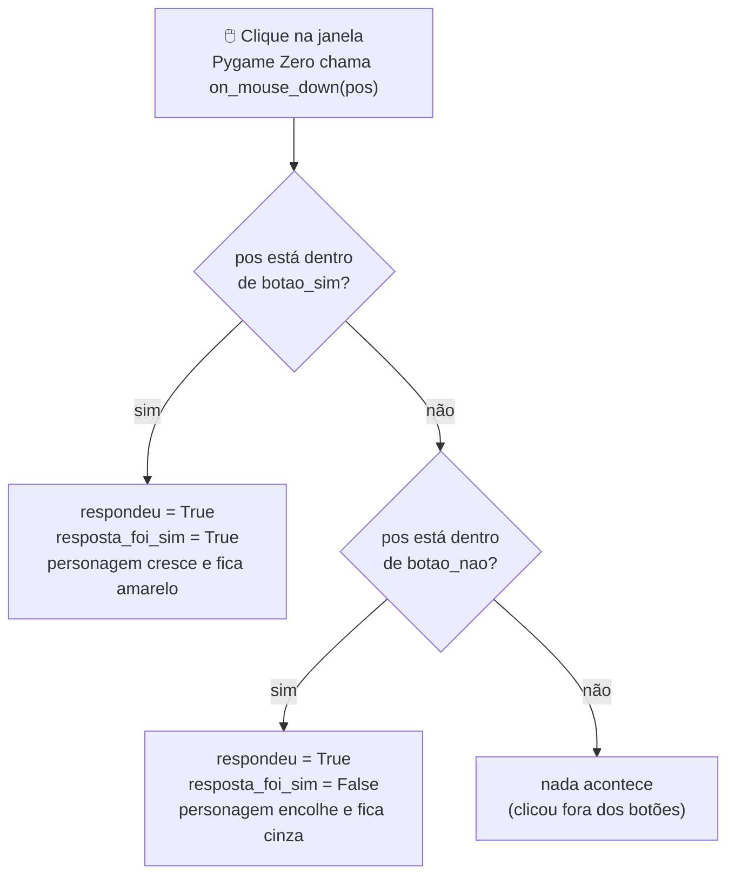

# Módulo 2 — O personagem e a primeira decisão (material do aluno)

## A ideia de hoje

No Módulo 1 seu `jogo.py` ganhou uma tela de boas-vindas. Hoje ela vai virar a **primeira cena de
verdade** do jogo: um personagem aparece na tela, uma pergunta sobre um hábito cristão é feita
(ex.: "Você orou hoje?"), e o jogador responde clicando em **Sim** ou **Não**. O personagem
**reage**: cresce e muda de cor no "Sim", fica do mesmo jeito (ou menor) no "Não" — a primeira
"decisão" programada do jogo.

## O que vamos aprender hoje

- **Coordenadas**: como dizer onde algo fica na tela — um par de números `(x, y)`
- Desenhar formas: um **círculo** (o personagem) e **retângulos** (os botões)
- **Variáveis lógicas** (`True` / `False`): guardar se algo já aconteceu ou não
- **`if` / `elif`**: fazer o programa decidir o que fazer, comparando com `==`
- **Evento de clique**: uma função especial que o Pygame Zero chama sozinho quando você clica na
  tela
- **`global`**: como uma função consegue mudar uma variável que existe fora dela

## O que você já tem pronto (do Módulo 1)

Abra de novo o `jogo.py` que você criou no Módulo 1, na raiz de `crescendo-como-jesus/`. Ele já
tem:

```python
import pgzrun

WIDTH = 800
HEIGHT = 600
TITLE = "Crescendo como Jesus"

COR_DE_FUNDO = "skyblue"
COR_DO_TEXTO = "white"
NOME_DO_PECADOR = "..."


def draw():
    screen.fill(COR_DE_FUNDO)
    screen.draw.text(...)
    screen.draw.text(...)


pgzrun.go()
```

Hoje vamos **trocar o conteúdo de dentro de `draw()`** pela cena do personagem — o `import`, o
`WIDTH`/`HEIGHT`/`TITLE` e o `pgzrun.go()` continuam exatamente iguais, no começo e no fim do
arquivo. A mensagem de boas-vindas e o versículo saem de cena, mas o seu **nome de pecador**
continua na tela — só muda de lugar, para um cantinho discreto.

## Construindo o personagem e a decisão, passo a passo

Vamos escrever aos poucos e **rodar depois de cada passo**, do mesmo jeito do Módulo 1.

### Passo 1 — coordenadas e o personagem parado

**Antes** da função `draw()` (fora dela), crie as variáveis do personagem:

```python
# Posição e tamanho do personagem (um círculo, por enquanto)
personagem_x = WIDTH // 2
personagem_y = HEIGHT // 2 - 60
personagem_raio = 40
personagem_cor = "gold"
```

Troque o conteúdo de `draw()` para desenhar o círculo no lugar do texto de boas-vindas — mas
**mantenha** o nome do pecador, só que agora **num cantinho** da tela em vez do centro:

```python
def draw():
    screen.fill(COR_DE_FUNDO)

    screen.draw.text(
        "Pecador: " + NOME_DO_PECADOR,
        topleft=(10, HEIGHT - 30),
        fontsize=16,
        color=COR_DO_TEXTO,
    )

    screen.draw.filled_circle(
        (personagem_x, personagem_y), personagem_raio, personagem_cor
    )
```

- **Coordenada**: todo lugar na tela é um par de números `(x, y)`. `x` cresce **para a direita**,
  `y` cresce **para baixo** (o `(0, 0)` é o canto **superior esquerdo** da janela — diferente do
  caderno de matemática, onde `y` cresce para cima!).
- `WIDTH // 2` e `HEIGHT // 2` são o **meio da tela** (já usado no Módulo 1); o `- 60` sobe o
  personagem um pouco, para deixar espaço pra pergunta em cima.
- `screen.draw.filled_circle((x, y), raio, cor)` desenha um **círculo preenchido**: centro em
  `(x, y)`, tamanho `raio`, na cor indicada.
- `topleft=(10, HEIGHT - 30)` é outro jeito de posicionar texto: em vez de `center` (que
  centraliza), `topleft` ancora o **canto superior esquerdo** do texto naquele ponto — aqui, 10
  pixels da borda esquerda e perto do rodapé (`HEIGHT - 30`).

**Rode.** No canto inferior esquerdo aparece "Pecador: [seu nome]", pequeno. No meio da tela,
um pouco acima do centro, aparece uma **bola dourada**, sobre o fundo azul-claro.

### Passo 2 — a pergunta na tela

Junto das outras variáveis, no topo do arquivo:

```python
PERGUNTA = "Você orou hoje?"
```

Dentro de `draw()`, **antes** do círculo, desenhe o texto da pergunta:

```python
def draw():
    screen.fill(COR_DE_FUNDO)

    screen.draw.text(
        PERGUNTA,
        center=(WIDTH // 2, HEIGHT // 2 - 160),
        fontsize=32,
        color=COR_DO_TEXTO,
    )

    screen.draw.filled_circle(
        (personagem_x, personagem_y), personagem_raio, personagem_cor
    )
```

`screen.draw.text(...)` já apareceu no Módulo 1 — só muda a posição (`HEIGHT // 2 - 160`, bem
acima do personagem).

**Rode.** Agora a pergunta **"Você orou hoje?"** aparece em cima da bola dourada.

### Passo 3 — os botões Sim e Não

Junto das outras variáveis, no topo:

```python
# Área (retângulo) de cada botão: (x, y, largura, altura)
botao_sim = Rect((WIDTH // 2 - 160, HEIGHT // 2 + 120), (120, 50))
botao_nao = Rect((WIDTH // 2 + 40, HEIGHT // 2 + 120), (120, 50))
```

- `Rect((x, y), (largura, altura))` é um **retângulo**: `(x, y)` é o canto **superior esquerdo**,
  e `(largura, altura)` é o tamanho. O Pygame Zero já sabe o que é `Rect` — não precisa de
  `import` extra.
- Cada botão é só uma **área invisível** por enquanto — o próximo passo desenha ela.

Dentro de `draw()`, depois do personagem, desenhe os dois botões:

```python
    screen.draw.filled_rect(botao_sim, "green")
    screen.draw.text("Sim", center=botao_sim.center, fontsize=28, color="white")

    screen.draw.filled_rect(botao_nao, "red")
    screen.draw.text("Não", center=botao_nao.center, fontsize=28, color="white")
```

- `screen.draw.filled_rect(retangulo, cor)` pinta o retângulo.
- `botao_sim.center` é um **atalho do próprio `Rect`**: ele calcula sozinho o ponto central do
  retângulo — não precisamos fazer conta.

**Rode.** Aparecem um botão **verde "Sim"** e um botão **vermelho "Não"**, abaixo do personagem.
Clicar ainda não faz nada — isso é o próximo passo.

### Passo 4 — detectando o clique

Depois de `draw()` (fora dela), crie uma nova função:

```python
def on_mouse_down(pos):
    if botao_sim.collidepoint(pos):
        print("clicou no Sim")
    elif botao_nao.collidepoint(pos):
        print("clicou no Não")
```

- `on_mouse_down(pos)` é uma **função especial**, igual `draw()`: o Pygame Zero **chama ela
  sozinho** toda vez que você clica na janela, e entrega em `pos` a coordenada `(x, y)` de onde
  foi o clique.
- `retangulo.collidepoint(pos)` responde `True` ou `False`: "esse ponto está **dentro** deste
  retângulo?".
- `if` / `elif` compara: **se** o clique caiu dentro de `botao_sim`, faz uma coisa; **senão, se**
  caiu dentro de `botao_nao`, faz outra. Repare no `==` que não aparece aqui — `collidepoint` já
  devolve `True`/`False` pronto, então o `if` testa ele direto.

**Rode e clique nos dois botões.** Nada muda **na tela**, mas abra o **terminal integrado**
(`` Ctrl+` ``): a cada clique dentro de um botão aparece a mensagem `clicou no Sim` ou `clicou no
Não`. Clicar **fora** dos dois botões não imprime nada. Feche a janela para continuar.

### Passo 5 — guardando a resposta e fazendo o personagem reagir

Troque os `print(...)` do passo anterior por código que **muda o personagem de verdade**. Junto
das outras variáveis, no topo do arquivo:

```python
# Estado da resposta: começa sem nenhuma resposta ainda
respondeu = False
resposta_foi_sim = False
```

- `True` / `False` são os dois únicos valores **lógicos** do Python — aqui guardam "o jogador já
  respondeu?" e "a resposta foi Sim?".

Agora reescreva `on_mouse_down`:

```python
def on_mouse_down(pos):
    global respondeu, resposta_foi_sim, personagem_raio, personagem_cor

    if botao_sim.collidepoint(pos):
        respondeu = True
        resposta_foi_sim = True
        personagem_raio = 60
        personagem_cor = "yellow"
    elif botao_nao.collidepoint(pos):
        respondeu = True
        resposta_foi_sim = False
        personagem_raio = 30
        personagem_cor = "gray"
```

- **Por que o `global`?** Uma função, por padrão, **não pode mudar** uma variável de fora dela —
  só ler. A linha `global respondeu, resposta_foi_sim, personagem_raio, personagem_cor` avisa o
  Python: "estas variáveis não são novas, são as que já existem lá em cima — quero **mudar elas
  de verdade**". Sem o `global`, o Python cria uma cópia local que some assim que a função
  termina, e a tela nunca muda.
- No "Sim": `personagem_raio` fica maior (60) e a cor muda para `"yellow"`.
- No "Não": `personagem_raio` fica menor (30) e a cor muda para `"gray"`.

**Rode e clique no "Sim".** O personagem **cresce e fica amarelo**. Feche, rode de novo e clique
no **"Não"**: o personagem **encolhe e fica cinza**.

### Passo 6 — a mensagem de acordo com a resposta

Por último, dentro de `draw()`, depois do personagem e dos botões, mostre uma mensagem só depois
que o jogador responder:

```python
    if respondeu:
        if resposta_foi_sim:
            mensagem = "Muito bem! Continue assim!"
        else:
            mensagem = "Que tal fazer isso hoje?"

        screen.draw.text(
            mensagem,
            center=(WIDTH // 2, HEIGHT // 2 + 220),
            fontsize=26,
            color=COR_DO_TEXTO,
        )
```

- O primeiro `if respondeu:` só entra **depois** que algum botão foi clicado — antes disso,
  `respondeu` é `False` e nada é desenhado ali.
- O `if`/`else` de dentro escolhe **qual texto** mostrar, guardando o resultado numa variável
  `mensagem` antes de desenhar.

**Rode.** Antes de clicar, só aparecem a pergunta, o personagem e os botões. Clique no **"Sim"**:
o personagem cresce, fica amarelo, e aparece **"Muito bem! Continue assim!"** embaixo. Feche, rode
de novo e clique no **"Não"**: o personagem encolhe, fica cinza, e aparece **"Que tal fazer isso
hoje?"**.



Pronto — compare com o [`exemplo.py`](exemplo.py) deste módulo: é o mesmo código que você acabou
de construir.

## Sua missão

- [ ] Escolha a cor e o tamanho inicial do seu personagem;
- [ ] Escolha uma pergunta sobre um hábito cristão (ex.: "Você obedeceu aos seus pais hoje?",
      "Você leu a Bíblia hoje?");
- [ ] Programe a reação: **cresce e muda de cor** no "Sim", **fica do mesmo tamanho ou menor** no
      "Não";
- [ ] Mostre uma mensagem diferente para cada resposta.

Construa **do zero**, seguindo os passos acima — não copie o `exemplo.py` pronto; ele é só para
comparar no fim ou para destravar se você empacar.

## Desafios

- **Desafio extra:** adicione uma segunda pergunta que aparece depois da primeira ser respondida.
- **Desafio criativo:** personalize as cores, o formato do personagem e as mensagens.

## Palavras novas

| Termo | O que significa |
|---|---|
| Coordenada | Um endereço na tela: um valor `x` (horizontal) e um valor `y` (vertical), a partir do canto superior esquerdo |
| `topleft=(x, y)` | Outro jeito de posicionar texto: ancora pelo canto superior esquerdo, em vez de centralizar como `center` |
| `screen.draw.filled_circle(...)` | Desenha um círculo preenchido: centro, raio e cor |
| `Rect((x, y), (largura, altura))` | Um retângulo: canto superior esquerdo + tamanho |
| `screen.draw.filled_rect(...)` | Pinta um `Rect` inteiro de uma cor |
| `retangulo.center` | Atalho do `Rect` que já calcula o ponto central dele |
| `True` / `False` | Verdadeiro ou falso — os dois únicos valores possíveis de uma variável lógica |
| `if` / `elif` / `else` | "Se" isso for verdade, faça uma coisa; "senão, se" outra coisa for verdade, faça outra; "senão", faça a última |
| `==` | Compara dois valores (é diferente de `=`, que guarda um valor numa variável) |
| Evento | Algo que acontece durante o jogo, como um clique na tela |
| `on_mouse_down(pos)` | Função especial que o Pygame Zero chama sozinho a cada clique, entregando a posição `pos` do clique |
| `retangulo.collidepoint(pos)` | Responde `True`/`False`: esse ponto está dentro do retângulo? |
| `global` | Dentro de uma função, avisa que uma variável não é nova — é a de fora, e queremos mudar ela de verdade |

## Deu erro? Tenta isso primeiro

- **Esqueceu os dois pontos (`:`) depois do `if`/`elif`/`else`:** confira se colocou `:` no final
  da linha.
- **O clique não faz nada:** confira se a função se chama **exatamente** `on_mouse_down` (com
  esse nome, sem erro de digitação) e se recebe `pos` entre os parênteses.
- **`UnboundLocalError` ou a tela não muda depois do clique:** falta o `global` no começo de
  `on_mouse_down`, listando as variáveis que a função precisa mudar.
- **Usou `=` em vez de `==`:** `=` guarda um valor; `==` compara dois valores — são diferentes!
- **Botão no lugar errado:** confira os números do `Rect` — o primeiro par é a posição, o segundo
  é o tamanho.

Ao final, **salve** o `jogo.py` (na raiz de `crescendo-como-jesus/`).
