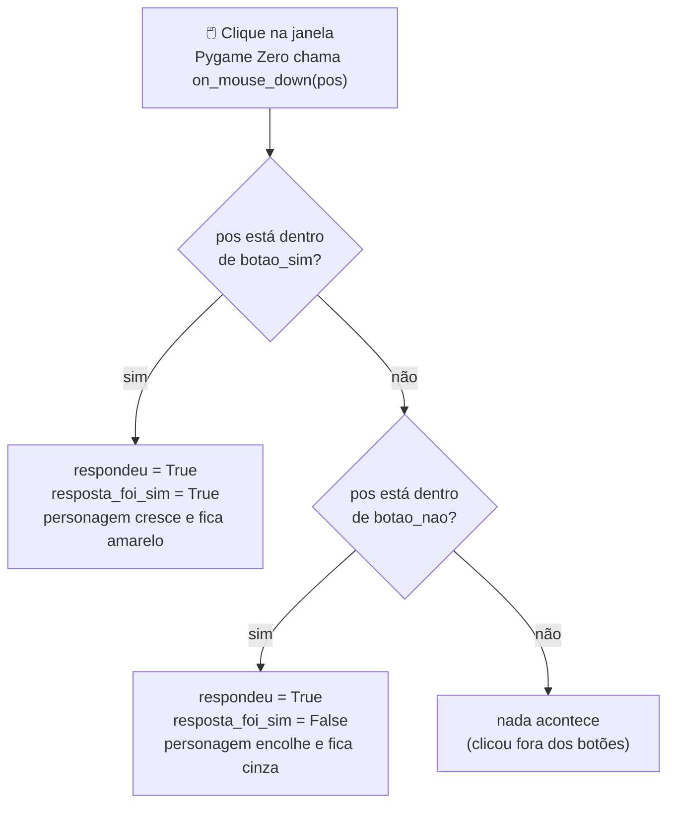

# Módulo 2 — O personagem e a primeira decisão (material do professor)

**Duração:** 1h30 · **Ferramentas:** Python, VS Code (já configurados desde o Módulo 0)

## O que o aluno já traz do Módulo 1

Este módulo **não instala nada**. Cada aluno já tem, na raiz de `crescendo-como-jesus/`, o
`jogo.py` do Módulo 1: `import pgzrun` no topo, `WIDTH`/`HEIGHT`/`TITLE`, uma `draw()` que pinta o
fundo e desenha dois textos (boas-vindas + nome do pecador), e `pgzrun.go()` no fim. Hoje vamos
**trocar o conteúdo de `draw()`** pela cena do personagem — a mensagem de boas-vindas e o
versículo saem, mas o **nome do pecador continua na tela** (só muda de lugar, pra um cantinho); o
resto do arquivo não muda.

## Conceitos

- Coordenadas na tela: eixo X (esquerda→direita) e eixo Y (cima→baixo), origem no canto superior
  esquerdo
- Desenhar formas com Pygame Zero: `filled_circle`, `Rect`, `filled_rect`
- Valores lógicos (`True` / `False`)
- Comparação (`==`, diferente de `=`) e decisão (`if` / `elif` / `else`)
- Evento de clique: a função especial `on_mouse_down(pos)`
- `global`: por que uma função precisa avisar que vai mudar uma variável de fora dela

## Parte do jogo

O personagem aparece na tela e reage (cresce e muda de cor, ou encolhe) à resposta de uma
pergunta sobre um hábito cristão — a primeira "decisão" programada do jogo.

## Por que lógica já no módulo 2

Em vez de aprender `if`/`elif`/`else` de forma isolada, a criança já vê o próprio personagem do
jogo reagindo a uma decisão — o mesmo tipo de lógica que, lá no Módulo 8, vai controlar o
crescimento de estatura ao coletar bons hábitos. Aqui a decisão é feita por **clique** (sim/não),
sem precisar do teclado ainda (isso vem no Módulo 3).

## Roteiro da aula

### 1. Recapitular o Módulo 1 e apresentar a ideia de hoje (8 min)

- Abrir o `jogo.py` de um aluno (ou o do professor) e relembrar: `WIDTH`/`HEIGHT`/`TITLE`,
  `draw()`, `screen.fill`, `screen.draw.text`.
- Anunciar: hoje a tela de boas-vindas vira a **primeira cena de verdade** — um personagem
  aparece, uma pergunta é feita ("Você orou hoje?") e o jogador responde clicando em **Sim** ou
  **Não**. O personagem reage à resposta: essa é a "primeira decisão" do jogo.

### 2. Conceitos: coordenadas, lógica e decisão (10 min)

- **Coordenadas:** a tela é uma grade de números. `x` cresce da esquerda pra direita, `y` de cima
  pra baixo — **diferente** do gráfico de matemática, onde `y` cresce pra cima. Toda posição é um
  par `(x, y)`.
- **Valores lógicos:** no dia a dia, muita coisa só pode ser "verdade" ou "mentira" — "hoje é
  domingo" (verdadeiro ou falso), "eu orei hoje" (verdadeiro ou falso). No Python isso vira
  `True` e `False`.
- **Decisão:** assim como na vida a gente decide o que fazer dependendo da resposta ("se eu orar
  hoje, eu cresço um pouquinho"), o programa decide o que desenhar usando `if` (se), `elif`
  (senão, se) e `else` (senão).
- **Cuidado com `=` × `==`:** `=` guarda um valor numa variável; `==` compara dois valores. É o
  erro mais comum da aula — vale escrever os dois lado a lado no quadro.

### 3. Demonstração: personagem e decisão, passo a passo (35 min)

Escrever **ao vivo, rodando depois de cada passo** — os alunos vão seguir o mesmo passo a passo na
atividade. Abrir o `jogo.py` existente e ir alterando.

**Passo 1 — coordenadas e o personagem parado.** Antes de `draw()`:

```python
personagem_x = WIDTH // 2
personagem_y = HEIGHT // 2 - 60
personagem_raio = 40
personagem_cor = "gold"
```

Trocar o conteúdo de `draw()` — **preservando** o nome do pecador, agora num cantinho:

```python
def draw():
    screen.fill(COR_DE_FUNDO)

    screen.draw.text(
        "Pecador: " + NOME_DO_PECADOR,
        topleft=(10, HEIGHT - 30),
        fontsize=16,
        color=COR_DO_TEXTO,
    )

    screen.draw.filled_circle(
        (personagem_x, personagem_y), personagem_raio, personagem_cor
    )
```

- `screen.draw.filled_circle((x, y), raio, cor)` — círculo preenchido, centro `(x, y)`.
- `topleft=(10, HEIGHT - 30)` ancora o texto pelo canto superior esquerdo, em vez de `center` —
  vale contrastar os dois: um centraliza, o outro fixa um canto.
- **Ponto de continuidade:** a mensagem de boas-vindas e o versículo do Módulo 1 saem de cena
  hoje, mas o nome do pecador não — reforça que o `jogo.py` é o **mesmo arquivo evoluindo**, não
  um projeto novo a cada aula.
- Rodar: no canto inferior esquerdo aparece "Pecador: [nome]", pequeno; no centro, um pouco
  acima do meio, a **bola dourada**.

**Passo 2 — a pergunta.** No topo:

```python
PERGUNTA = "Você orou hoje?"
```

Em `draw()`, antes do círculo:

```python
    screen.draw.text(
        PERGUNTA,
        center=(WIDTH // 2, HEIGHT // 2 - 160),
        fontsize=32,
        color=COR_DO_TEXTO,
    )
```

- Mesmo `screen.draw.text` do Módulo 1, só muda a posição. Rodar: a pergunta aparece acima do
  personagem.

**Passo 3 — os botões Sim e Não.** No topo:

```python
botao_sim = Rect((WIDTH // 2 - 160, HEIGHT // 2 + 120), (120, 50))
botao_nao = Rect((WIDTH // 2 + 40, HEIGHT // 2 + 120), (120, 50))
```

- `Rect((x, y), (largura, altura))`: canto superior esquerdo + tamanho. Já vem com o Pygame Zero,
  não precisa `import`.

Em `draw()`, depois do personagem:

```python
    screen.draw.filled_rect(botao_sim, "green")
    screen.draw.text("Sim", center=botao_sim.center, fontsize=28, color="white")

    screen.draw.filled_rect(botao_nao, "red")
    screen.draw.text("Não", center=botao_nao.center, fontsize=28, color="white")
```

- `retangulo.center` já calcula o centro sozinho — apontar isso, evita conta manual.
- Rodar: aparecem os dois botões. Clicar ainda não faz nada.

**Passo 4 — detectando o clique.** Depois de `draw()`:

```python
def on_mouse_down(pos):
    if botao_sim.collidepoint(pos):
        print("clicou no Sim")
    elif botao_nao.collidepoint(pos):
        print("clicou no Não")
```

- `on_mouse_down(pos)` é **especial** como `draw()`: o Pygame Zero chama sozinho a cada clique,
  entregando a posição em `pos`.
- `retangulo.collidepoint(pos)` devolve `True`/`False`.
- Rodar e clicar nos dois botões com o terminal integrado (`` Ctrl+` ``) visível: aparece
  `clicou no Sim` / `clicou no Não` a cada clique dentro de um botão; clique fora não imprime
  nada.

**Passo 5 — guardando a resposta e reagindo de verdade.** No topo:

```python
respondeu = False
resposta_foi_sim = False
```

Reescrever `on_mouse_down`, trocando os `print` por mudanças de estado:

```python
def on_mouse_down(pos):
    global respondeu, resposta_foi_sim, personagem_raio, personagem_cor

    if botao_sim.collidepoint(pos):
        respondeu = True
        resposta_foi_sim = True
        personagem_raio = 60
        personagem_cor = "yellow"
    elif botao_nao.collidepoint(pos):
        respondeu = True
        resposta_foi_sim = False
        personagem_raio = 30
        personagem_cor = "gray"
```

- **Ponto de atenção do módulo:** sem `global`, o Python cria uma **cópia local** de cada
  variável dentro da função — ela muda só ali dentro e some quando a função termina; a tela nunca
  reflete a mudança. `global` avisa "estas variáveis são as de fora, mude elas de verdade".
- Rodar, clicar no "Sim": personagem cresce e fica amarelo. Rodar de novo, clicar no "Não":
  encolhe e fica cinza.



**Passo 6 — a mensagem de acordo com a resposta.** Em `draw()`, depois do personagem e dos
botões:

```python
    if respondeu:
        if resposta_foi_sim:
            mensagem = "Muito bem! Continue assim!"
        else:
            mensagem = "Que tal fazer isso hoje?"

        screen.draw.text(
            mensagem,
            center=(WIDTH // 2, HEIGHT // 2 + 220),
            fontsize=26,
            color=COR_DO_TEXTO,
        )
```

- `if respondeu:` só entra depois do primeiro clique.
- Rodar: antes do clique só aparecem pergunta, personagem e botões; clicando em "Sim" some a
  dúvida e aparece a mensagem de incentivo; clicando em "Não", a mensagem de convite.

Mostrar o [`exemplo.py`](exemplo.py) completo — é o mesmo código construído ao vivo.

### 4. Atividade prática (25 min)

Cada aluno, a partir do próprio `jogo.py` do Módulo 1, constrói **do zero** (seguindo o passo a
passo) uma versão com:

1. Cor e tamanho iniciais do próprio personagem;
2. Uma pergunta sobre um hábito cristão (ex.: "Você obedeceu aos seus pais hoje?", "Você leu a
   Bíblia hoje?");
3. Reação de **crescer e mudar de cor** no "Sim", **ficar do mesmo tamanho ou menor** no "Não";
4. Mensagem de acordo com a resposta.

Não copiar o [`exemplo.py`](exemplo.py) pronto — ele serve só para comparar no fim ou destravar
quem empacou.

### 5. Desafios (5 min)

- **Missão principal:** personagem + pergunta com Sim/Não + reação visual diferente para cada
  resposta.
- **Desafio extra:** adicionar uma segunda pergunta que aparece depois da primeira ser respondida.
- **Desafio criativo:** personalizar cores, formato do personagem e texto das mensagens.

### 6. Revisão e salvamento (7 min)

- Cada aluno salva o `jogo.py` (mesma raiz de `crescendo-como-jesus/`).
- Roda rápida: 2 ou 3 alunos mostram as duas reações do personagem pros colegas.

## Fundamentos trabalhados

- Coordenadas (posição X, Y)
- Formas com Pygame Zero (`filled_circle`, `Rect`, `filled_rect`)
- Valores lógicos (`True` / `False`)
- Comparação (`==`) e decisão (`if` / `elif` / `else`)
- Eventos (clique do mouse/toque na tela) e a função especial `on_mouse_down(pos)`
- `global`: escopo de variável dentro de função

## Resultado esperado

O nome do pecador (herdado do Módulo 1) aparece pequeno no canto inferior esquerdo. O personagem
aparece na tela junto de uma pergunta e dois botões (Sim/Não). Antes do clique, só o nome, a
pergunta e o personagem parado aparecem. Ao clicar em "Sim", o personagem cresce e fica amarelo e
uma mensagem de incentivo aparece; ao clicar em "Não", o personagem encolhe e fica cinza e uma
mensagem de convite aparece.

## Vocabulário novo para os alunos

| Termo | Explicação simples |
|---|---|
| Coordenada | Um endereço na tela: um valor `x` (horizontal) e um valor `y` (vertical), a partir do canto superior esquerdo |
| `topleft=(x, y)` | Outro jeito de posicionar texto: ancora pelo canto superior esquerdo, em vez de centralizar como `center` |
| `screen.draw.filled_circle(...)` | Desenha um círculo preenchido: centro, raio e cor |
| `Rect((x, y), (largura, altura))` | Um retângulo: canto superior esquerdo + tamanho |
| `screen.draw.filled_rect(...)` | Pinta um `Rect` inteiro de uma cor |
| `retangulo.center` | Atalho do `Rect` que já calcula o ponto central dele |
| `True` / `False` | Os dois únicos valores possíveis de uma variável lógica: verdadeiro ou falso |
| `if` / `elif` / `else` | "Se" isso for verdade, faça uma coisa; "senão, se" outra for verdade, faça outra; "senão", faça a última |
| `==` | Compara dois valores (diferente de `=`, que guarda um valor) |
| Evento | Algo que acontece durante o jogo, como um clique ou toque na tela |
| `on_mouse_down(pos)` | Função especial que o Pygame Zero chama sozinho a cada clique, entregando a posição `pos` |
| `retangulo.collidepoint(pos)` | Responde `True`/`False`: esse ponto está dentro do retângulo? |
| `global` | Dentro de uma função, avisa que uma variável não é nova — é a de fora, e será mudada de verdade |

## Erros comuns e como ajudar

- **Esqueceu os dois pontos (`:`) depois do `if`/`elif`/`else`:** o Python acusa erro de sintaxe;
  mostrar a linha exata do erro.
- **Indentação errada dentro do `if`/`elif`/`else`:** reforçar que tudo que pertence ao bloco
  precisa ter o mesmo recuo (mesma regra do Módulo 1).
- **Clique não é detectado:** conferir se a função se chama **exatamente** `on_mouse_down(pos)`
  e se a área do `Rect` está com posição e tamanho corretos.
- **`UnboundLocalError` ou a tela não reage ao clique:** falta o `global` no começo de
  `on_mouse_down`, listando as variáveis que a função muda. É o erro mais comum e mais confuso
  deste módulo — vale mostrar o efeito **sem** o `global` primeiro (a tela não muda) e depois
  **com** ele, para o aluno ver a diferença na prática.
- **Comparação usando `=` em vez de `==`:** erro clássico — `=` guarda um valor, `==` compara
  dois valores.
