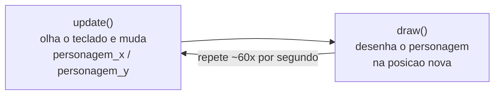

# Módulo 3 — Movimentando o personagem (material do aluno)

## A ideia de hoje

No Módulo 2 o seu personagem aprendeu a **reagir a uma decisão** (Sim/Não). A pergunta e os
botões já cumpriram o papel deles e **saem de cena** hoje. Agora o personagem ganha **vida**:
passa a **andar pelo cenário** quando você aperta as setas do teclado. É o primeiro passo pro
jogo virar um labirinto de verdade.

## O que vamos aprender hoje

- O **laço do jogo**: o Pygame Zero fica repetindo "pensar → desenhar" o tempo todo
- **`update()`**: a função especial onde o jogo **muda as coisas de lugar**
- **`x = x + VELOCIDADE`**: como um número guardado numa variável "anda"
- **`keyboard`**: saber se uma seta está pressionada **agora**
- **`on_key_down(key)`**: fazer algo **uma vez**, no instante em que uma tecla é apertada
- **`keys.SPACE`**: o nome de uma tecla no Pygame Zero

## O que você já tem pronto (do Módulo 2)

Abra o `jogo.py` que você evoluiu no Módulo 2, na raiz de `crescendo-como-jesus/`. Ele já tem o
`import pgzrun`, o `WIDTH`/`HEIGHT`/`TITLE`, as variáveis do personagem (`personagem_x`,
`personagem_y`, `personagem_raio`, `personagem_cor`), a `draw()` com o fundo, o nome do pecador
num cantinho e o personagem como círculo, o `on_mouse_down(pos)` com a decisão Sim/Não, e o
`pgzrun.go()` no fim.

Hoje a gente **apaga a cena de decisão** (a pergunta, os botões e o `on_mouse_down`) e faz o
personagem **andar**. O `import`, o `WIDTH`/`HEIGHT`/`TITLE`, o personagem e o `pgzrun.go()`
continuam. O seu **nome de pecador** continua no cantinho.

## Construindo o movimento, passo a passo

Escreva aos poucos e **rode depois de cada passo**.

### Passo 1 — limpar a cena do Módulo 2 e pôr o personagem no meio

Apague do arquivo:

- a variável `PERGUNTA`;
- os `Rect` `botao_sim` e `botao_nao`;
- as variáveis `respondeu` e `resposta_foi_sim`;
- a função `on_mouse_down` inteira;
- dentro de `draw()`, as linhas que desenhavam a pergunta, os botões e a mensagem final.

Deixe as variáveis do personagem assim (agora o `y` começa **no meio-meio**, sem o `- 60`) e crie
a `VELOCIDADE`:

```python
# Posição, tamanho e cor do personagem (um círculo, por enquanto)
personagem_x = WIDTH // 2
personagem_y = HEIGHT // 2
personagem_raio = 40
personagem_cor = "gold"

# Quantos pixels o personagem anda a cada passo
VELOCIDADE = 5
```

A `draw()` fica só com o fundo, o nome no cantinho, uma dica no topo e o personagem:

```python
def draw():
    screen.fill(COR_DE_FUNDO)

    screen.draw.text(
        "Pecador: " + NOME_DO_PECADOR,
        topleft=(10, HEIGHT - 30),
        fontsize=16,
        color=COR_DO_TEXTO,
    )

    screen.draw.text(
        "Use as setas para andar. Espaco volta ao meio.",
        center=(WIDTH // 2, 30),
        fontsize=24,
        color=COR_DO_TEXTO,
    )

    screen.draw.filled_circle(
        (personagem_x, personagem_y), personagem_raio, personagem_cor
    )
```

**Rode.** A bola dourada aparece **no centro exato** da tela, com a dica em cima e o seu nome no
canto. Nada se mexe ainda.

### Passo 2 — a função `update()` e o primeiro movimento

Depois da `draw()` (fora dela), crie a função `update()`:

```python
def update():
    global personagem_x, personagem_y

    personagem_x = personagem_x + VELOCIDADE
```

- `update()` é uma **função especial**, igual à `draw()`: o Pygame Zero **chama ela sozinho**,
  cerca de **60 vezes por segundo**, sempre **antes** de desenhar. É aqui que o jogo **muda** as
  coisas de lugar.
- `global personagem_x, personagem_y` — igual ao Módulo 2: sem isso, a função não consegue mudar
  as variáveis de fora dela e a tela nunca anda.
- `personagem_x = personagem_x + VELOCIDADE` **não** é uma conta de matemática. É uma ordem:
  "pegue o valor que está em `personagem_x` agora, some `VELOCIDADE`, e guarde de volta". Rodando
  60 vezes por segundo, o número cresce sem parar.

**Rode.** A bola **desliza sozinha para a direita** e some pela borda. É pra ser assim mesmo — no
próximo passo você pega o controle.

### Passo 3 — andar só quando a seta está apertada

Troque a linha solta do `personagem_x` por dois `if` que olham o teclado:

```python
def update():
    global personagem_x, personagem_y

    if keyboard.right:
        personagem_x = personagem_x + VELOCIDADE
    if keyboard.left:
        personagem_x = personagem_x - VELOCIDADE
```

- `keyboard.right` vale `True` **enquanto** a seta direita está pressionada, e `False` quando você
  solta. Como o `update()` roda toda hora, dá pra perguntar "a seta está apertada **agora**?" o
  tempo todo.
- `keyboard.left` **diminui** o `x` — anda para a esquerda.
- São dois `if` **separados** (não `elif`): se você apertar as duas setas juntas, as duas linhas
  rodam e o personagem fica parado.

**Rode.** A bola fica parada até você **segurar** a seta →. Solta, ela para. Com ← ela vai pra
esquerda.

### Passo 4 — as quatro direções

Acrescente cima e baixo dentro do `update()`:

```python
    if keyboard.down:
        personagem_y = personagem_y + VELOCIDADE
    if keyboard.up:
        personagem_y = personagem_y - VELOCIDADE
```

- **Lembra do Módulo 2?** O `y` cresce **para baixo**. Então **descer** é `+ VELOCIDADE` e
  **subir** é `- VELOCIDADE`.

**Rode.** Agora o personagem anda nas 4 direções. Se você segurar duas setas ao mesmo tempo (→ e
↑, por exemplo), ele anda **na diagonal**.

### Passo 5 — voltar ao meio com a barra de espaço

Depois do `update()` (fora dele), crie:

```python
def on_key_down(key):
    global personagem_x, personagem_y

    if key == keys.SPACE:
        personagem_x = WIDTH // 2
        personagem_y = HEIGHT // 2
```

- `on_key_down(key)` é o **primo de teclado** do `on_mouse_down(pos)` do Módulo 2: o Pygame Zero
  chama **uma vez**, no instante em que você aperta uma tecla, e `key` diz **qual** tecla foi.
- Diferença pro Passo 3: `keyboard.right` a gente **pergunta** dentro do `update()`, quadro a
  quadro. `on_key_down` o Pygame Zero **avisa** a gente, uma vez, quando a tecla desce. Use ele
  pra ações de "apertou → aconteceu uma vez".
- `keys.SPACE` é o nome que o Pygame Zero dá pra barra de espaço (também existe `keys.A`,
  `keys.LEFT`, `keys.RETURN`…).

**Rode.** Ande para longe com as setas e aperte a **barra de espaço**: o personagem volta pro
centro na hora.

## Como o Pygame Zero faz o personagem andar



Cada volta move o personagem um pouquinho (`VELOCIDADE` pixels) e redesenha. Rápido o bastante, o
olho vê **movimento** no lugar de saltos.

Pronto — compare com o [`exemplo.py`](exemplo.py) deste módulo: é o mesmo código que você acabou
de construir.

## Sua missão

- [ ] Apague a cena de decisão do Módulo 2 (pergunta, botões e `on_mouse_down`);
- [ ] Ponha o personagem no centro da tela;
- [ ] Crie o `update()` com `global`;
- [ ] Faça o personagem andar nas **4 direções** com as setas;
- [ ] Faça a barra de espaço trazer o personagem de volta ao meio.

Construa seguindo os passos — não copie o `exemplo.py` pronto; ele é só pra comparar no fim ou
destravar se você empacar.

## Desafios

- **Desafio extra:** impeça o personagem de **sair da tela** — use `if` pra segurar `personagem_x`
  entre `0` e `WIDTH`, e `personagem_y` entre `0` e `HEIGHT`. (É uma prévia do Módulo 4, quando
  entram as paredes.)
- **Desafio criativo:** aceite também as teclas `W A S D`; mude a cor do personagem enquanto ele
  anda; deixe o personagem mais rápido ou mais devagar mexendo em `VELOCIDADE`.

## Palavras novas

| Termo | O que significa |
|---|---|
| Laço do jogo | O Pygame Zero repetindo "pensar (`update`) → desenhar (`draw`)" muitas vezes por segundo |
| `update()` | Função especial que o Pygame Zero chama ~60 vezes por segundo, antes de cada `draw()`; é onde o jogo muda as coisas de lugar |
| `x = x + 5` | Uma ordem: pega o valor atual de `x`, soma 5 e guarda de volta em `x` — é assim que uma posição "anda" |
| `VELOCIDADE` | Variável **nossa** (não é do Pygame Zero) com quantos pixels o personagem anda por passo |
| `keyboard.left` / `.right` / `.up` / `.down` | `True` **enquanto** a seta correspondente está pressionada |
| `on_key_down(key)` | Função especial chamada **uma vez** no instante em que uma tecla é apertada; `key` diz qual foi |
| `keys.SPACE` | O jeito do Pygame Zero de nomear a barra de espaço (também `keys.A`, `keys.LEFT`, `keys.RETURN`…) |

## Deu erro? Tenta isso primeiro

- **O personagem não anda (ou aparece `UnboundLocalError`):** falta o `global personagem_x,
  personagem_y` no começo do `update()`. É o mesmo erro do Módulo 2.
- **Escreveu o nome da função errado:** o Pygame Zero só chama se for **exatamente** `update` e
  `on_key_down` (sem maiúscula, sem erro de digitação).
- **`keyboard.right()` com parênteses:** é `keyboard.right` **sem** parênteses — é um valor
  `True`/`False`, não uma função pra chamar.
- **O personagem sobe quando você aperta para baixo:** trocou o sinal. Descer é
  `personagem_y + VELOCIDADE`; subir é `- VELOCIDADE` (o `y` cresce para baixo).
- **`keys.space` minúsculo:** é `keys.SPACE`, em maiúsculas.
- **Movimento rápido ou lento demais:** ajuste o número em `VELOCIDADE` (5 é um bom começo).

Ao final, **salve** o `jogo.py` (na raiz de `crescendo-como-jesus/`).
