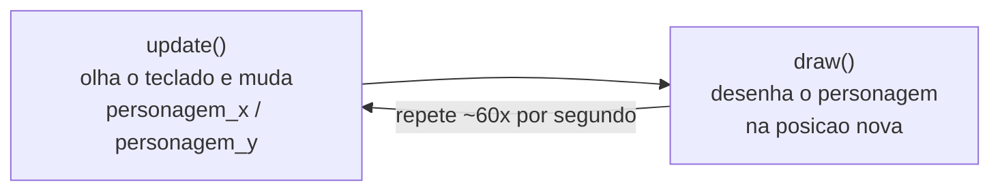

# Módulo 3 — Movimentando o personagem (material do professor)

**Duração:** 1h30 · **Ferramentas:** Python, VS Code (já configurados desde o Módulo 0)

## O que o aluno já traz do Módulo 2

Este módulo **não instala nada**. Cada aluno já tem, na raiz de `crescendo-como-jesus/`, o
`jogo.py` do Módulo 2: `import pgzrun` no topo, `WIDTH`/`HEIGHT`/`TITLE`, as variáveis do
personagem (`personagem_x`, `personagem_y`, `personagem_raio`, `personagem_cor`), uma `draw()` que
pinta o fundo, escreve o nome do pecador num cantinho e desenha o personagem como um círculo, um
`on_mouse_down(pos)` com a decisão Sim/Não e `pgzrun.go()` no fim.

Hoje a **pergunta e os botões cumpriram o papel deles** (ensinaram decisão com `if`/`elif`/`else`)
e **saem de cena**. O personagem continua igual — círculo, mesma posição inicial — mas ganha
**vida**: passa a andar pelo cenário quando o jogador aperta as setas do teclado. O `nome do
pecador` continua no cantinho (continuidade, como no Módulo 2).

## Conceitos

- O **laço do jogo**: o Pygame Zero fica repetindo "pensar → desenhar" muitas vezes por segundo
- `update()`: a função especial onde o jogo **pensa** e muda as coisas de lugar (roda antes de
  cada `draw()`)
- `x = x + VELOCIDADE`: como um número guardado numa variável "anda" (pega o valor atual, soma,
  guarda de volta)
- Teclado contínuo: `keyboard.left` / `.right` / `.up` / `.down` — `True` **enquanto** a seta
  está pressionada
- Teclado por evento: `on_key_down(key)` — dispara **uma vez** no instante em que a tecla é
  apertada (o primo de teclado do `on_mouse_down` do Módulo 2)
- `keys.SPACE` — o jeito do Pygame Zero de nomear uma tecla

Reforço do Módulo 2: `if`, `==`, `global`, e o eixo `y` que cresce **para baixo**.

## Parte do jogo

O personagem anda nas 4 direções pelo cenário, controlado pelas setas do teclado. Ainda **sem
paredes** — ele anda livre e pode até sair da tela (as paredes do labirinto vêm no Módulo 4). A
barra de espaço traz o personagem de volta ao meio.

## Por que `update()` agora

No Módulo 2 o jogo só reagia a **um clique de cada vez** — entre um clique e outro, nada
acontecia. Um jogo de verdade precisa de algo acontecendo **o tempo todo**: o personagem andando,
os inimigos se mexendo, o tempo passando. Esse "tempo todo" é o `update()`, e é ele que vai
carregar quase toda a lógica do jogo daqui pra frente (movimento dos inimigos no Módulo 7, o
tempo da oração no Módulo 9, a troca de fases no Módulo 11).

## Roteiro da aula

### 1. Recapitular o Módulo 2 e apresentar a ideia de hoje (8 min)

- Abrir o `jogo.py` de um aluno e relembrar: as variáveis do personagem, a `draw()`, o
  `on_mouse_down(pos)` com `if`/`elif`/`else` e `global`.
- Anunciar: a pergunta e os botões já ensinaram o que tinham pra ensinar e saem hoje. O
  personagem vai **ganhar vida** — anda pelo cenário quando você aperta as setas. É o primeiro
  passo pra virar um jogo de labirinto de verdade.
- Perguntar à turma: "no Módulo 2, o que fazia o programa reagir?" (um clique). "E se a gente
  quiser o personagem andando **sem parar** enquanto a seta está apertada?" — aí entra uma função
  nova.

### 2. Conceitos: o laço do jogo, `update()` e teclado (12 min)

- **O laço do jogo.** Desenhar no quadro dois quadros ligados em círculo: `update()` → `draw()` →
  `update()` → `draw()`… O Pygame Zero repete isso **cerca de 60 vezes por segundo**. Em `draw()`
  a gente só **desenha**; em `update()` a gente **muda** (posição, cor, contadores).
- **`x = x + VELOCIDADE`.** Não é "igualdade da matemática" — é uma **ordem**: "pegue o valor que
  está em `personagem_x` agora, some `VELOCIDADE`, e guarde o resultado de volta em
  `personagem_x`". Se isso roda 60 vezes por segundo, o número cresce sem parar → o personagem
  desliza pela tela.
- **`keyboard`.** `keyboard.right` vale `True` **enquanto** a seta direita está pressionada e
  `False` quando solta. Como `update()` roda toda hora, dá pra perguntar "a seta está apertada
  **agora**?" a cada quadro.
- **`on_key_down(key)`.** É o irmão de teclado do `on_mouse_down(pos)` do Módulo 2: o Pygame Zero
  chama **uma vez** no instante em que uma tecla desce, e `key` diz qual foi. Serve pra ações de
  "apertou → aconteceu uma vez" (voltar ao meio, pausar, atirar), não pra movimento contínuo.
- **Eixos, de novo (Módulo 2).** `x` cresce pra direita, `y` cresce **pra baixo**. Então "subir" é
  `personagem_y = personagem_y - VELOCIDADE` (diminui o `y`).

### 3. Demonstração: o personagem anda, passo a passo (33 min)

Escrever **ao vivo, rodando depois de cada passo**. Abrir o `jogo.py` do Módulo 2 e ir alterando.

**Passo 1 — limpar a cena do Módulo 2 e centralizar o personagem.**

Apagar do arquivo: a variável `PERGUNTA`, os `Rect` `botao_sim`/`botao_nao`, as variáveis
`respondeu`/`resposta_foi_sim`, a função `on_mouse_down` inteira e os trechos de `draw()` que
desenhavam a pergunta, os botões e a mensagem final.

Deixar as variáveis do personagem assim (tirar o `- 60` do `y`, pra ele começar no meio-meio) e
somar a velocidade:

```python
personagem_x = WIDTH // 2
personagem_y = HEIGHT // 2
personagem_raio = 40
personagem_cor = "gold"

VELOCIDADE = 5
```

`draw()` fica só com o fundo, o nome no cantinho, uma dica no topo e o personagem:

```python
def draw():
    screen.fill(COR_DE_FUNDO)

    screen.draw.text(
        "Pecador: " + NOME_DO_PECADOR,
        topleft=(10, HEIGHT - 30),
        fontsize=16,
        color=COR_DO_TEXTO,
    )

    screen.draw.text(
        "Use as setas para andar. Espaco volta ao meio.",
        center=(WIDTH // 2, 30),
        fontsize=24,
        color=COR_DO_TEXTO,
    )

    screen.draw.filled_circle(
        (personagem_x, personagem_y), personagem_raio, personagem_cor
    )
```

- Rodar: a bola dourada aparece **no centro exato** da tela, com a dica em cima e o nome no
  canto. Nada se mexe ainda.
- **Ponto de continuidade:** é o mesmo `jogo.py` evoluindo — o personagem e o nome do pecador
  atravessam do Módulo 2; só a cena de decisão sai.

**Passo 2 — a função `update()` e o primeiro movimento (automático).** Depois de `draw()`:

```python
def update():
    global personagem_x, personagem_y

    personagem_x = personagem_x + VELOCIDADE
```

- `update()` é **especial** como `draw()`: o Pygame Zero chama sozinho, ~60 vezes por segundo,
  **antes** de cada `draw()`.
- `global` de novo (Módulo 2): sem ele, `update()` cria uma cópia local e a tela nunca muda.
- Rodar: a bola **desliza sozinha para a direita** e some pela borda. "Ué, ele fugiu!" — é
  esperado. `VELOCIDADE` pixels por quadro × 60 quadros por segundo = 300 pixels por segundo.
  Mostrar que trocar `VELOCIDADE` pra `1` deixa lento e pra `20` deixa muito rápido.

**Passo 3 — andar só quando a seta está apertada.** Trocar a linha solta pelo teclado:

```python
def update():
    global personagem_x, personagem_y

    if keyboard.right:
        personagem_x = personagem_x + VELOCIDADE
    if keyboard.left:
        personagem_x = personagem_x - VELOCIDADE
```

- `keyboard.right` é `True` **enquanto** a seta direita está pressionada. `keyboard.left` diminui
  o `x` (anda pra esquerda).
- São dois `if` **separados** (não `elif`): se as duas setas estiverem apertadas juntas, as duas
  linhas rodam e uma anula a outra — o personagem fica parado, o que faz sentido.
- Rodar: a bola fica parada até você **segurar** →; solta, ela para. ← leva pra esquerda.

**Passo 4 — as quatro direções.** Acrescentar cima e baixo:

```python
    if keyboard.down:
        personagem_y = personagem_y + VELOCIDADE
    if keyboard.up:
        personagem_y = personagem_y - VELOCIDADE
```

- **Cuidado com o eixo (Módulo 2):** descer é `+ VELOCIDADE` no `y`; subir é `- VELOCIDADE`.
  Errar aqui é comum — o personagem sobe quando você aperta pra baixo.
- Rodar: anda nas 4 direções. Segurando duas setas (→ e ↑, por exemplo) ele anda **na diagonal**,
  de graça.

**Passo 5 — voltar ao meio com a barra de espaço (`on_key_down`).** Depois de `update()`:

```python
def on_key_down(key):
    global personagem_x, personagem_y

    if key == keys.SPACE:
        personagem_x = WIDTH // 2
        personagem_y = HEIGHT // 2
```

- Contraste com o Passo 3: `keyboard.right` a gente **pergunta** dentro de `update()`, quadro a
  quadro ("está apertada agora?"). `on_key_down(key)` o Pygame Zero **avisa** a gente, uma vez, no
  instante do aperto. É o mesmo modelo do `on_mouse_down(pos)` do Módulo 2, só que pra tecla.
- `key == keys.SPACE`: `keys.SPACE` é o nome que o Pygame Zero dá pra barra de espaço (existe
  `keys.A`, `keys.LEFT`, `keys.RETURN`…). Reforça o `==` do Módulo 2.
- Rodar: andar pra longe com as setas, apertar **espaço** — o personagem volta pro centro na hora.

Mostrar o [`exemplo.py`](exemplo.py) completo — é o mesmo código construído ao vivo.

### Como o Pygame Zero faz o personagem andar



Cada volta muda a posição um pouquinho (`VELOCIDADE` pixels) e redesenha. Rápido o bastante, o
olho vê **movimento** em vez de saltos.

### 4. Atividade prática (25 min)

Cada aluno, a partir do próprio `jogo.py` do Módulo 2, segue o passo a passo e chega em:

1. Personagem no centro da tela;
2. `update()` com `global`;
3. Andar nas **4 direções** com as setas;
4. Barra de espaço traz o personagem de volta ao meio.

Não copiar o [`exemplo.py`](exemplo.py) pronto — ele serve pra comparar no fim ou destravar quem
empacou.

### 5. Desafios (7 min)

- **Missão principal:** personagem anda nas 4 direções com as setas do teclado.
- **Desafio extra:** impedir que o personagem **saia da tela** — usar `if` pra travar
  `personagem_x` entre `0` e `WIDTH` e `personagem_y` entre `0` e `HEIGHT` (é uma prévia do
  Módulo 4, onde entram as paredes).
- **Desafio criativo:** aceitar também as teclas `W A S D` além das setas; mudar `personagem_cor`
  enquanto anda; deixar o personagem mais rápido ou mais devagar mexendo em `VELOCIDADE`.

### 6. Revisão e salvamento (5 min)

- Cada aluno salva o `jogo.py` (mesma raiz de `crescendo-como-jesus/`).
- Roda rápida: 2 ou 3 alunos mostram o personagem andando pros colegas.

## Fundamentos trabalhados

- O laço do jogo: `update()` repetido antes de cada `draw()`
- `update()` como função especial (assim como `draw()` e `on_mouse_down`)
- `x = x + n` para movimentar uma posição
- Teclado contínuo (`keyboard.left/right/up/down`) × teclado por evento (`on_key_down(key)`)
- `keys.SPACE` e a comparação `==` (reforço do Módulo 2)
- `global` dentro de função (reforço do Módulo 2)
- Eixo `y` cresce para baixo (reforço do Módulo 2)

## Resultado esperado

A bola dourada (o personagem, herdado do Módulo 2) aparece no centro da tela, com o nome do
pecador no cantinho e uma dica no topo. Segurando as setas do teclado, o personagem anda nas 4
direções (e na diagonal, com duas setas juntas). Sem paredes ainda: ele pode sair da tela.
Apertar a barra de espaço traz o personagem de volta ao centro.

## Vocabulário novo para os alunos

| Termo | Explicação simples |
|---|---|
| Laço do jogo | O Pygame Zero repetindo "pensar (`update`) → desenhar (`draw`)" muitas vezes por segundo |
| `update()` | Função especial que o Pygame Zero chama ~60 vezes por segundo, antes de cada `draw()`; é onde o jogo muda as coisas de lugar |
| `x = x + 5` | Uma ordem: pega o valor atual de `x`, soma 5, guarda de volta em `x` — é assim que uma posição "anda" |
| `VELOCIDADE` | Variável **nossa** (não é do Pygame Zero) com quantos pixels o personagem anda por passo |
| `keyboard.left` / `.right` / `.up` / `.down` | `True` **enquanto** a seta correspondente está pressionada |
| `on_key_down(key)` | Função especial chamada **uma vez** no instante em que uma tecla é apertada; `key` diz qual foi |
| `keys.SPACE` | O jeito do Pygame Zero de nomear a barra de espaço (também `keys.A`, `keys.LEFT`, `keys.RETURN`…) |

## Erros comuns e como ajudar

- **Personagem não anda (ou `UnboundLocalError`):** falta `global personagem_x, personagem_y` no
  começo de `update()`. É o mesmo erro do Módulo 2 — mostrar sem o `global` (nada acontece) e
  depois com ele.
- **`update` escrito errado** (`Update`, `atualizar`, `update(dt)` sem usar `dt`): o Pygame Zero
  só chama a função se o nome for **exatamente** `update`. O mesmo vale pra `on_key_down`.
- **`keyboard.right()` com parênteses:** é `keyboard.right` **sem** parênteses — é um valor
  `True`/`False`, não uma função.
- **Personagem sobe quando aperta pra baixo:** trocou o sinal. Descer é `personagem_y + VELOCIDADE`
  (o `y` cresce pra baixo); subir é `- VELOCIDADE`.
- **`keys.space` minúsculo:** é `keys.SPACE`, em maiúsculas.
- **Usou `=` em vez de `==`** na linha `if key == keys.SPACE:` — erro clássico do Módulo 2: `=`
  guarda um valor, `==` compara dois valores.
- **Movimento rápido demais ou lento demais:** ajustar o número em `VELOCIDADE` (5 é um bom
  ponto de partida).
