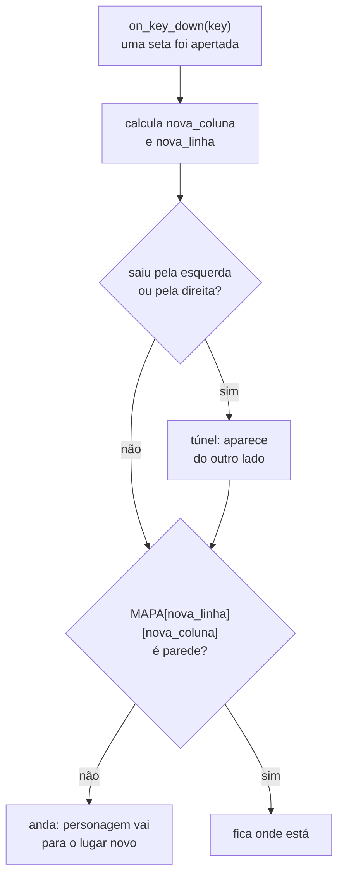

# Módulo 4 — Os muros do labirinto (material do aluno)

## A ideia de hoje

No Módulo 3 o seu personagem aprendeu a **andar**, mas andava livre, sem nada no caminho, e até
fugia da tela. Hoje o cenário vira um **labirinto**: você vai escrever um **mapa feito de letras**
e ensinar o computador a ler esse mapa para desenhar as paredes. O personagem passa a andar pelos
corredores, **sem atravessar parede** e **sem sair da tela**.

Hoje tem bastante coisa nova. Se não der tempo de terminar, tudo bem: você continua no começo do
Módulo 5.

## O que vamos aprender hoje

- **Lista**: uma variável que guarda **vários valores em fila**
- **Índice**: a posição de cada item na lista, contando **a partir do 0**
- **`len(...)`**: quantos itens tem uma lista (ou quantas letras tem um texto)
- **`for`**: repetir alguma coisa **para cada** item de uma lista
- **`range(n)`**: a fila de números `0, 1, 2, …` para usar no `for`
- **Comparar números**: `<`, `>`, `<=`, `>=`, `!=`

## O que você já tem pronto (do Módulo 3)

Abra o `jogo.py` que você evoluiu no Módulo 3, na raiz de `crescendo-como-jesus/`. Ele tem o
`import pgzrun`, o `WIDTH`/`HEIGHT`/`TITLE`, as cores, o nome do pecador, as variáveis do
personagem, a `VELOCIDADE`, a `draw()`, o `update()` que anda com as setas, o `on_key_down(key)`
que volta ao meio com espaço, e o `pgzrun.go()` no fim.

Hoje o personagem troca de jeito de andar: em vez de pixels soltos, ele passa a morar **num
quadradinho do mapa**.

## Primeiro, experimente: listas no terminal

Antes de mexer no jogo, vamos brincar com listas num arquivo separado.

No VS Code, crie o arquivo **`listas.py` dentro da pasta `aula-04/`** (não no `jogo.py`). Ele
**não** tem `pgzrun`: é Python puro, e o resultado aparece no **terminal**, na parte de baixo do
VS Code. Digite e rode com ▶ **"Run Python File"**:

```python
habitos = ["Oração", "Bíblia", "Culto", "Obedecer aos pais", "Ajudar o próximo"]

print(habitos[0])
print(habitos[4])
print(len(habitos))
```

- `habitos` é uma **lista**: vários valores entre `[ ]`, separados por vírgula.
- Cada valor tem uma posição, o **índice**. A contagem começa do **0**: `habitos[0]` é o primeiro,
  `habitos[4]` é o quinto (e último).
- `len(habitos)` diz **quantos itens** a lista tem.

**Rode.** No terminal aparece:

```
Oração
Ajudar o próximo
5
```

Agora troque o `habitos[4]` por `habitos[5]` e rode. Aparece um erro: `IndexError: list index out
of range`. Quer dizer: "o índice 5 está **fora** da lista" (ela só vai de 0 a 4). Volte para `[4]`.
Guarde esse erro na memória: ele vai aparecer de novo hoje.

Agora acrescente, embaixo:

```python
for habito in habitos:
    print("Bom hábito: " + habito)

for numero in range(5):
    print(numero)
```

- `for habito in habitos:` quer dizer "**para cada** item da lista, chame ele de `habito` e faça o
  que está recuado embaixo". O recuo funciona igual ao do `def` e do `if`.
- `range(5)` é a fila de números `0, 1, 2, 3, 4`. Começa no 0 e para **antes** do 5, igual aos
  índices.

**Rode.** Aparecem cinco linhas começando com `Bom hábito: `, uma para cada item, e depois os
números de `0` a `4`, um por linha.

Por último, acrescente:

```python
linha = "#..#"
print(linha[0])
print(linha[1])

print(3 < 5)
print(3 > 5)
print(5 >= 5)
print("#" != ".")
```

- Um **texto** também é uma fila: de **letras**. `linha[0]` é a primeira letra, `"#"`.
- `<` (menor), `>` (maior), `<=` (menor ou igual), `>=` (maior ou igual), `==` (igual) e `!=`
  (**diferente**) comparam dois valores e respondem `True` ou `False`.

**Rode.** Aparecem `#`, `.`, `True`, `False`, `True`, `True`.

## Construindo o labirinto, passo a passo

Agora volte para o `jogo.py`. Escreva aos poucos e **rode depois de cada passo**.

### Passo 1 — o mapa

Logo depois do `import pgzrun`, coloque o mapa (o professor passa o texto pronto) e troque o
`WIDTH = 800` e o `HEIGHT = 600` por este cálculo:

```python
MAPA = [
    "                    ",
    "####################",
    "#........##........#",
    "#.##.###.##.###.##.#",
    "#..................#",
    "#.##.#.######.#.##.#",
    "#....#...##...#....#",
    "####.###.##.###.####",
    "    .#........#.    ",
    "####.#.######.#.####",
    "#........##........#",
    "#.##.###.##.###.##.#",
    "#........  ........#",
    "####################",
    "                    ",
]

TILE = 40

COLUNAS = len(MAPA[0])
LINHAS = len(MAPA)

WIDTH = COLUNAS * TILE
HEIGHT = LINHAS * TILE
```

- O `MAPA` é uma **lista de textos**: cada texto é uma linha do labirinto. `#` é parede, `.` é
  caminho. Os pontinhos vão virar os bons hábitos no Módulo 5.
- Toda linha tem **exatamente 20** letras, até as linhas de espaço. A primeira e a última ficam
  vazias: é onde vão a dica e o seu nome.
- `TILE` é o tamanho de cada quadradinho do mapa: 40 pixels.
- `len(MAPA[0])` conta as letras da primeira linha (20) e `len(MAPA)` conta as linhas (15). Então a
  janela fica com 20 × 40 = **800** de largura e 15 × 40 = **600** de altura.

**Rode.** A janela abre do mesmo tamanho de antes. Ainda não aparece parede nenhuma: o mapa existe,
mas ninguém mandou desenhar.

### Passo 2 — desenhar as paredes

Junto das outras cores, crie:

```python
COR_DA_PAREDE = "navy"
```

Dentro da `draw()`, logo depois do `screen.fill(...)`:

```python
    for linha in range(LINHAS):
        for coluna in range(COLUNAS):
            if MAPA[linha][coluna] == "#":
                parede = Rect((coluna * TILE, linha * TILE), (TILE, TILE))
                screen.draw.filled_rect(parede, COR_DA_PAREDE)
```

- Leia assim: "**para cada linha**, **para cada coluna**: se a letra ali é `#`, desenha um
  quadrado naquele lugar". É um `for` **dentro** de outro `for`.
- `MAPA[linha]` é a linha inteira (um texto) e `MAPA[linha][coluna]` é **uma letra** dessa linha.
- O canto do quadrado fica em `coluna × TILE` (o `x`) e `linha × TILE` (o `y`). É o mesmo `Rect`
  dos botões do Módulo 2.
- Atenção ao **recuo**: `for`, depois `for` mais para dentro, depois `if` mais para dentro, depois
  o desenho mais para dentro ainda.

**Rode.** O **labirinto azul-escuro** aparece! O personagem do Módulo 3 ainda anda por cima das
paredes. Isso muda agora.

### Passo 3 — o personagem mora num quadradinho

Troque as variáveis `personagem_x`, `personagem_y` e `VELOCIDADE` por estas:

```python
INICIO_COLUNA = 9
INICIO_LINHA = 12

personagem_coluna = INICIO_COLUNA
personagem_linha = INICIO_LINHA
personagem_raio = TILE // 2 - 4
personagem_cor = "gold"
```

Na `draw()`, troque a linha que desenha o personagem por:

```python
    x = personagem_coluna * TILE + TILE // 2
    y = personagem_linha * TILE + TILE // 2
    screen.draw.filled_circle((x, y), personagem_raio, personagem_cor)
```

E ainda:

- **Apague a função `update()` inteira.** Num labirinto, o personagem vai andar **um quadradinho
  por aperto de seta**, e isso fica no `on_key_down`.
- No `on_key_down`, troque `personagem_x` e `personagem_y` por `personagem_coluna` e
  `personagem_linha` (no `global` também), e troque `WIDTH // 2` e `HEIGHT // 2` por
  `INICIO_COLUNA` e `INICIO_LINHA`.
- Mude a dica do topo para `"Setas: anda um quadradinho. Espaco: volta ao inicio."` e a posição
  dela para `center=(WIDTH // 2, TILE // 2)`, a faixa vazia de cima.

Por que `+ TILE // 2`? `coluna * TILE` é o **canto** do quadradinho; somando meio quadradinho, a
bola fica bem no **centro** dele. A coluna 9 e a linha 12 (contando do 0!) são o espaço vazio no
meio do corredor de baixo.

**Rode.** A bola dourada aparece **encaixada no corredor de baixo**, parada. As setas ainda não
fazem nada.

### Passo 4 — andar um quadradinho por aperto

Dentro do `on_key_down`, depois do `if` do espaço, escreva:

```python
    nova_coluna = personagem_coluna
    nova_linha = personagem_linha

    if key == keys.RIGHT:
        nova_coluna = personagem_coluna + 1
    if key == keys.LEFT:
        nova_coluna = personagem_coluna - 1
    if key == keys.DOWN:
        nova_linha = personagem_linha + 1
    if key == keys.UP:
        nova_linha = personagem_linha - 1

    personagem_coluna = nova_coluna
    personagem_linha = nova_linha
```

- Primeiro o jogo **pensa**: "para onde o personagem **quer** ir?" (`nova_coluna`, `nova_linha`).
  Depois ele anda.
- `keys.RIGHT`, `keys.LEFT`, `keys.DOWN` e `keys.UP` são os nomes das setas.

**Rode.** Cada aperto de seta anda **um quadradinho**. Mas o personagem **atravessa as paredes**!
Vamos consertar.

### Passo 5 — não atravessar parede

Troque as duas últimas linhas (`personagem_coluna = nova_coluna` e `personagem_linha =
nova_linha`) por:

```python
    if MAPA[nova_linha][nova_coluna] != "#":
        personagem_coluna = nova_coluna
        personagem_linha = nova_linha
```

- `!=` quer dizer **diferente**. Leia: "se a letra do lugar novo **não é** parede, anda". Se for
  parede, o personagem fica onde está.

**Rode.** O personagem para na frente das paredes.

Agora teste uma coisa: vá até o **corredor do meio** (aquele aberto dos dois lados) e saia pela
**ponta direita**. O jogo fecha com **`IndexError: string index out of range`**. É o mesmo erro do
experimento! As colunas vão de 0 a 19, e o personagem tentou olhar a **coluna 20**, que não
existe. Pela ponta esquerda não dá erro, mas o personagem some de um jeito esquisito. O próximo
passo conserta os dois lados.

### Passo 6 — o túnel

Coloque isto **entre** os `if` das setas e o `if` da parede:

```python
    if nova_coluna < 0:
        nova_coluna = COLUNAS - 1
    if nova_coluna >= COLUNAS:
        nova_coluna = 0
```

- "Saiu pela esquerda (coluna **menor que 0**)? Aparece na última coluna. Saiu pela direita
  (coluna **20 ou mais**)? Aparece na coluna 0." É o túnel do Pac-Man.
- Tem que ficar **antes** do `if` da parede: assim o jogo nunca olha uma coluna que não existe.

**Rode.** Pelo corredor do meio, o personagem sai por um lado e entra pelo outro. Nas outras
bordas o mapa é fechado com `#`, então ele **nunca sai da tela**. A barra de espaço traz ele de
volta ao começo.

## O que acontece quando você aperta uma seta



Pronto: compare com o [`exemplo.py`](exemplo.py) deste módulo. É o mesmo código que você acabou de
construir.

## Sua missão

- [ ] Rode o `aula-04/listas.py` e veja as listas, o `for` e as comparações no terminal;
- [ ] Coloque o mapa no `jogo.py` e faça a janela nascer do tamanho dele;
- [ ] Desenhe as paredes com dois `for`;
- [ ] Faça o personagem morar num quadradinho e andar um quadradinho por aperto;
- [ ] Impeça o personagem de atravessar parede;
- [ ] Faça o túnel funcionar.

Construa seguindo os passos. Não copie o `exemplo.py` pronto: ele é só para comparar no fim ou
destravar se você empacar.

## Desafios

- **Desafio extra:** aceite também as teclas `W A S D` (`keys.W`, `keys.A`, `keys.S`, `keys.D`).
  Ou faça o personagem ficar **vermelho** quando tentar andar para uma parede, e voltar a ser
  dourado quando andar. Dica: um `else` no `if` da parede, mudando o `personagem_cor` (que precisa
  entrar no `global`).
- **Desafio criativo:** desenhe o seu próprio labirinto trocando `#` e `.` de lugar (mantenha 20
  letras por linha e as bordas fechadas); mude as cores da parede e do fundo; troque o `TILE` para
  `30` e veja o que acontece com a janela.

## Palavras novas

| Termo | O que significa |
|---|---|
| Lista | Uma variável que guarda vários valores em fila, entre `[ ]`, separados por vírgula |
| Item | Cada valor guardado dentro da lista |
| Índice | A posição de um item na lista, contando **a partir do 0**: `lista[0]` é o primeiro |
| `len(...)` | Diz quantos itens tem uma lista, ou quantas letras tem um texto |
| `for` | Repete um bloco de código **para cada** item de uma lista |
| `range(n)` | A fila de números de `0` até `n - 1`, para usar no `for` |
| Laço dentro de laço | Um `for` dentro de outro: para cada linha, passa por cada coluna |
| `<` `>` `<=` `>=` `==` `!=` | Comparações: menor, maior, menor ou igual, maior ou igual, igual, **diferente**. Respondem `True` ou `False` |
| Mapa | A lista de textos que desenha o labirinto com letras (`#` parede, `.` caminho) |
| `TILE` | Variável **nossa** com o tamanho de cada quadradinho do mapa, em pixels |
| `IndexError` | Erro de quando você pede uma posição que não existe |

## Deu erro? Tenta isso primeiro

- **`IndexError: string index out of range` quando anda:** falta o túnel (Passo 6), ou ele está
  **depois** do `if` da parede. Ele tem que vir antes.
- **O labirinto sai torto:** alguma linha do mapa não tem 20 letras, ou falta uma **vírgula** no
  fim de alguma linha do mapa. Confira a linha suspeita.
- **Só aparece um pedaço das paredes:** confira o **recuo**: o segundo `for` fica dentro do
  primeiro, o `if` dentro do segundo, e o desenho dentro do `if`.
- **O personagem aparece dentro da parede:** o `INICIO_COLUNA` ou o `INICIO_LINHA` aponta para um
  `#`. Lembre que a contagem começa do 0.
- **O personagem não anda:** o `global` do `on_key_down` tem que ser
  `global personagem_coluna, personagem_linha`.
- **`NameError: name 'personagem_x' is not defined`:** sobrou algum `personagem_x` ou
  `personagem_y` do Módulo 3. Troque pelo jeito novo. Se o erro aparece quando você **segura** uma
  seta, sobrou o `update()` do Módulo 3: apague a função inteira.
- **`keys.right` minúsculo:** é `keys.RIGHT`, em maiúsculas.

Ao final, **salve** o `jogo.py` (na raiz de `crescendo-como-jesus/`) e o `aula-04/listas.py`.
