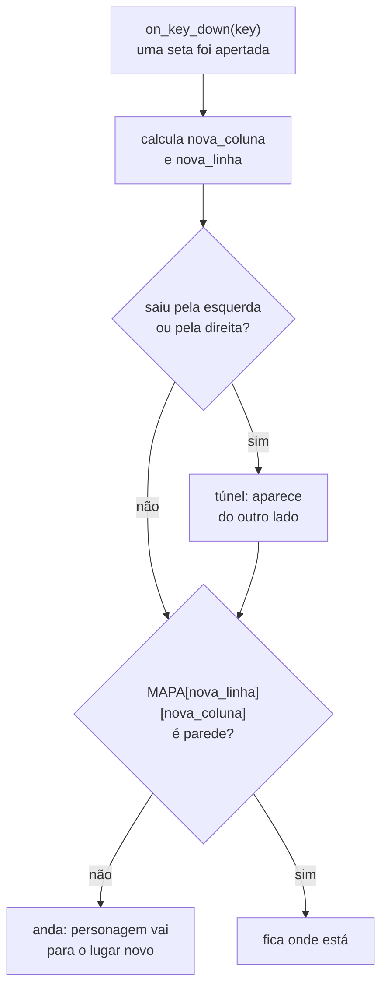

# Módulo 4 — Os muros do labirinto (material do professor)

**Duração:** 1h30 (a atividade prática pode continuar no Módulo 5) · **Ferramentas:** Python, VS
Code (já configurados desde o Módulo 0)

## O que o aluno já traz do Módulo 3

Este módulo **não instala nada**. Cada aluno já tem, na raiz de `crescendo-como-jesus/`, o
`jogo.py` do Módulo 3: `import pgzrun`, `WIDTH`/`HEIGHT`/`TITLE`, as cores, o
`NOME_DO_PECADOR`, as variáveis do personagem (`personagem_x`, `personagem_y`, `personagem_raio`,
`personagem_cor`), a `VELOCIDADE`, a `draw()` (fundo, dica, nome no cantinho, personagem), o
`update()` que anda com as setas, o `on_key_down(key)` que volta ao meio com espaço e o
`pgzrun.go()` no fim.

Hoje o cenário vira **labirinto**. O mapa passa a ser uma **lista de textos** (um desenho feito
de letras), as paredes são desenhadas a partir dele, e o personagem passa a morar **num
quadradinho do mapa** (coluna e linha, não mais pixels soltos). Ele anda **um quadradinho por
aperto de seta**, não atravessa parede e não sai da tela.

## Conceitos

- **Lista**: uma variável que guarda **vários valores em fila**, entre `[ ]`, separados por
  vírgula
- **Índice**: a posição de um item na lista, **começando do 0** (`lista[0]` é o primeiro)
- **`len(...)`**: quantos itens tem uma lista (ou quantas letras tem um texto)
- **Texto como fileira de letras**: `"#..#"[0]` é `"#"`. Por isso `MAPA[linha][coluna]` pega uma
  letra do mapa
- **Laço `for`**: repetir um bloco **para cada item** de uma lista
- **`range(n)`**: a fila de números `0, 1, 2, …, n-1`, pra usar no `for`
- **Laço dentro de laço**: para cada linha, passar por cada coluna — é assim que se percorre uma
  grade
- **Operadores relacionais**: `<`, `>`, `<=`, `>=`, `!=` (e o `==` do Módulo 2). Cada um responde
  `True` ou `False`

Reforço: `if`, `==`, `global`, `on_key_down(key)` e `keys.` (Módulo 3), `Rect` e
`screen.draw.filled_rect` (Módulo 2), `//` (Módulo 1).

## Parte do jogo

O labirinto aparece na tela, desenhado a partir de um mapa de letras. O personagem começa num
quadradinho do caminho e anda um quadradinho a cada aperto de seta. Ele **não atravessa parede**
e **não sai da tela**: pelas bordas o labirinto é fechado, e no corredor do meio há um **túnel**
(sai por um lado, entra pelo outro, como no Pac-Man). Os pontinhos `.` do mapa ainda não
aparecem: eles viram os bons hábitos no Módulo 5.

## Por que esta aula é pesada (e tudo bem)

Listas e `for` são dois conceitos grandes, e o labirinto precisa dos dois ao mesmo tempo: o mapa
**é** uma lista, e desenhá-lo **é** um `for` dentro de outro `for`. Por isso a aula começa com um
bloco de **experimentar fora do jogo** (no terminal, com `print`), antes de mexer no `jogo.py`.

É esperado que a parte teórica ocupe boa parte do tempo e que a construção do labirinto **não
termine hoje** para parte da turma. O Módulo 5 é, de propósito, mais leve e começa com tempo para
terminar o labirinto. Não apresse: é melhor sair daqui entendendo `for` do que com o mapa
copiado.

### Por que o personagem troca de pixels para quadradinhos

No Módulo 3 o personagem andava 5 pixels por quadro e ia parar em qualquer lugar da tela. Num
labirinto, ele precisa estar **sempre encaixado num corredor**. O jeito mais simples de garantir
isso é o personagem **morar num quadradinho** (`personagem_coluna`, `personagem_linha`) e andar
**um quadradinho por aperto**. Assim, perguntar "tem parede ali?" vira olhar **uma letra** do
mapa.

Consequência: o `update()` com `keyboard.right` sai de cena (se ele andasse um quadradinho por
quadro, seriam 60 quadradinhos por segundo) e o movimento vai para o `on_key_down(key)`, que o
aluno já conhece do Módulo 3. Segurar a seta **não** repete o passo: cada aperto é um passo. Isso
é de propósito e facilita acertar as curvas. O `update()` volta quando as tentações começarem a
andar sozinhas.

## Roteiro da aula

### 1. Recapitular o Módulo 3 e apresentar a ideia de hoje (8 min)

- Abrir o `jogo.py` de um aluno e relembrar: `update()` rodando ~60 vezes por segundo,
  `keyboard.right`, `on_key_down(key)` e `keys.SPACE`.
- Mostrar o [jogo de referência](../../jogo/jogo.py) rodando de novo por alguns segundos e
  perguntar: "o que tem nessa tela que o nosso jogo ainda não tem?" (as **paredes**). "Como a
  gente contaria pro computador onde fica cada parede?"
- Desenhar no quadro uma grade pequena (5 × 4) e pintar as paredes. Depois escrever embaixo a
  mesma grade **com letras**: `#` onde é parede, `.` onde é caminho. "Esse desenho feito de
  letras é o nosso **mapa**. Hoje o computador vai aprender a ler ele."

### 2. Conceitos: listas, `for` e comparações (15 min)

- **Lista.** "Até agora cada variável guardava **uma** coisa. Uma lista guarda **várias**, em
  fila." Escrever: `habitos = ["Oração", "Bíblia", "Culto", "Obedecer aos pais", "Ajudar o
  próximo"]`. Colchetes, vírgulas, a ordem importa.
- **Índice começa do 0.** `habitos[0]` é `"Oração"`, `habitos[4]` é `"Ajudar o próximo"`. Fazer a
  turma contar em voz alta a partir do zero. `habitos[5]` dá **erro**: não existe a sexta
  posição (`IndexError`). Esse erro vai aparecer de novo hoje, de propósito.
- **`len(habitos)`** responde `5`. O último índice é sempre `len - 1`.
- **Texto é uma fileira de letras.** `"#..#"[0]` é `"#"`, `"#..#"[1]` é `"."`. Então, se o mapa é
  uma lista de textos, `MAPA[2]` é **a linha 2 inteira** e `MAPA[2][5]` é **a letra da coluna 5
  da linha 2**. Mostrar com o dedo na grade do quadro: primeiro desce até a linha, depois anda até
  a coluna.
- **`for`.** "Repetir **para cada** item." `for habito in habitos:` e embaixo, com recuo, o que
  fazer com cada um. O recuo funciona igual ao do `def` e do `if`: tudo que está recuado é
  repetido.
- **`range(5)`** é a fila `0, 1, 2, 3, 4` (começa no 0, para **antes** do 5: igual aos índices).
  `for linha in range(15):` passa por todas as 15 linhas do mapa.
- **Laço dentro de laço.** Como ler a grade inteira? "Para cada linha, passa por cada coluna."
  Mostrar no quadro a ordem: linha 0 inteira da esquerda pra direita, depois linha 1, e assim por
  diante (é a ordem em que a gente lê um livro).
- **Operadores relacionais.** Perguntas de sim ou não com números e textos: `3 < 5` (`True`),
  `3 > 5` (`False`), `5 >= 5` (`True`), `"#" != "."` (`True`: `!=` é "diferente de"). Relembrar o
  `==` do Módulo 2. Hoje o `!=` responde "isso **não** é parede?" e o `<`/`>=` responde "saí da
  tela?".

### 3. Experimentar: listas no terminal (15 min)

Cada aluno cria `aula-04/listas.py` (na subpasta da aula, **não** no `jogo.py`). Esse arquivo não
tem `pgzrun`: é Python puro, e o resultado aparece no **terminal** do VS Code, embaixo do código.
Digitar e rodar (▶ "Run Python File") aos poucos:

```python
habitos = ["Oração", "Bíblia", "Culto", "Obedecer aos pais", "Ajudar o próximo"]

print(habitos[0])
print(habitos[4])
print(len(habitos))

for habito in habitos:
    print("Bom hábito: " + habito)

for numero in range(5):
    print(numero)

linha = "#..#"
print(linha[0])
print(linha[1])

print(3 < 5)
print(3 > 5)
print(5 >= 5)
print("#" != ".")
```

Resultado esperado no terminal, nessa ordem: `Oração`, `Ajudar o próximo`, `5`, cinco linhas
`Bom hábito: ...`, os números `0` a `4` (um por linha), `#`, `.`, `True`, `False`, `True`, `True`.

- Pedir que cada um **troque** o `habitos[4]` por `habitos[5]` e rode: aparece `IndexError: list
  index out of range`. Ler o erro juntos: "o índice 5 está fora da lista". Voltar para `[4]`.
- Pergunta para a turma: "o que imprime `range(3)`?" (0, 1, 2).

### 4. Demonstração: o labirinto, passo a passo (30 min)

Escrever **ao vivo, rodando depois de cada passo**, no `jogo.py` do Módulo 3.

**Passo 1 — o mapa e o tamanho da janela.** Logo depois do `import pgzrun`, colar o mapa
(distribuir o texto pronto para a turma: digitar 15 linhas de 20 letras não é o objetivo da aula).
Trocar o `WIDTH = 800` / `HEIGHT = 600` por um cálculo feito a partir do mapa:

```python
MAPA = [
    "                    ",
    "####################",
    "#........##........#",
    "#.##.###.##.###.##.#",
    "#..................#",
    "#.##.#.######.#.##.#",
    "#....#...##...#....#",
    "####.###.##.###.####",
    "    .#........#.    ",
    "####.#.######.#.####",
    "#........##........#",
    "#.##.###.##.###.##.#",
    "#........  ........#",
    "####################",
    "                    ",
]

TILE = 40

COLUNAS = len(MAPA[0])
LINHAS = len(MAPA)

WIDTH = COLUNAS * TILE
HEIGHT = LINHAS * TILE
```

- Todas as linhas têm **exatamente 20** letras (inclusive as de espaço). A primeira e a última
  linha ficam vazias: é onde vão a dica e o nome do pecador.
- `TILE` é o tamanho de cada quadradinho, em pixels. `len(MAPA[0])` conta as letras da primeira
  linha (20), `len(MAPA)` conta as linhas (15). 20 × 40 = 800 e 15 × 40 = 600: a janela continua
  do mesmo tamanho, mas agora **nasce do mapa**.
- Rodar: a janela abre igual ao Módulo 3. Nada de parede ainda: o mapa existe, mas ninguém mandou
  desenhar.

**Passo 2 — desenhar as paredes.** Criar `COR_DA_PAREDE = "navy"` junto das outras cores. Na
`draw()`, logo depois do `screen.fill(...)`:

```python
    for linha in range(LINHAS):
        for coluna in range(COLUNAS):
            if MAPA[linha][coluna] == "#":
                parede = Rect((coluna * TILE, linha * TILE), (TILE, TILE))
                screen.draw.filled_rect(parede, COR_DA_PAREDE)
```

- Ler em voz alta: "para cada linha, para cada coluna: se a letra ali é `#`, desenha um quadrado
  naquele lugar".
- O canto do quadrado: coluna × TILE para o `x`, linha × TILE para o `y`. Exemplo: coluna 3,
  linha 2 → canto em `(120, 80)`.
- É o `Rect` do Módulo 2 (os botões Sim/Não), agora criado **dentro do laço**, um para cada `#`.
- **Três níveis de recuo**: `for` → `for` → `if` → desenho. Conferir o recuo de cada linha antes de
  rodar.
- Rodar: o **labirinto azul-escuro** aparece. O personagem do Módulo 3 continua lá, por cima das
  paredes, andando livre. Isso muda agora.

**Passo 3 — o personagem mora num quadradinho.** Trocar `personagem_x`/`personagem_y` e a
`VELOCIDADE` por:

```python
INICIO_COLUNA = 9
INICIO_LINHA = 12

personagem_coluna = INICIO_COLUNA
personagem_linha = INICIO_LINHA
personagem_raio = TILE // 2 - 4
personagem_cor = "gold"
```

Na `draw()`, o personagem passa a ser desenhado a partir do quadradinho (trocar a linha do
`filled_circle`):

```python
    x = personagem_coluna * TILE + TILE // 2
    y = personagem_linha * TILE + TILE // 2
    screen.draw.filled_circle((x, y), personagem_raio, personagem_cor)
```

**Apagar a função `update()` inteira** e, dentro do `on_key_down`, trocar `personagem_x` /
`personagem_y` por `personagem_coluna` / `personagem_linha` (e `WIDTH // 2` / `HEIGHT // 2` por
`INICIO_COLUNA` / `INICIO_LINHA`). Mover o texto da dica para a linha vazia de cima:
`center=(WIDTH // 2, TILE // 2)`, com o texto `"Setas: anda um quadradinho. Espaco: volta ao
inicio."`.

- `+ TILE // 2` leva do canto do quadradinho para o **centro** dele. O raio é um pouco menor que
  meio quadradinho, para caber no corredor.
- Coluna 9, linha 12: o espaço vazio embaixo, no meio do labirinto (contando do 0!).
- Rodar: a bola dourada aparece **encaixada no corredor de baixo**, parada. As setas não fazem
  nada ainda (apagamos o `update()`).

**Passo 4 — andar um quadradinho por aperto.** Dentro do `on_key_down`, depois do `if` do espaço:

```python
    nova_coluna = personagem_coluna
    nova_linha = personagem_linha

    if key == keys.RIGHT:
        nova_coluna = personagem_coluna + 1
    if key == keys.LEFT:
        nova_coluna = personagem_coluna - 1
    if key == keys.DOWN:
        nova_linha = personagem_linha + 1
    if key == keys.UP:
        nova_linha = personagem_linha - 1

    personagem_coluna = nova_coluna
    personagem_linha = nova_linha
```

- A ideia é **pensar antes de andar**: primeiro calcula **para onde quer ir** (`nova_coluna`,
  `nova_linha`), depois decide se vai. Por enquanto vai sempre.
- `keys.RIGHT`, `keys.LEFT`, `keys.DOWN`, `keys.UP`: os nomes das setas (o Módulo 3 já mostrou que
  existem).
- Rodar: cada aperto anda **um quadradinho**. Segurar a seta não repete. E o personagem
  **atravessa as paredes**! "Como a gente impede?"

**Passo 5 — não atravessar parede.** Trocar as duas últimas linhas por:

```python
    if MAPA[nova_linha][nova_coluna] != "#":
        personagem_coluna = nova_coluna
        personagem_linha = nova_linha
```

- "Só anda se a letra do lugar novo **não for** parede." É a mesma leitura `MAPA[linha][coluna]`
  do Passo 2, agora para decidir em vez de desenhar.
- Rodar: o personagem para na frente das paredes. Pedir a alguém para ir até o **corredor do
  meio** e sair pela **ponta direita**: o jogo fecha com `IndexError: string index out of range`.
  Ler o erro junto: a linha tem colunas de 0 a 19, e o personagem tentou olhar a **coluna 20**,
  que não existe. É o mesmo erro do `habitos[5]` do experimento.
- Pela ponta esquerda não dá erro, mas o personagem some de um jeito esquisito (em Python, índice
  negativo conta de trás pra frente). Não precisa aprofundar: o próximo passo resolve os dois
  lados.

**Passo 6 — o túnel.** Entre o cálculo da nova posição e o `if` da parede:

```python
    if nova_coluna < 0:
        nova_coluna = COLUNAS - 1
    if nova_coluna >= COLUNAS:
        nova_coluna = 0
```

- "Saiu pela esquerda (coluna menor que 0)? Aparece na última coluna. Saiu pela direita (coluna 20
  ou mais)? Aparece na coluna 0." É o túnel do Pac-Man.
- Aqui entram `<` e `>=`. Por que `>= COLUNAS` e não `> COLUNAS`? Porque a coluna 20 **já** está
  fora (as colunas vão de 0 a 19).
- A ordem importa: o túnel **antes** do `if` da parede, para nunca olhar uma coluna que não existe.
- Rodar: pelo corredor do meio, sai por um lado e entra pelo outro. Nas outras bordas o próprio
  mapa é fechado com `#`, então o personagem **nunca sai da tela**.

Mostrar o [`exemplo.py`](exemplo.py) completo: é o mesmo código construído ao vivo.

### O que acontece quando uma seta é apertada



### 5. Atividade prática (15 min, pode continuar no Módulo 5)

Cada aluno, a partir do próprio `jogo.py` do Módulo 3, segue o passo a passo e chega em:

1. O mapa como lista e a janela calculada com `len`;
2. As paredes desenhadas com dois `for`;
3. O personagem num quadradinho, andando um quadradinho por aperto;
4. Sem atravessar parede, com o túnel funcionando.

Quem não terminar continua no começo do Módulo 5. Não copiar o [`exemplo.py`](exemplo.py) pronto:
ele serve para comparar no fim ou destravar quem empacou.

### 6. Desafios (5 min)

- **Missão principal:** labirinto desenhado a partir do mapa; o personagem anda pelos corredores
  sem atravessar parede e sem sair da tela.
- **Desafio extra:** aceitar também `W A S D` (`keys.W`, `keys.A`, `keys.S`, `keys.D`); fazer o
  personagem ficar **vermelho** quando tenta andar para uma parede e voltar a ser dourado quando
  anda (um `else` no `if` da parede, mudando `personagem_cor`, que precisa entrar no `global`).
- **Desafio criativo:** redesenhar o labirinto trocando `#` e `.` de lugar (mantendo 20 letras por
  linha e as bordas fechadas); mudar `COR_DA_PAREDE` e `COR_DE_FUNDO`; mudar o `TILE` para `30` e
  ver o que acontece com a janela.

### 7. Revisão e salvamento (2 min)

- Cada aluno salva o `jogo.py` (raiz de `crescendo-como-jesus/`) e o `aula-04/listas.py`.
- Pergunta de saída: "o que é `MAPA[2][5]`?" (a letra da linha 2, coluna 5).

## Fundamentos trabalhados

- Lista, item, índice começando do 0 e `IndexError`
- `len()` para listas e para textos
- Texto como fileira de letras (`texto[0]`)
- Laço `for` sobre uma lista e sobre `range(n)`
- Laço dentro de laço para percorrer uma grade
- Operadores relacionais `<`, `>`, `<=`, `>=`, `!=`, `==`
- Posição na grade (coluna, linha) × posição na tela (pixels)
- Reforço: `if`, `global`, `on_key_down(key)`, `keys.`, `Rect`, `//`

## Resultado esperado

A janela (800 × 600) mostra o labirinto azul-escuro desenhado a partir do mapa, com a dica na
faixa de cima e o nome do pecador na faixa de baixo. A bola dourada começa no corredor de baixo,
no meio. Cada aperto de seta anda um quadradinho; o personagem para na frente das paredes, nunca
sai da tela, e pelo túnel do corredor do meio sai por um lado e entra pelo outro. A barra de
espaço traz o personagem de volta ao começo.

## Vocabulário novo para os alunos

| Termo | Explicação simples |
|---|---|
| Lista | Uma variável que guarda vários valores em fila, entre `[ ]`, separados por vírgula |
| Item | Cada valor guardado dentro da lista |
| Índice | A posição de um item na lista, contando **a partir do 0**: `lista[0]` é o primeiro |
| `len(...)` | Diz quantos itens tem uma lista, ou quantas letras tem um texto |
| `for` | Repete um bloco de código **para cada** item de uma lista |
| `range(n)` | A fila de números de `0` até `n - 1`, pra usar no `for` |
| Laço dentro de laço | Um `for` dentro de outro: para cada linha, passa por cada coluna |
| Operadores relacionais | `<` menor, `>` maior, `<=` menor ou igual, `>=` maior ou igual, `==` igual, `!=` diferente. Respondem `True` ou `False` |
| Mapa | A lista de textos que desenha o labirinto com letras (`#` parede, `.` caminho) |
| `TILE` | Variável **nossa** com o tamanho de cada quadradinho do mapa, em pixels |
| `IndexError` | Erro de quando se pede uma posição que não existe (ex.: o item 5 de uma lista de 5) |

## Erros comuns e como ajudar

- **`IndexError: string index out of range` ao andar:** o túnel não está feito ou está **depois**
  do `if` da parede. O `if` do túnel tem que vir antes de olhar o `MAPA`.
- **Labirinto torto ou `IndexError` ao desenhar:** alguma linha do mapa tem mais ou menos de 20
  letras (faltou um espaço nas linhas vazias, ou uma vírgula entre as linhas, que faz o Python
  **grudar** dois textos num só). Contar as letras da linha suspeita.
- **Só aparece uma linha de paredes, ou só uma parede:** recuo errado. O segundo `for` tem que
  estar recuado dentro do primeiro, e o desenho dentro do `if`.
- **O personagem aparece dentro da parede:** `INICIO_COLUNA`/`INICIO_LINHA` apontam para um `#`.
  Lembrar que a contagem começa do 0.
- **O personagem não anda:** o `global` do `on_key_down` ainda cita `personagem_x`,
  `personagem_y`; tem que ser `global personagem_coluna, personagem_linha`.
- **`NameError: name 'personagem_x' is not defined`:** sobrou algum `personagem_x`/`personagem_y`
  do Módulo 3 (na `draw()` ou no `on_key_down`). Se o erro só aparece ao **segurar** uma seta,
  sobrou o `update()` do Módulo 3: apagar a função inteira.
- **`keys.right` minúsculo:** é `keys.RIGHT`, em maiúsculas.
- **Usou `=` no `if`:** `if MAPA[...] = "#"` dá `SyntaxError`. Para comparar é `==` ou `!=`.
