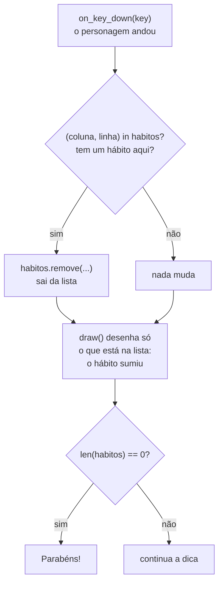

# Módulo 5 — Os bons hábitos no mapa (material do aluno)

## A ideia de hoje

Desde o Módulo 4 o seu mapa tem um monte de pontinhos `.` que **não aparecem** na tela. Hoje eles
viram os **bons hábitos**: bolinhas espalhadas pelos corredores do labirinto. Quando o seu
personagem passa por cima de uma, ela **some**, porque você coletou aquele hábito. Quando não
sobrar nenhum, aparece uma mensagem de parabéns.

> "E crescia Jesus em sabedoria, e em estatura, e em graça, para com Deus e os homens."
> (Lucas 2:52)

Ninguém cresce de uma vez: é **um pouco por dia**. Os bons hábitos (🙏 oração, 📖 Bíblia,
⛪ culto, ❤️ obedecer aos pais, 🤝 ajudar o próximo) são assim: um de cada vez, pelo caminho.

## Ainda não terminou o labirinto?

Se o seu labirinto do Módulo 4 ainda não está pronto, **termine primeiro**: siga os passos do
Módulo 4 até o personagem andar sem atravessar parede e o túnel funcionar sem erro. Depois volte
para cá.

## O que vamos aprender hoje

- **Lista vazia** `[]` e **`.append(...)`**: começar uma lista sem nada e ir colocando itens
- **`in`**: perguntar se um item **está** na lista
- **`.remove(...)`**: tirar um item da lista
- **Pares** `(coluna, linha)`: dois números guardados juntos

## O que você já tem pronto (do Módulo 4)

O seu `jogo.py` (na raiz de `crescendo-como-jesus/`) já tem o `MAPA`, o `TILE`, a janela nascendo
do mapa, as paredes desenhadas com dois `for`, o personagem morando num quadradinho e o
`on_key_down(key)` que anda, respeita as paredes e faz o túnel.

## Primeiro, experimente: a mochila

Crie o arquivo **`mochila.py` dentro da pasta `aula-05/`** (não no `jogo.py`). É Python puro, e o
resultado aparece no **terminal**. Digite e rode com ▶ **"Run Python File"**:

```python
mochila = []
print(mochila)
print(len(mochila))

mochila.append("Oração")
mochila.append("Bíblia")
mochila.append("Culto")
print(mochila)
print(len(mochila))
```

- `mochila = []` é uma lista **vazia**: sem nenhum item.
- `mochila.append("Oração")` coloca um item **no fim** da lista.

**Rode.** No terminal aparece:

```
[]
0
['Oração', 'Bíblia', 'Culto']
3
```

Agora acrescente:

```python
print("Bíblia" in mochila)
print("Preguiça" in mochila)

mochila.remove("Bíblia")
print(mochila)
print("Bíblia" in mochila)
```

- `"Bíblia" in mochila` pergunta: "a Bíblia **está** na mochila?". Responde `True` ou `False`.
- `mochila.remove("Bíblia")` **tira** a Bíblia da lista.

**Rode.** Aparecem mais estas linhas:

```
True
False
['Oração', 'Culto']
False
```

A preguiça não está na mochila! 😄

Agora acrescente `mochila.remove("Mentira")` no fim e rode. Aparece o erro **`ValueError:
list.remove(x): x not in list`**: não dá para tirar o que não está lá. Por isso, no jogo, a gente
sempre **pergunta com `in` antes** de usar o `remove`. Apague essa linha.

Por último, acrescente:

```python
lugar = (3, 2)
print(lugar[0])
print(lugar[1])
```

- `(3, 2)` guarda **dois números juntos**: um **par**. É igual ao `(x, y)` que você usa no
  `filled_circle` desde o Módulo 2. `lugar[0]` é o primeiro número e `lugar[1]` é o segundo.

**Rode.** Aparecem `3` e `2`.

## Construindo os bons hábitos, passo a passo

Agora volte para o `jogo.py`. Escreva aos poucos e **rode depois de cada passo**.

### Passo 1 — a lista de hábitos, lida do mapa

Depois das variáveis do personagem, **fora de qualquer função** (sem recuo), escreva:

```python
habitos = []
for linha in range(LINHAS):
    for coluna in range(COLUNAS):
        if MAPA[linha][coluna] == ".":
            habitos.append((coluna, linha))

print(len(habitos))
```

- É o **mesmo** `for` dentro de `for` que desenha as paredes. Só que agora ele procura `.` em vez
  de `#` e, em vez de desenhar, **guarda** o lugar `(coluna, linha)` na lista.
- Repare nos **dois pares de parênteses** em `append((coluna, linha))`: os de fora são do
  `append`, os de dentro fazem o par.
- Como esse código está **fora das funções**, ele roda **uma vez só**, quando o jogo abre.

**Rode.** A janela abre igual, e no **terminal** aparece **`116`**: é a quantidade de pontinhos do
mapa. (Se você mudou o mapa, o número vai ser outro, e tudo bem.) Depois de conferir, **apague a
linha do `print`**.

### Passo 2 — desenhar os hábitos

Junto das outras cores, crie:

```python
COR_DO_HABITO = "darkgreen"
```

Na `draw()`, **depois** do `for` que desenha as paredes:

```python
    for habito in habitos:
        x = habito[0] * TILE + TILE // 2
        y = habito[1] * TILE + TILE // 2
        screen.draw.filled_circle((x, y), 6, COR_DO_HABITO)
```

- Leia assim: "**para cada** hábito da lista, desenha uma bolinha no centro do quadradinho dele".
- `habito[0]` é a coluna e `habito[1]` é a linha. A conta para achar o centro é a mesma do
  personagem.

**Rode.** Os corredores ficam **cheios de bolinhas verdes**! O personagem passa por cima delas,
mas elas ainda não somem.

### Passo 3 — coletar

No **fim** do `on_key_down`, depois do `if` da parede (no mesmo recuo dele, não dentro), escreva:

```python
    if (personagem_coluna, personagem_linha) in habitos:
        habitos.remove((personagem_coluna, personagem_linha))
```

- Leia assim: "o lugar onde o personagem está **é um dos hábitos** da lista? Então tira da lista".
- A `draw()` desenha **só o que está na lista**. Saiu da lista, some da tela.
- O `in` vem antes do `remove` para não dar aquele `ValueError` da mochila.

**Rode.** Cada bolinha **some** quando o personagem para em cima dela. Ande um pouco e veja o
caminho limpo que fica para trás.

### Passo 4 — a mensagem de parabéns

Na `draw()`, troque o texto fixo da dica do topo por isto:

```python
    if len(habitos) == 0:
        mensagem = "Parabens! Voce encheu sua vida de bons habitos!"
    else:
        mensagem = "Setas: anda. Passe por cima dos bons habitos."

    screen.draw.text(
        mensagem,
        center=(WIDTH // 2, TILE // 2),
        fontsize=24,
        color=COR_DO_TEXTO,
    )
```

- `len(habitos) == 0` quer dizer "a lista ficou **vazia**": não sobrou nenhum hábito no mapa.
- A variável `mensagem` guarda **qual** texto vai aparecer.

**Rode e jogue até o fim.** Colete todos os hábitos. Quando você pegar o último, a dica do topo
vira: **"Parabens! Voce encheu sua vida de bons habitos!"**

## O que acontece quando o personagem anda



Pronto: compare com o [`exemplo.py`](exemplo.py) deste módulo. É o mesmo código que você acabou de
construir.

## Sua missão

- [ ] Rode o `aula-05/mochila.py` e veja o `append`, o `in` e o `remove` no terminal;
- [ ] Monte a lista `habitos` lendo o mapa (e confira o número no terminal);
- [ ] Desenhe os hábitos como bolinhas;
- [ ] Faça o hábito sumir quando o personagem passar por cima;
- [ ] Mostre a mensagem de parabéns quando não sobrar nenhum.

Construa seguindo os passos. Não copie o `exemplo.py` pronto: ele é só para comparar no fim ou
destravar se você empacar.

## Desafios

- **Desafio extra:** faça a tecla `R` trazer **todos os hábitos de volta**. Dentro do
  `on_key_down`, crie um `if key == keys.R:` e, dentro dele, escreva `habitos = []` e o mesmo `for`
  que monta a lista. Dica: aqui você precisa pôr `habitos` no `global`, porque a função troca a
  lista inteira por uma nova. Outro desafio: use `print` para mostrar no terminal quantos hábitos
  faltam, a cada um que você coleta.
- **Desafio criativo:** mude a cor e o tamanho das bolinhas; desenhe os hábitos como quadradinhos
  (com `Rect` e `filled_rect`); coloque hábitos também no corredor do túnel, trocando os espaços do
  mapa por `.`.

## Palavras novas

| Termo | O que significa |
|---|---|
| Lista vazia `[]` | Uma lista sem nenhum item, pronta para ser enchida |
| `.append(...)` | Coloca um item novo no fim da lista |
| `in` | Pergunta se um item está na lista; responde `True` ou `False` |
| `.remove(...)` | Tira um item da lista (dá erro se o item não estiver lá) |
| Par `(coluna, linha)` | Dois valores guardados juntos; pega cada um com `[0]` e `[1]` |
| `ValueError` | Erro de quando você tenta tirar da lista um item que não está nela |

## Deu erro? Tenta isso primeiro

- **`ValueError: list.remove(x): x not in list`:** falta o `if ... in habitos:` antes do `remove`.
  Ou a ordem ficou trocada em algum lugar: é sempre **coluna primeiro, linha depois**.
- **As bolinhas não somem:** confira se é `(coluna, linha)` em todo lugar (no `append` e no `in`),
  e se o `if` da coleta não ficou recuado dentro de outro `if`.
- **`TypeError: list.append() takes exactly one argument (2 given)`:** faltaram os parênteses de
  dentro. É `habitos.append((coluna, linha))`, com **dois** pares de parênteses.
- **Nenhuma bolinha aparece:** o `for` que desenha tem que estar dentro da `draw()` e **depois** do
  `screen.fill(...)`. E o `if` que monta a lista procura `"."`, não `"#"`.
- **A mensagem de parabéns aparece logo no começo:** a lista ficou vazia. Confira se o
  `habitos = []` está **antes** do `for` que enche a lista, e não depois.
- **`UnboundLocalError` quando aperta `R` (desafio extra):** faltou `habitos` no `global`.

Ao final, **salve** o `jogo.py` (na raiz de `crescendo-como-jesus/`) e o `aula-05/mochila.py`.
