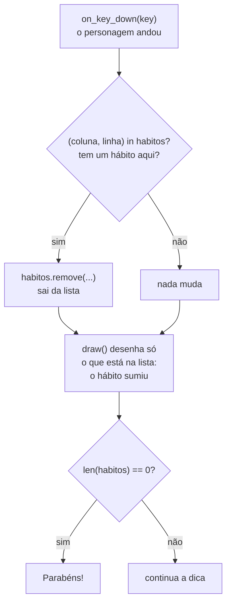

# Módulo 5 — Os bons hábitos no mapa (material do professor)

**Duração:** 1h30 · **Ferramentas:** Python, VS Code (já configurados desde o Módulo 0)

## O que o aluno já traz do Módulo 4

Este módulo **não instala nada**. Cada aluno já tem (ou termina hoje, no primeiro bloco) o
`jogo.py` do Módulo 4: o `MAPA` como lista de textos, `TILE`, `COLUNAS`/`LINHAS` calculados com
`len`, a janela nascendo do mapa, as paredes desenhadas com dois `for`, o personagem morando num
quadradinho (`personagem_coluna`, `personagem_linha`) e o `on_key_down(key)` que anda um
quadradinho por aperto, respeita as paredes e faz o túnel.

Hoje os pontinhos `.` que já estavam no mapa desde o Módulo 4 **viram bons hábitos**: bolinhas
espalhadas pelos corredores, que **somem** quando o personagem passa por cima. Quando não sobra
nenhum, aparece uma mensagem de parabéns.

## Conceitos

Módulo de **reforço** de listas e `for`, com poucas coisas novas:

- **Lista vazia** `[]` e **`.append(...)`**: começar uma lista sem nada e ir acrescentando itens
  no fim
- **Par de valores** `(coluna, linha)`: dois números juntos, como o `(x, y)` do Módulo 2. Pega-se
  cada um com `[0]` e `[1]`, igual a uma lista
- **`in`**: pergunta se um item **está** na lista (`True`/`False`)
- **`.remove(...)`**: tira um item da lista
- **`len(lista) == 0`**: a lista ficou vazia
- **Código fora das funções roda uma vez**, na hora em que o jogo abre (é assim que a lista de
  hábitos é montada)

Reforço do Módulo 4: `for` dentro de `for` para percorrer o mapa, `MAPA[linha][coluna]`, `len`,
índices. Reforço do Módulo 2: `if`/`else`.

## Parte do jogo

Os bons hábitos aparecem como bolinhas verdes em todos os corredores marcados com `.` no mapa
(116 no mapa do curso). Quando o personagem para em cima de um, ele **some**. Quando todos foram
coletados, a dica do topo vira uma mensagem de parabéns.

Ainda **não** há placar (entra no Módulo 6), nem tentações (Módulo 7), nem a oração como poder
especial (Módulo 9). Todos os hábitos são desenhados iguais por enquanto.

## Por que a aula é leve

O Módulo 4 trouxe dois conceitos pesados de uma vez (listas e `for`) e muita gente sai de lá sem
ter terminado o labirinto. Este módulo usa **as mesmas ferramentas** para uma coisa nova:
uma lista que **muda durante o jogo**. Por isso começa com tempo para terminar o Módulo 4, e o
conteúdo novo (`append`, `in`, `remove`) é pequeno e muito visual: o aluno **vê** a lista
encolhendo na tela.

### Ligação com o tema

Lucas 2:52 diz que Jesus **crescia**: ninguém cresce de uma vez, é um pouco por dia. Os bons
hábitos (🙏 oração, 📖 Bíblia, ⛪ culto, ❤️ obedecer aos pais, 🤝 ajudar o próximo) são assim: um de
cada vez, pelo caminho, até encher a vida de virtude. Vale fazer essa ligação ao apresentar a
mensagem final.

### Por que `habitos` não precisa de `global`

No `on_key_down` a gente faz `habitos.remove(...)`: tira um item **de dentro** da lista, mas a
variável `habitos` continua sendo a mesma lista. O `global` só é necessário quando a função
**troca** o valor da variável (`habitos = ...`), como no desafio extra de fazer os hábitos
voltarem. Se um aluno puser `habitos` no `global` "por garantia", não tem problema nenhum.

## Roteiro da aula

### 0. Terminar o labirinto do Módulo 4 (até 15 min)

- Quem não terminou o Módulo 4 segue o passo a passo de lá até o túnel funcionar. Quem terminou
  pode fazer um dos desafios do Módulo 4 ou ajudar um colega (explicando, sem digitar por ele).
- Critério para seguir: labirinto desenhado, personagem andando sem atravessar parede, túnel sem
  `IndexError`.

### 1. Recapitular e apresentar a ideia de hoje (5 min)

- Apontar para o mapa no código: "desde a aula passada tem um monte de pontinhos `.` aqui que
  **não aparecem** na tela. Hoje eles viram os bons hábitos."
- Perguntar: "como o jogo vai **lembrar** quais hábitos ainda estão no mapa e quais você já
  pegou?" (uma lista que começa cheia e vai perdendo itens).

### 2. Conceitos: montar e desmontar uma lista (10 min)

- **Lista vazia e `append`.** `mochila = []` é uma lista sem nada. `mochila.append("Oração")`
  coloca um item **no fim**. Dá para montar uma lista aos poucos, um item de cada vez, inclusive
  dentro de um `for`.
- **`in`.** `"Oração" in mochila` pergunta "a oração está na mochila?" e responde `True` ou
  `False`. É uma pergunta, como o `==`: serve dentro de `if`.
- **`remove`.** `mochila.remove("Oração")` tira o item. Se o item **não** está na lista, dá erro
  (`ValueError`). Por isso a gente sempre pergunta com `in` antes de remover.
- **Pares.** Um hábito precisa de **dois** números para dizer onde está: coluna e linha. `(3, 2)`
  guarda os dois juntos, como o `(x, y)` que a gente passa para o `filled_circle` desde o Módulo 2.
  `lugar[0]` é a coluna, `lugar[1]` é a linha.
- Escrever no quadro a lista `habitos` pequena, por exemplo `[(1, 2), (2, 2), (3, 2)]`, e apagar
  um item de cada vez conforme um "personagem" (o dedo) passa por cima.

### 3. Experimentar: a mochila no terminal (10 min)

Cada aluno cria `aula-05/mochila.py` (Python puro, sem `pgzrun`, resultado no terminal):

```python
mochila = []
print(mochila)
print(len(mochila))

mochila.append("Oração")
mochila.append("Bíblia")
mochila.append("Culto")
print(mochila)
print(len(mochila))

print("Bíblia" in mochila)
print("Preguiça" in mochila)

mochila.remove("Bíblia")
print(mochila)
print("Bíblia" in mochila)

lugar = (3, 2)
print(lugar[0])
print(lugar[1])
```

Resultado esperado no terminal, nessa ordem: `[]`, `0`, `['Oração', 'Bíblia', 'Culto']`, `3`,
`True`, `False`, `['Oração', 'Culto']`, `False`, `3`, `2`.

- Brincar com o `"Preguiça" in mochila` dar `False`: "a preguiça não está na mochila".
- Pedir que cada um acrescente `mochila.remove("Mentira")` no fim e rode: aparece `ValueError:
  list.remove(x): x not in list`. "Não dá para tirar o que não está lá. Por isso, no jogo, a gente
  pergunta com `in` antes." Apagar a linha.

### 4. Demonstração: os bons hábitos, passo a passo (25 min)

Escrever **ao vivo, rodando depois de cada passo**, no `jogo.py` do Módulo 4.

**Passo 1 — montar a lista de hábitos lendo o mapa.** Depois das variáveis do personagem (fora
de qualquer função):

```python
habitos = []
for linha in range(LINHAS):
    for coluna in range(COLUNAS):
        if MAPA[linha][coluna] == ".":
            habitos.append((coluna, linha))

print(len(habitos))
```

- É o **mesmo** `for` dentro de `for` que desenha as paredes, só que procurando `.` em vez de `#`,
  e em vez de desenhar, **guarda** a posição na lista.
- Atenção aos **dois pares de parênteses** em `append((coluna, linha))`: os de fora são do
  `append`, os de dentro fazem o par.
- Esse código está **fora de qualquer função**: roda **uma vez só**, quando o jogo abre. A `draw()`
  roda o tempo todo; isto aqui não.
- Rodar: a janela abre igual, e no **terminal** aparece `116` (a quantidade de pontinhos do mapa).
  Se alguém mudou o mapa, o número muda, e tudo bem. Depois de conferir, **apagar o `print`**.

**Passo 2 — desenhar os hábitos.** Criar `COR_DO_HABITO = "darkgreen"` junto das cores. Na
`draw()`, depois das paredes:

```python
    for habito in habitos:
        x = habito[0] * TILE + TILE // 2
        y = habito[1] * TILE + TILE // 2
        screen.draw.filled_circle((x, y), 6, COR_DO_HABITO)
```

- "Para cada hábito da lista, desenha uma bolinha no centro do quadradinho dele." É a mesma conta
  de pixels do personagem (Módulo 4), com `habito[0]` no lugar da coluna e `habito[1]` no lugar
  da linha.
- Rodar: os corredores ficam **cheios de bolinhas verdes**. O personagem passa por cima delas, mas
  elas não somem ainda.

**Passo 3 — coletar.** No fim do `on_key_down`, depois do `if` da parede (e fora dele, no mesmo
recuo):

```python
    if (personagem_coluna, personagem_linha) in habitos:
        habitos.remove((personagem_coluna, personagem_linha))
```

- "O lugar onde o personagem está é um dos hábitos da lista? Então tira da lista." Como a `draw()`
  desenha **só o que está na lista**, o hábito some da tela sozinho.
- O `in` antes do `remove` evita o `ValueError` do experimento: nos lugares sem hábito (ou que já
  foram coletados), o `remove` nem é chamado.
- Não precisa de `habitos` no `global` (ver "Por que `habitos` não precisa de `global`" acima).
- Rodar: cada bolinha **some** quando o personagem para em cima dela. Andar um pouco e mostrar o
  rastro limpo que fica para trás.

**Passo 4 — a mensagem de parabéns.** Na `draw()`, trocar o texto fixo da dica por uma escolha
com `if`/`else`:

```python
    if len(habitos) == 0:
        mensagem = "Parabens! Voce encheu sua vida de bons habitos!"
    else:
        mensagem = "Setas: anda. Passe por cima dos bons habitos."

    screen.draw.text(
        mensagem,
        center=(WIDTH // 2, TILE // 2),
        fontsize=24,
        color=COR_DO_TEXTO,
    )
```

- `len(habitos) == 0` quer dizer "a lista ficou vazia": não sobrou nenhum hábito no mapa.
- A variável `mensagem` guarda **qual** texto mostrar; o `screen.draw.text` é um só.
- Rodar e jogar até o fim: coletar os 116 leva uns 2 ou 3 minutos, e é o próprio jogo. No último
  hábito, a dica do topo vira a mensagem de parabéns. Ligar com Lucas 2:52 (ver "Ligação com o
  tema").

Mostrar o [`exemplo.py`](exemplo.py) completo: é o mesmo código construído ao vivo.

### O que acontece quando o personagem anda



### 5. Atividade prática (15 min)

Cada aluno, no próprio `jogo.py`, segue o passo a passo e chega em:

1. A lista `habitos` montada a partir do mapa (conferindo o número no terminal);
2. Os hábitos desenhados como bolinhas;
3. O hábito some quando o personagem passa por cima;
4. A mensagem de parabéns quando não sobra nenhum.

Não copiar o [`exemplo.py`](exemplo.py) pronto: ele serve para comparar no fim ou destravar quem
empacou.

### 6. Desafios (5 min)

- **Missão principal:** bons hábitos espalhados pelo mapa, que somem quando o personagem passa por
  cima, e a mensagem de parabéns no fim.
- **Desafio extra:** apertar `R` faz **todos os hábitos voltarem**. Dentro do `on_key_down`:
  `if key == keys.R:` e, dentro dele, `habitos = []` seguido do mesmo `for` que monta a lista.
  Aqui **precisa** pôr `habitos` no `global` (a função troca a lista inteira por outra). Outro:
  mostrar no terminal, com `print`, quantos hábitos faltam a cada um coletado.
- **Desafio criativo:** mudar a cor e o tamanho das bolinhas; desenhar os hábitos como
  quadradinhos (`Rect` + `filled_rect`); pôr pontinhos também no corredor do túnel, trocando os
  espaços do mapa por `.`.

### 7. Revisão e salvamento (5 min)

- Cada aluno salva o `jogo.py` (raiz de `crescendo-como-jesus/`) e o `aula-05/mochila.py`.
- Roda rápida: 2 ou 3 alunos mostram a mensagem de parabéns (ou o rastro limpo pelo labirinto).
- Pergunta de saída: "por que a gente pergunta com `in` antes de usar `remove`?"

## Fundamentos trabalhados

- Lista vazia `[]` e `.append(...)`
- Montar uma lista com `for` dentro de `for` (reforço do Módulo 4)
- Pares `(coluna, linha)` guardados numa lista; `par[0]` e `par[1]`
- `in` para perguntar se um item está na lista
- `.remove(...)` e o `ValueError` quando o item não existe
- `len(lista) == 0` para saber se a lista acabou
- Código fora de função roda uma vez, quando o jogo abre
- Reforço: `if`/`else`, `MAPA[linha][coluna]`, `for` na `draw()`

## Resultado esperado

O labirinto do Módulo 4 agora tem bolinhas verdes em todos os corredores marcados com `.`. Cada
bolinha some quando o personagem para em cima dela, deixando o caminho limpo para trás. O túnel e
o espaço vazio do começo não têm hábito. Quando o último hábito é coletado, a dica do topo vira
"Parabens! Voce encheu sua vida de bons habitos!".

## Vocabulário novo para os alunos

| Termo | Explicação simples |
|---|---|
| Lista vazia `[]` | Uma lista sem nenhum item, pronta para ser enchida |
| `.append(...)` | Coloca um item novo no fim da lista |
| `in` | Pergunta se um item está na lista; responde `True` ou `False` |
| `.remove(...)` | Tira um item da lista (dá erro se o item não estiver lá) |
| Par `(coluna, linha)` | Dois valores guardados juntos; pega cada um com `[0]` e `[1]` |
| `ValueError` | Erro de quando se tenta tirar da lista um item que não está nela |
| Bom hábito | No jogo, cada bolinha do mapa: algo bom que faz a gente crescer, um de cada vez |

## Erros comuns e como ajudar

- **`ValueError: list.remove(x): x not in list`:** faltou o `if ... in habitos:` antes do
  `remove`, ou os dois usam coisas diferentes (por exemplo, `(personagem_linha,
  personagem_coluna)` invertido em um deles). A ordem é sempre **coluna, linha**.
- **As bolinhas não somem:** o par está invertido (`(linha, coluna)`) no `append` ou no `in`, ou o
  `if` da coleta ficou **dentro** de outro `if` (o do espaço, por exemplo). Conferir o recuo.
- **`TypeError: list.append() takes exactly one argument (2 given)`:** faltaram os parênteses de
  dentro: é `habitos.append((coluna, linha))`, com dois pares de parênteses.
- **Nenhuma bolinha aparece:** o `for` que desenha está fora da `draw()` (sem recuo), ou está
  **antes** do `screen.fill(...)` (o fundo pinta por cima). Ou a lista foi montada procurando `"#"`
  em vez de `"."`.
- **O terminal mostra `0`:** o `if` do Passo 1 compara com a letra errada, ou o mapa não tem
  pontinhos.
- **A mensagem de parabéns aparece logo no começo:** a lista ficou vazia. Geralmente o
  `habitos = []` foi escrito **depois** do `for` que enche a lista (e esvaziou tudo de novo).
- **`UnboundLocalError` ao apertar `R` (desafio extra):** faltou `habitos` no `global`.
